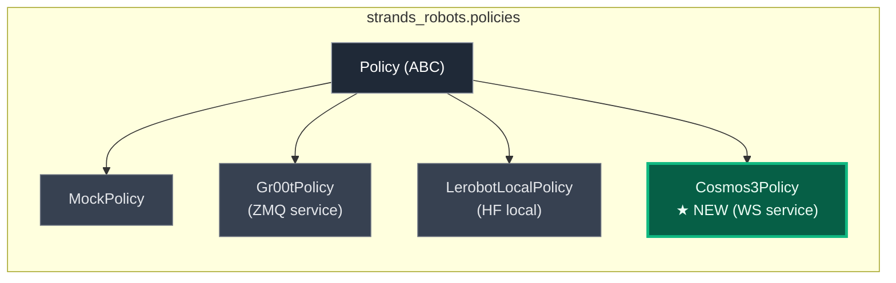
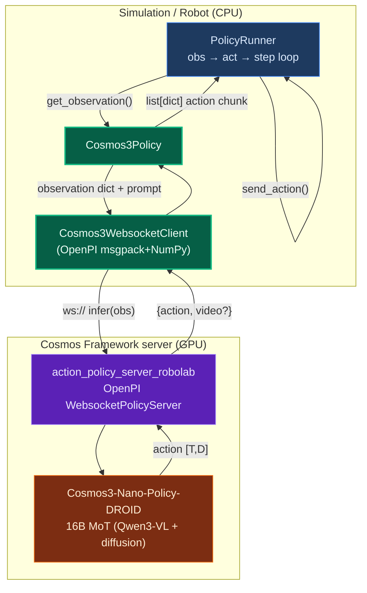
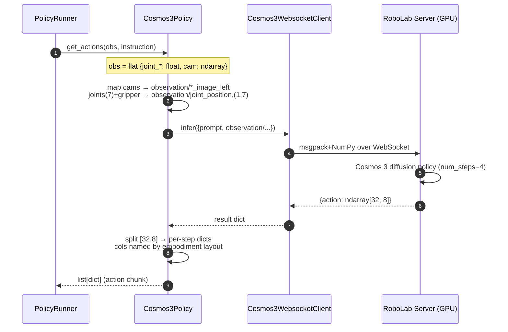
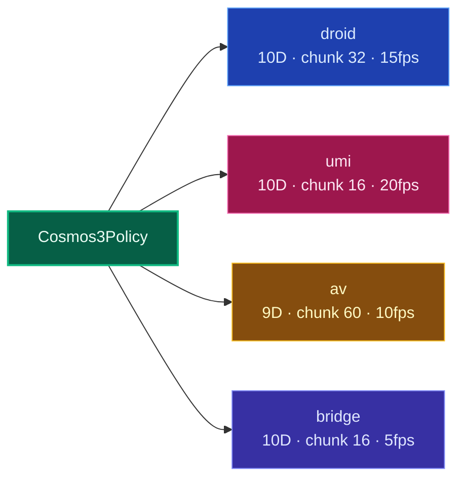
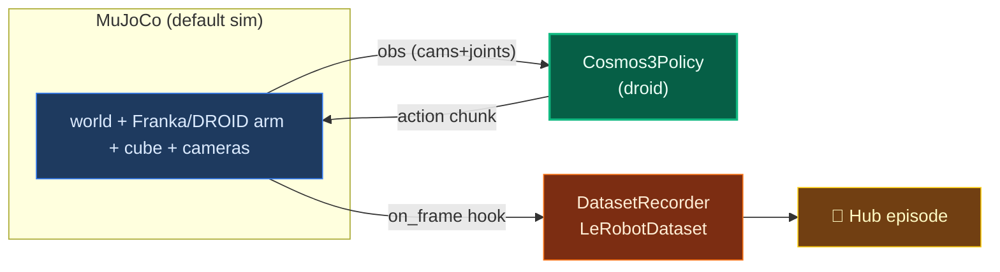
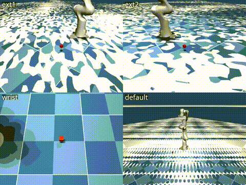

# feat(policy): NVIDIA Cosmos 3 omnimodal VLA policy provider

Adds **Cosmos 3** as a first-class policy provider in `strands_robots.policies`,
so `create_policy("cosmos3", ...)` returns a `Policy` that maps robot
observations → action chunks using NVIDIA's `Cosmos3-Nano-Policy-DROID`
vision-language robot policy — served locally via **Cosmos Framework** (pure
Python, **no NIM, no Docker required**).

> Cosmos 3 is an omnimodal world model. Its **Generator _action_ surface** (the
> `policy` mode: `image + instruction → action chunk + rollout video`) is, in
> effect, a VLA policy — a 1:1 fit for the robots `Policy` contract.

---

## 🧩 Where it fits



`Cosmos3Policy` mirrors `Gr00tPolicy`'s **service mode** exactly: the GPU model
lives in a server process; the policy is a thin client. For Cosmos 3 that
server is the framework's ready-made **RoboLab OpenPI WebSocket policy server**.

---

## 🔌 Runtime architecture



**Start the server** (once, holds the GPU):

```bash
# In a cosmos-framework checkout (uv sync --group=cu130-train --group=policy-server)
python -m cosmos_framework.scripts.action_policy_server_robolab \
    --checkpoint-path nvidia/Cosmos3-Nano-Policy-DROID --port 8000
# → ws://<host>:8000/   +   http://<host>:8000/healthz
```

---

## 🔁 Observation → action data flow



**Verified live** (`scratch/PHASE1_RESULTS.md`): the real server returns a
`(32, 8)` chunk = 32 steps × `[joint_0..joint_6, gripper]` from 3 cam frames +
7-DOF joint state + instruction. Warm latency ≈ **3.1 s/chunk**.

---

## 🤖 Available embodiments

Each maps a Cosmos 3 `domain_name` → action dim, chunk size, fps, and a named
action-column layout (so the policy emits per-actuator dicts, not opaque rows).

| Embodiment | `domain_name`          | Action dim | Chunk | FPS | Action space(s)        | Layout (named columns)                                  |
|------------|------------------------|:----------:|:-----:|:---:|------------------------|---------------------------------------------------------|
| **droid**  | `droid_lerobot`        | 10         | 32    | 15  | `joint_pos` (default), `midtrain` | `joint_pos`: `[joint_0..6, gripper]` (8D); `midtrain`: `[ee_x,y,z, qx,qy,qz,qw, gripper]` |
| **umi**    | `umi`                  | 10         | 16    | 20  | `midtrain`             | `[tx,ty,tz, r0..r5, grasp]` (9D pose Δ + grasp)         |
| **av**     | `av`                   | 9          | 60    | 10  | `midtrain`             | `[tx,ty,tz, r0..r5]` (ego pose, no gripper)             |
| **bridge** | `bridge_orig_lerobot`  | 10         | 16    | 5   | `midtrain`             | `[tx,ty,tz, r0..r5, grasp]`                             |

Aliases: `droid_lerobot`/`franka`/`robomind-franka` → `droid`,
`bridge_orig_lerobot` → `bridge`, `autonomous_vehicle` → `av`.



---

## 🚀 How to use (with strands-robots)

### 1. Construct the policy

```python
from strands_robots.policies import create_policy

# by provider name
policy = create_policy("cosmos3", embodiment="droid", host="localhost", port=8000)

# smart strings also resolve to cosmos3:
create_policy("cosmos3://localhost:8000")
create_policy("nvidia/Cosmos3-Nano-Policy-DROID")   # model-id → cosmos3
create_policy("c3")                                  # shorthand
```

### 2. Direct inference

```python
policy.set_robot_state_keys([f"joint_{i}" for i in range(7)] + ["gripper"])
chunk = policy.get_actions_sync(observation, "pick up the cube")
# chunk == [{"joint_0": .., ..., "gripper": ..}, ...]   # one dict per timestep
```

### 3. Map robot-specific camera/actuator names

```python
policy = create_policy(
    "cosmos3", embodiment="droid", port=8000,
    observation_mapping={
        "wrist":  "observation/wrist_image_left",
        "front":  "observation/exterior_image_1_left",
        "side":   "observation/exterior_image_2_left",
    },
    action_mapping={"joint_0": "shoulder_pan", "gripper": "grip"},
)
```

---

## 🕹️ Run in MuJoCo (default sim) + record DROID episodes

Because `Cosmos3Policy` is a standard `Policy`, it drops straight into the
`PolicyRunner` / `Simulation.run_policy` path — **including episode recording to
a LeRobotDataset**. This means you can generate teleop-free demonstrations
*from Cosmos 3 itself*.



```python
from strands_robots import Simulation

sim = Simulation(tool_name="sim", mesh=False)
sim.create_world()
sim.add_robot(name="arm", data_config="droid")           # Franka/DROID-like arm
sim.add_object(name="cube", shape="box", position=[0.4, 0.0, 0.05])
sim.add_camera(name="wrist",  position=[0.3, 0.0, 0.5], target=[0.4, 0, 0.05])
sim.add_camera(name="front",  position=[0.9, 0.0, 0.4], target=[0.4, 0, 0.05])
sim.add_camera(name="side",   position=[0.4, 0.6, 0.4], target=[0.4, 0, 0.05])

# Roll out Cosmos 3 in sim and record the episode as a LeRobotDataset.
sim.run_policy(
    robot_name="arm",
    policy_provider="cosmos3",
    policy_kwargs={
        "embodiment": "droid",
        "port": 8000,
        "observation_mapping": {
            "wrist": "observation/wrist_image_left",
            "front": "observation/exterior_image_1_left",
            "side":  "observation/exterior_image_2_left",
        },
    },
    instruction="pick up the red cube",
    n_steps=200,
    control_frequency=15.0,        # match the policy's training fps
    record={"repo_id": "you/cosmos3_droid_pick", "fps": 15},
)
```

> **Embodiment caveat:** `Cosmos3-Nano-Policy-DROID` emits a **DROID/Franka**
> action space (`joint_pos`: 7 joint targets + gripper). Drive a DROID/Franka-
> like arm in sim, or supply an `action_mapping` / IK shim for other arms.

---

## 🎥 Live results — real Cosmos 3 episodes recorded in MuJoCo

Recorded **on a single L40S** by rolling out the real
`nvidia/Cosmos3-Nano-Policy-DROID` policy server against a Franka/Panda arm in
MuJoCo, capturing 4 cameras to a **LeRobotDataset** and pushing to the Hub.

**📦 Dataset:** [`cagataydev/cosmos3-droid-mujoco`](https://huggingface.co/datasets/cagataydev/cosmos3-droid-mujoco)
— 3 episodes · 144 frames · 15 fps · 4 cameras (`wrist`, `ext1`, `ext2`, `default`)
· `observation.state` + `action` (8D joint_pos) · tasks: *"pick up the red cube"* (center/left/right).

**4-camera montage** (top: `ext1` · `ext2`, bottom: `wrist` · `default`):



**Montage MP4** (plays inline on GitHub):

https://github.com/cagataycali/robots/raw/feat/cosmos3-policy/docs/media/cosmos3/cosmos3_droid_montage.mp4

Full-resolution per-camera MP4s (`wrist`, `ext1`, `ext2`, `default`) ship with
the dataset on the Hub:
[`cagataydev/cosmos3-droid-mujoco/tree/main/videos`](https://huggingface.co/datasets/cagataydev/cosmos3-droid-mujoco/tree/main/videos).

**Reproduce** (server must be running — see *Runtime architecture*):

```bash
# scratch/mujoco_record_multi.py — 3 episodes, push to HF
python scratch/mujoco_record_multi.py cagataydev/cosmos3-droid-mujoco 3 48 push
```

> Per-episode wall-clock ≈ 19 s (48 control steps @ action_horizon 8 ⇒ 6 policy
> calls × ~3 s/chunk). The episodes are *teleop-free demonstrations generated by
> Cosmos 3 itself* — exactly the synthetic-data loop the Generator action
> surface is built for.

---

## 📦 What's in this PR

```
strands_robots/policies/cosmos3/
├── __init__.py        # exports Cosmos3Policy, embodiments, client
├── policy.py          # Cosmos3Policy(Policy): obs→server, action chunk→list[dict]
├── client.py          # Cosmos3WebsocketClient (thin OpenPI msgpack+NumPy client)
└── embodiments.py     # droid / umi / av / bridge specs + action layouts

strands_robots/registry/policies.json   # + "cosmos3" provider entry
strands_robots/policies/__init__.py      # export Cosmos3Policy
pyproject.toml                           # + [cosmos3-service] extra (openpi-client)

tests/policies/cosmos3/
├── test_embodiments.py   # 6 tests — specs, aliases, dims
├── test_policy.py        # 13 tests — contract, obs build, action unpack, mapping
└── test_registry.py      # 6 tests — registry, shorthands, smart strings, factory
```

**25 unit tests, all green** (no GPU, mocked client). A live client↔server
roundtrip through the real OpenPI wire (fake policy) is also verified.

---

## ✅ Verification

| Check | Status |
|-------|--------|
| `nvidia/Cosmos3-Nano-Policy-DROID` returns `(32, 8)` chunk on L40S | ✅ (Phase 1) |
| Real OpenPI client↔server roundtrip via `Cosmos3Policy` | ✅ |
| 25 unit tests (embodiments / policy / registry) | ✅ |
| `create_policy("cosmos3" \| "c3" \| "cosmos3://…" \| "nvidia/Cosmos3-…")` | ✅ |
| Imports stay safe without `openpi-client` (lazy in client) | ✅ |

## 📝 Notes / follow-ups
- **OpenPI client** is an optional extra: `pip install 'strands-robots[cosmos3-service]'`.
- **Guardrails**: the framework's guardrail model `nvidia/Cosmos-Guardrail1` is
  HF-gated; run the server with guardrails disabled (or request access).
- **Offline mode** (subprocess `cosmos_framework.scripts.inference
  model_mode=policy`, no server) is a planned follow-up for batch/repro.
- **MuJoCo recording** wiring shown above uses the existing `run_policy` +
  `DatasetRecorder` path; an end-to-end DROID-in-MuJoCo example is a follow-up.
