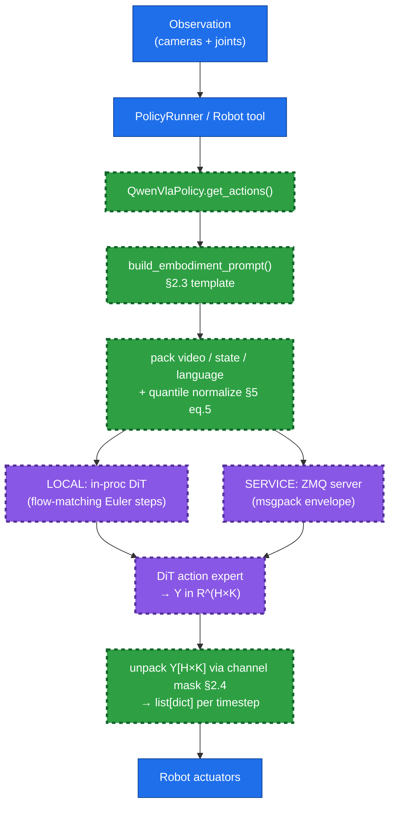
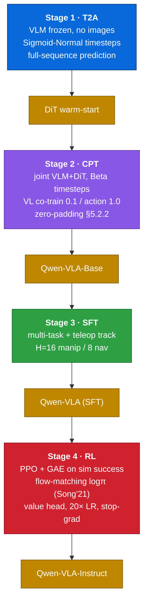
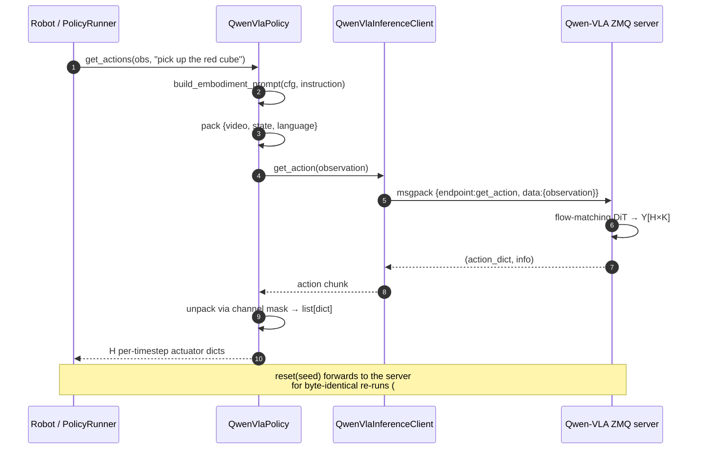
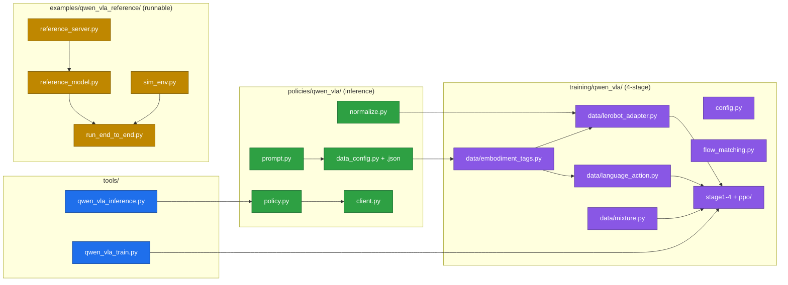

# Add Qwen-VLA: unified VLA policy provider + 4-stage training pipeline

> Feature branch: `feat/qwen-vla` → `main`
> Closes the **collect → tune → continue** loop for `strands-robots` by adding
> the **Qwen-VLA** unified vision-language-action model (Qwen Team,
> arXiv:2605.30280v2) as a first-class policy provider **and** wiring up its
> full 4-stage training recipe (T2A → CPT → SFT → RL).

---

## TL;DR

Qwen-VLA = Qwen3.5-4B VLM backbone + 1.15B-param DiT flow-matching action
expert, conditioned on an **embodiment-aware text prompt** (the sole
platform-specific interface). This PR ships it in two halves that mirror the
existing GR00T design:

1. **Inference provider** (`policies/qwen_vla/`) — deploy & run a Qwen-VLA
   checkpoint through `Robot()` / `PolicyRunner`, LOCAL or SERVICE (ZMQ).
2. **Training pipeline** (`strands_robots/training/qwen_vla/`) — the 4-stage
   recipe driven by data collected through this repo.

**Everything in this PR has been run end-to-end on an NVIDIA L40S** with a
runnable reference model (`examples/qwen_vla_reference/`): all 4 training
stages, both inference modes, and hot-swap redeploy. See
[Local verification](#local-verification).

- **156 tests** (144 unit + stub/e2e integration), ruff-clean, 0 regressions.

---

## 1. Architecture mapping

How Qwen-VLA slots into the existing stack — color-coded by layer:



**Key design decision:** the *embodiment prompt is THE interface.* Deploying to
a new robot = a new prompt (a new `QwenVlaDataConfig`), **not** a new model
head — exactly the paper's out-of-domain generalization property (§4).

---

## 2. The closed loop (collect → tune → continue)

This is the loop the PR enables, color-coded by phase:

```mermaid
flowchart LR
    classDef collect fill:#1f6feb,stroke:#0b3d91,color:#fff
    classDef train fill:#8957e5,stroke:#553098,color:#fff
    classDef deploy fill:#2ea043,stroke:#116329,color:#fff
    classDef store fill:#bf8700,stroke:#7a5800,color:#fff

    subgraph COLLECT["① COLLECT"]
        TELE["Teleop / sim rollouts"]:::collect
        REC["DatasetRecorder<br/>→ LeRobotDataset"]:::collect
    end

    subgraph TUNE["② TUNE (4-stage recipe)"]
        ADAPT["LeRobotAdapter<br/>→ (video,state,lang,Y,mask)"]:::store
        T2A["Stage 1 · T2A"]:::train
        CPT["Stage 2 · CPT<br/>→ Qwen-VLA-Base"]:::train
        SFT["Stage 3 · SFT"]:::train
        RL["Stage 4 · RL (PPO+GAE)<br/>→ Qwen-VLA-Instruct"]:::train
    end

    subgraph DEPLOY["③ CONTINUE / REDEPLOY"]
        CKPT["checkpoint .pt"]:::store
        SWAP["qwen_vla_train(action=hotswap)"]:::deploy
        SRV["Running QwenVlaPolicy SERVICE"]:::deploy
    end

    TELE --> REC --> ADAPT
    ADAPT --> T2A --> CPT --> SFT --> RL --> CKPT
    CKPT --> SWAP --> SRV
    SRV -. "new demos" .-> TELE
```



The dashed arrow is the loop closing: a redeployed policy drives more data
collection, which feeds the next tuning round — **no downtime, no restart.**

---

## 3. The 4-stage training recipe

Faithful to the paper (§3–4), with the timestep distribution and loss weights
the ablations recommend:



| Stage | Module | Timestep dist | Key knobs |
|---|---|---|---|
| 1 · T2A | `stage1_t2a.run_t2a` | Sigmoid-Normal | VLM frozen, no images |
| 2 · CPT | `stage2_cpt.run_cpt` | Beta | joint VLM+DiT, VL 0.1/action 1.0 |
| 3 · SFT | `stage3_sft.run_sft` | Beta | multi-task + teleop |
| 4 · RL  | `stage4_rl.run_rl`  | Beta | PPO γ0.99 λ0.95 ε0.2, value-LR 20× |

---

## 4. Inference data flow (SERVICE mode)



---

## 5. Component / file map



`registry/policies.json` registers `qwen_vla` (shorthands `qwen`, `qwen-vla`,
`qwenvla`); `pyproject.toml` adds `qwen-vla-service` / `qwen-vla` /
`qwen-vla-train` extras.

---

## 6. Local verification

Run on **NVIDIA L40S (46 GB)**, torch 2.6+cu124, transformers 4.57.

### Full closed loop (`examples/qwen_vla_reference/run_end_to_end.py`)

```
STAGE 1: T2A   final_loss = 0.8409   → t2a_warmstart.pt
STAGE 2: CPT   final_loss = 0.0169   → qwen_vla_base.pt   (Qwen-VLA-Base)
STAGE 3: SFT   final_loss = 0.6582   → qwen_vla_sft.pt
STAGE 4: RL    objective ≈ 0         → qwen_vla_instruct.pt (Instruct)
SERVICE inference: horizon=16, deterministic_reset=True, instruction_sensitive=True
LOCAL   inference: horizon=16
REDEPLOY hot-swap: status=success
ALL E2E ASSERTIONS PASSED   (wall time ≈ 8 s)
```

### PPO actually learns (value head → exogenous target)

```
value_mean @start = -0.055
iter  0: 10.49   iter 10: 0.76   iter 20: 0.46   iter 30: 0.90   iter 39: 0.963
value_mean @end   =  0.963        (target = 1.0)
```

The value head, trained under PPO+GAE with the clipped surrogate, converges
toward the exogenous reward target — a faithful (toy-scale) reproduction of
the Table-11 non-negative-transfer trend.

> The reference model (`examples/qwen_vla_reference/`) is a **small but genuine**
> Qwen-VLA architecture (VLM-style conditioning encoder + AdaLN DiT flow-matching
> action expert + stop-grad value head). It exists so the full pipeline is
> runnable **today**, before the upstream Qwen-VLA package / checkpoint is public
> (the only open risk, §6.2 of PLAN). When upstream ships, LOCAL mode swaps the
> loader; SERVICE mode already works against any server speaking the documented
> ZMQ envelope.

### Test summary

| Suite | Count | Status |
|---|---|---|
| Unit (`tests/test_qwen_vla_*.py`) | 144 | ✅ pass |
| Integration stub (`tests_integ/qwen_vla/test_qwen_vla_inference.py`) | 4 (+1 GPU skip) | ✅ pass |
| Integration e2e (`tests_integ/qwen_vla/test_qwen_vla_e2e.py`) | 1 GPU | ✅ pass (15.8 s) |
| ruff check + format | — | ✅ clean |
| Pre-existing repo failures touched | 0 | ✅ none |

Reproduce:

```bash
pip install -e '.[qwen-vla-train]'
python -m pytest tests/test_qwen_vla_*.py -q                 # unit
python -m pytest tests_integ/qwen_vla/ -q                    # integration (GPU)
python examples/qwen_vla_reference/run_end_to_end.py         # full closed loop
```

---

## 7. Conventions compliance (AGENTS.md)

- Python 3.12+, dependency bounds capped per policy; thin `__init__.py` exports.
- **Raise on fatal** / no silent zero-action defaults; `require_optional()` for
  torch/transformers/zmq; heavy deps gated behind extras + lazy imports.
- `validate_inputs()` allowlist on every `@tool` path (host metacharacters,
  loopback-only bind, traversal / protected-dir rejection — PR #90/#92 lessons).
- No emojis in tool results / logs; servers bind `127.0.0.1` by default.
- Each provider has integration tests with real inference (GPU-gated).
- `reset(seed=)` forwarding for reproducible eval/RL (#187 contract).

---

## 8. Files changed

```
strands_robots/policies/qwen_vla/    prompt, data_config(+json), normalize, client, policy, __init__
strands_robots/training/qwen_vla/    config, flow_matching, stage1-4, ppo/{rollout,logprob,value_head}
strands_robots/training/qwen_vla/data/  embodiment_tags, lerobot_adapter, language_action, mixture
strands_robots/tools/                qwen_vla_inference, qwen_vla_train (+ lazy registration)
strands_robots/registry/policies.json   qwen_vla provider entry
examples/qwen_vla_reference/         reference_model, reference_server, sim_env, run_end_to_end
tests/                               5 unit test modules (144 tests)
tests_integ/qwen_vla/                stub round-trip + GPU e2e
docs/qwen_vla.md                     usage + training guide
pyproject.toml                       qwen-vla[-service|-train] extras
```

---

## 9. Open questions / follow-ups (tracked on the project board)

1. **Upstream checkpoint/package** (§6.2 PLAN): wire the real loader into LOCAL
   mode once `Qwen/Qwen-VLA-*` + the inference package are public.
2. **Multi-GPU training** (DeepSpeed/FSDP) for the full-scale 4B+1.15B model.
3. **cuRobo** for higher-fidelity T2A goal trajectories (MuJoCo-IK fallback OK).
4. **RLinf** vs the in-repo PPO — decide on vendoring vs optional backend.
5. Validate the unified `K` is wide enough for the widest embodiment
   (dual-arm + dex hand).
