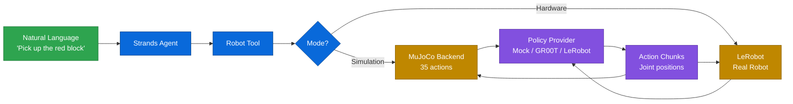

<div align="center">
  <div>
    <a href="https://strandsagents.com">
      
    </a>
  </div>

  <h1>
    Strands Robots
  </h1>

  <h2>
    Robot Control & Simulation for Strands Agents
  </h2>

  <div align="center">
    <a href="https://pypi.org/project/strands-robots/"></a>
    <a href="https://github.com/strands-labs/robots"></a>
    <a href="https://github.com/strands-labs/robots/blob/main/LICENSE"></a>
    <a href="https://mujoco.org"></a>
    <a href="https://github.com/NVIDIA/Isaac-GR00T"></a>
    <a href="https://github.com/huggingface/lerobot"></a>
  </div>
  
  <p>
    <a href="https://strandsagents.com/">Strands Docs</a>
    ◆ <a href="https://mujoco.org">MuJoCo</a>
    ◆ <a href="https://github.com/NVIDIA/Isaac-GR00T">NVIDIA GR00T</a>
    ◆ <a href="https://github.com/huggingface/lerobot">LeRobot</a>
    ◆ <a href="https://github.com/dusty-nv/jetson-containers">Jetson Containers</a>
  </p>
</div>

Control and simulate robots with natural language through [Strands Agents](https://github.com/strands-agents/sdk-python). Simulate 38 robots in MuJoCo, run policies, record LeRobot datasets, and deploy to real hardware — all from the same API.

## The 5-Line Promise

```python
from strands_robots import Robot
from strands import Agent

robot = Robot("so100")            # MuJoCo sim, auto-downloads assets
agent = Agent(tools=[robot])      # 35 simulation actions as AgentTool
agent("Pick up the red cube")     # Agent orchestrates sim via natural language
```

That's it. `Robot("so100")` auto-detects simulation mode, downloads the MJCF model from [MuJoCo Menagerie](https://github.com/google-deepmind/mujoco_menagerie), builds a physics scene with ground plane and lighting, and exposes 35 actions (step, render, run_policy, record, randomize, ...) as a Strands AgentTool.

## How It Works



## Installation

```bash
pip install strands-robots
```

### With simulation (MuJoCo)

```bash
pip install "strands-robots[sim]"
```

### With everything

```bash
pip install "strands-robots[all]"
```

| Extra | What it adds | When you need it |
|-------|-------------|------------------|
| `sim` | `mujoco`, `robot_descriptions`, `opencv`, `Pillow` | Simulation |
| `lerobot` | `lerobot>=0.5` | LeRobot policy inference + dataset recording |
| `groot-service` | `pyzmq`, `msgpack` | NVIDIA GR00T inference |
| `all` | All of the above | Full development |

## Quick Start

### Simulation (no hardware needed)

```python
from strands_robots import Robot

# Create simulation — auto-downloads robot model
sim = Robot("unitree_g1")

# Step physics
sim.step(n_steps=100)

# Render a frame
sim.render(width=640, height=480, save_path="/tmp/frame.png")

# Run a policy
sim.run_policy(
    robot_name="unitree_g1",
    policy_provider="mock",
    instruction="walk forward",
    duration=5.0,
    record_video="/tmp/g1_walk.mp4",
)

sim.destroy()
```

### Agent-Driven Simulation

```python
from strands_robots import Robot
from strands import Agent

robot = Robot("so100")
agent = Agent(tools=[robot])

# The agent figures out the tool calls
agent("""
1. Add a red box at [0.3, 0, 0.05]
2. Run mock policy for 3 seconds to pick it up
3. Record video to /tmp/demo.mp4
4. Show me the final state
""")
```

### Dataset Recording (LeRobot v3 format)

```python
from strands_robots import Robot

sim = Robot("so100")

# Start recording to LeRobot dataset
sim.start_recording(
    repo_id="my-org/so100-pick-cube",
    task="pick up the red cube",
    fps=30,
    root="/tmp/my_dataset",
)

# Run policy — frames auto-captured
sim.run_policy(
    robot_name="so100",
    policy_provider="mock",
    instruction="pick up the red cube",
    duration=5.0,
    fast_mode=True,
)

# Save episode
sim.stop_recording()
sim.destroy()

# Output: /tmp/my_dataset/
#   meta/info.json          — LeRobot v3 metadata
#   meta/tasks.parquet      — task descriptions
#   data/chunk-000/         — observation.state + action parquet
```

### Real Hardware

```python
from strands import Agent
from strands_robots import Robot, gr00t_inference

# Create robot with cameras
robot = Robot(
    tool_name="my_arm",
    robot="so101_follower",
    cameras={
        "front": {"type": "opencv", "index_or_path": "/dev/video0", "fps": 30},
        "wrist": {"type": "opencv", "index_or_path": "/dev/video2", "fps": 30},
    },
    port="/dev/ttyACM0",
    data_config="so100_dualcam",
)

agent = Agent(tools=[robot, gr00t_inference])

# Start GR00T inference
agent.tool.gr00t_inference(
    action="start",
    checkpoint_path="/data/checkpoints/model",
    port=8000,
    data_config="so100_dualcam",
)

# Natural language control
agent("Use my_arm to pick up the red block using GR00T policy on port 8000")
```

## Architecture

```
                    ┌──────────────────────────┐
                    │      Strands Agent        │
                    │   (natural language in)   │
                    └──────────┬───────────────┘
                               │
                    ┌──────────▼───────────────┐
                    │      Robot Factory        │
                    │  Robot("so100") dispatches│
                    └──────┬──────────┬────────┘
                           │          │
              ┌────────────▼──┐  ┌────▼────────────┐
              │  Simulation   │  │  HardwareRobot   │
              │  (MuJoCo)     │  │  (LeRobot)       │
              │  35 actions   │  │  real servos      │
              └──────┬────────┘  └────┬─────────────┘
                     │                │
              ┌──────▼────────────────▼────────┐
              │         Policy Layer           │
              │  mock │ groot │ lerobot_local  │
              └──────────────┬─────────────────┘
                             │
              ┌──────────────▼─────────────────┐
              │       Dataset Recorder         │
              │  LeRobot v3 parquet + video    │
              └────────────────────────────────┘
```

## Simulation Features

The MuJoCo simulation backend exposes **35 actions** as a Strands AgentTool:

| Category | Actions |
|----------|---------|
| **World** | `create_world`, `load_scene`, `reset`, `get_state`, `destroy` |
| **Robots** | `add_robot`, `remove_robot`, `list_robots`, `get_robot_state` |
| **Objects** | `add_object`, `remove_object`, `move_object`, `list_objects` |
| **Cameras** | `add_camera`, `remove_camera` |
| **Policies** | `run_policy`, `start_policy`, `stop_policy`, `eval_policy`, `replay_episode` |
| **Rendering** | `render`, `render_depth`, `open_viewer`, `close_viewer` |
| **Physics** | `step`, `set_gravity`, `set_timestep`, `get_contacts` |
| **Recording** | `start_recording`, `stop_recording`, `get_recording_status` |
| **Randomization** | `randomize` (colors, physics, lighting, cameras) |
| **Assets** | `list_urdfs`, `register_urdf`, `get_features` |

### Supported Robots (38 robots, 120+ aliases)

Any robot in the registry works in simulation. Assets auto-download from MuJoCo Menagerie on first use.

```python
from strands_robots import list_robots

# List all simulation-capable robots
for r in list_robots():
    print(f"{r['name']}: {r['description']}")
```

**Key robots tested**: `so100` (6-DOF arm), `unitree_g1` (30 joints), `panda` (Franka), `unitree_h1` (humanoid), `aloha` (bimanual).

### Domain Randomization

```python
sim.randomize(
    target="colors",      # or "physics", "lighting", "camera", "all"
    robot_name="so100",
)
```

### Policy Evaluation

```python
result = sim.eval_policy(
    robot_name="so100",
    policy_provider="mock",
    instruction="pick up the cube",
    num_episodes=10,
    max_steps_per_episode=200,
)
# Returns success rate, mean reward, per-episode stats
```

## Policy Providers

| Provider | Description | Requirements |
|----------|-------------|-------------|
| `mock` | Sinusoidal test actions | None |
| `groot` | NVIDIA GR00T N1.5/N1.6 | `[groot-service]` + inference container |
| `lerobot_local` | HuggingFace LeRobot direct inference | `[lerobot]` + model weights |

```python
from strands_robots.policies.factory import create_policy

# Mock (for testing — no deps)
policy = create_policy(provider="mock")

# GR00T (requires inference server)
policy = create_policy(provider="groot", host="localhost", port=8000, data_config="so100_dualcam")

# LeRobot local (direct inference)
policy = create_policy(provider="lerobot_local", policy_path="lerobot/act_so100_pick")
```

## Tools Reference

### Robot Tool (Simulation Mode)

When `Robot("name")` detects simulation mode, it creates a MuJoCo `Simulation` with 35 actions accessible via natural language or direct calls.

### Robot Tool (Hardware Mode)

| Action | Description |
|--------|-------------|
| `execute` | Blocking policy execution until complete |
| `start` | Non-blocking async start |
| `status` | Get current task status |
| `stop` | Emergency stop |

### GR00T Inference Tool

| Action | Description |
|--------|-------------|
| `start` | Start GR00T inference service (Docker) |
| `stop` | Stop inference service |
| `status` | Check service health |
| `list` | List running services |

<details>
<summary><b>TensorRT Acceleration</b></summary>

```python
agent.tool.gr00t_inference(
    action="start",
    checkpoint_path="/data/checkpoints/model",
    port=8000,
    use_tensorrt=True,
    trt_engine_path="gr00t_engine",
    vit_dtype="fp8",
    llm_dtype="nvfp4",
    dit_dtype="fp8",
)
```

</details>

### Additional Tools

| Tool | Description |
|------|-------------|
| `lerobot_camera` | Camera discovery, capture, recording (OpenCV + RealSense) |
| `lerobot_calibrate` | Motor calibration management |
| `lerobot_teleoperate` | Record demonstrations for imitation learning |
| `pose_tool` | Store, retrieve, execute named robot poses |
| `serial_tool` | Low-level Feetech servo communication |

<details>
<summary><b>🐳 Jetson Container Setup (for GR00T Inference)</b></summary>

GR00T inference requires the Isaac-GR00T Docker container on Jetson platforms:

```bash
git clone https://github.com/dusty-nv/jetson-containers
cd jetson-containers
jetson-containers run $(autotag isaac-gr00t) &
```

**Tested Hardware:**
- NVIDIA Thor Dev Kit (Jetpack 7.0)
- NVIDIA Jetson AGX Orin (Jetpack 6.x)

See [Jetson Deployment Guide](https://github.com/NVIDIA/Isaac-GR00T/blob/main/deployment_scripts/README.md) for TensorRT optimization.

</details>

## GR00T Data Configurations

| Config | Video Keys | Description |
|--------|------------|-------------|
| `so100` | `video.webcam` | Single camera setup |
| `so100_dualcam` | `video.front`, `video.wrist` | Front + wrist cameras |
| `so100_4cam` | `video.front`, `video.wrist`, `video.top`, `video.side` | Quad camera |
| `fourier_gr1_arms_only` | `video.ego_view` | Humanoid bimanual arms |
| `bimanual_panda_gripper` | 3 camera views | Dual Franka Emika arms |
| `unitree_g1` | `video.rs_view` | G1 humanoid platform |

## Development

```bash
git clone https://github.com/strands-labs/robots
cd robots

# Create environment
uv venv --python 3.12 .venv
source .venv/bin/activate

# Install with simulation + dev tools
uv pip install -e ".[sim,dev]"

# Run tests (34 tests, ~1s)
uv run pytest tests/ -v

# Lint
uv run ruff check .
uv run ruff format --check .
```

See [AGENTS.md](AGENTS.md) for detailed testing guide, manual E2E validation scripts, and contribution workflow.

## Contributing

We welcome contributions! Please see:
- [AGENTS.md](AGENTS.md) for development guidelines
- [GitHub Issues](https://github.com/strands-labs/robots/issues) for bug reports
- [Pull Requests](https://github.com/strands-labs/robots/pulls) for contributions
- [Project Board](https://github.com/orgs/strands-labs/projects/2) for planned work

## License

Apache-2.0 — see [LICENSE](LICENSE).

<div align="center">
  <a href="https://github.com/strands-labs/robots">GitHub</a>
  ◆ <a href="https://pypi.org/project/strands-robots/">PyPI</a>
  ◆ <a href="https://mujoco.org">MuJoCo</a>
  ◆ <a href="https://github.com/NVIDIA/Isaac-GR00T">NVIDIA GR00T</a>
  ◆ <a href="https://github.com/huggingface/lerobot">LeRobot</a>
  ◆ <a href="https://strandsagents.com/">Strands Docs</a>
</div>
