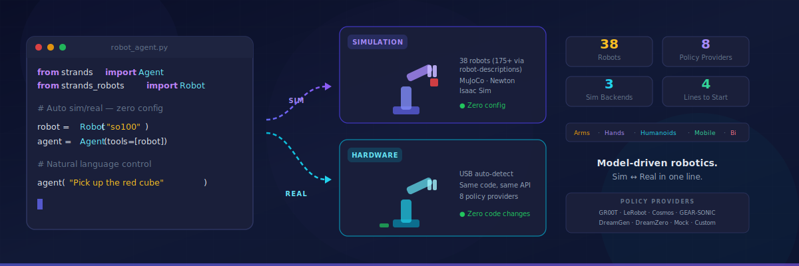
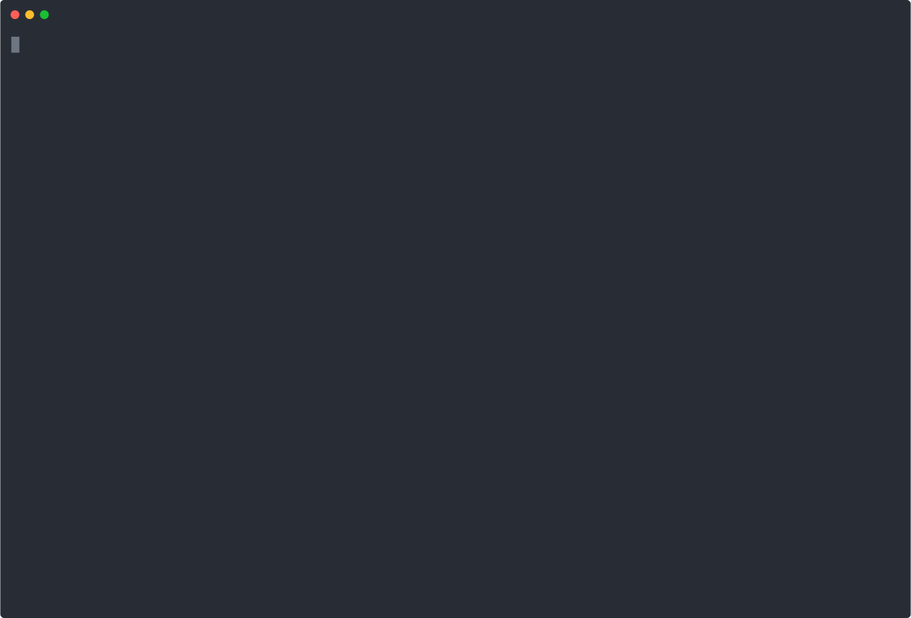

<div align="center">
  <div>
    <a href="https://strandsagents.com">
      
    </a>
  </div>

  <h1>
    Strands Robots
  </h1>

  <h2>
    A model-driven approach to building robot agents in just a few lines of code.
  </h2>

  <div align="center">
    <a href="https://github.com/strands-labs/robots/graphs/commit-activity"></a>
    <a href="https://github.com/strands-labs/robots/issues"></a>
    <a href="https://github.com/strands-labs/robots/pulls"></a>
    <a href="https://github.com/strands-labs/robots/blob/main/LICENSE"></a>
    <a href="https://pypi.org/project/strands-robots/"></a>
    <a href="https://python.org"></a>
  </div>

  <p>
    <a href="https://strands-labs.github.io/robots/">Documentation</a>
    ◆ <a href="https://github.com/strands-labs/robots/tree/main/samples">Examples</a>
    ◆ <a href="https://github.com/strands-agents/sdk-python">Strands SDK</a>
    ◆ <a href="https://github.com/strands-agents/tools">Tools</a>
    ◆ <a href="#policy-providers">Policies</a>
    ◆ <a href="#simulation">Simulation</a>
    ◆ <a href="docs/learning-path.md">🗺️ Learning Path</a>
  </p>
</div>

<div align="center">
  
</div>

<br/>

Strands Robots is a simple yet powerful SDK that takes a model-driven approach to building and running robot agents. From a tabletop arm picking up a cube to a humanoid navigating a warehouse, from MuJoCo simulation to real hardware deployment, Strands Robots scales with your needs.

## Feature Overview

- **Lightweight & Flexible**: One `Robot()` call that auto-detects sim or real hardware — no mode flags, no config files
- **Model Agnostic**: 8 policy providers — GR00T N1.6, LeRobot, Cosmos, GEAR-SONIC, DreamGen, DreamZero, and more
- **Sim ↔ Real**: A policy trained in simulation runs on real hardware with zero code changes
- **Built-in Strands**: Native [Strands Agent](https://github.com/strands-agents/sdk-python) integration — tell a robot what to do in plain English

## Quick Start

<div align="center">
  <a href="artifacts/quickstart.cast">
    
  </a>
  <br/>
  <sub>▶ Animated demo — <code>pip install "strands-robots[sim]"</code> → natural language robot control in 4 lines</sub>
</div>

```bash
pip install "strands-robots[sim]"
```

```python
from strands import Agent
from strands_robots import Robot

robot = Robot("so100")
agent = Agent(tools=[robot])
agent("Pick up the red cube")
```

That's it. Four lines from install to a robot arm grasping objects.

`Robot()` checks for USB hardware — if found, it controls the real robot. No hardware? It launches a MuJoCo simulation with the robot loaded. Same code, both worlds.

## Installation

Ensure you have Python 3.10+ installed, then:

```bash
pip install strands-robots            # Core (policies + real hardware)
pip install "strands-robots[sim]"       # + MuJoCo simulation (38 bundled robots, 175+ via robot-descriptions)
pip install "strands-robots[isaac]"     # + Isaac Sim/Lab (GPU-accelerated, NVIDIA only)
```

## Features at a Glance

### Smart Policy Resolution

Pass a model name — provider auto-detected:

```python
from strands_robots import create_policy

# HuggingFace model IDs — just paste them
policy = create_policy("lerobot/act_aloha_sim_transfer_cube_human")
policy = create_policy("openvla/openvla-7b")
policy = create_policy("microsoft/Magma-8B")

# Server addresses — protocol auto-detected
policy = create_policy("localhost:8080")       # → gRPC
policy = create_policy("ws://gpu:9000")        # → WebSocket
policy = create_policy("zmq://jetson:5555")    # → ZMQ (GR00T)
```

No provider names to memorize. No factory configuration. Just pass a string.

### Robot Factory

```python
from strands_robots import Robot

robot = Robot("so100")          # Auto sim/real
robot = Robot("unitree_g1")     # Humanoid
robot = Robot("aloha")          # Bimanual
robot = Robot("spot")           # Quadruped

# Force real hardware
robot = Robot("so100", mode="real",
    cameras={"front": {"type": "opencv", "index_or_path": "/dev/video0"}},
    port="/dev/ttyACM0")
```

38 robots ship in the box. Any name auto-resolves — `so100_dualcam` → `so100`, `libero_panda` → `panda`.

### DreamGen: Teach Once, Dream Many

Record one demonstration. Generate 50 variations per instruction. Train on the dreams.

```python
from strands_robots import DreamGenPipeline

pipeline = DreamGenPipeline(
    video_model="wan2.1",
    idm_checkpoint="nvidia/gr00t-idm-so100",
    embodiment_tag="so100",
)
results = pipeline.run_full_pipeline(
    robot_dataset_path="/data/pick_and_place",
    instructions=["pour water", "fold towel", "stack blocks"],
    num_per_prompt=50,
)
# 3 instructions × 50 variations = 150 training trajectories from 1 demo
```

### Training

```python
from strands_robots import create_trainer

# LeRobot (ACT, Pi0, Diffusion — any policy type)
trainer = create_trainer("lerobot",
    policy_type="act", dataset_repo_id="lerobot/so100_wipe")

# GR00T N1.6 fine-tuning
trainer = create_trainer("groot",
    base_model_path="nvidia/GR00T-N1.6-3B",
    dataset_path="/data/trajectories")

trainer.train()
```

## Simulation

Three backends. Same `Robot()` interface.

| | MuJoCo | Newton (GPU) | Isaac Sim |
|---|---|---|---|
| **Physics** | CPU, 1 env | GPU, Warp solver | GPU, 1–100K+ parallel |
| **Rendering** | Offscreen PNG | Ray tracing | RTX ray tracing |
| **Platform** | Mac / Linux / Win | Linux + NVIDIA | Linux + NVIDIA |

### Newton GPU Simulation

<table>
<tr>
<td align="center" width="33%">

https://github.com/strands-labs/robots/releases/download/sim-demos-v2/newton_unitree_g1.mp4

Unitree G1

</td>
<td align="center" width="33%">

https://github.com/strands-labs/robots/releases/download/sim-demos-v2/newton_unitree_h1.mp4

Unitree H1

</td>
<td align="center" width="33%">

https://github.com/strands-labs/robots/releases/download/sim-demos-v2/newton_unitree_go2.mp4

Unitree Go2

</td>
</tr>
<tr>
<td align="center">

https://github.com/strands-labs/robots/releases/download/sim-demos-v2/newton_panda.mp4

Franka Panda

</td>
<td align="center">

https://github.com/strands-labs/robots/releases/download/sim-demos-v2/newton_aloha.mp4

ALOHA

</td>
<td align="center">

https://github.com/strands-labs/robots/releases/download/sim-demos-v2/newton_fourier_n1.mp4

Fourier N1

</td>
</tr>
<tr>
<td align="center">

https://github.com/strands-labs/robots/releases/download/sim-demos-v2/newton_shadow_hand.mp4

Shadow Hand

</td>
<td align="center">

https://github.com/strands-labs/robots/releases/download/sim-demos-v2/newton_so100.mp4

SO-100

</td>
<td align="center">

https://github.com/strands-labs/robots/releases/download/sim-demos-v2/newton_spot.mp4

Spot

</td>
</tr>
</table>

<details>
<summary>Isaac Sim (RTX ray tracing)</summary>

<table>
<tr>
<td align="center" width="25%">

https://github.com/strands-labs/robots/releases/download/sim-demos-v2/isaac_g1.mp4

Unitree G1

</td>
<td align="center" width="25%">

https://github.com/strands-labs/robots/releases/download/sim-demos-v2/isaac_h1.mp4

Unitree H1

</td>
<td align="center" width="25%">

https://github.com/strands-labs/robots/releases/download/sim-demos-v2/isaac_go2.mp4

Unitree Go2

</td>
<td align="center" width="25%">

https://github.com/strands-labs/robots/releases/download/sim-demos-v2/isaac_franka.mp4

Franka Panda

</td>
</tr>
<tr>
<td align="center">

https://github.com/strands-labs/robots/releases/download/sim-demos-v2/isaac_spot.mp4

Spot

</td>
<td align="center">

https://github.com/strands-labs/robots/releases/download/sim-demos-v2/isaac_cassie.mp4

Cassie

</td>
<td align="center">

https://github.com/strands-labs/robots/releases/download/sim-demos-v2/isaac_shadow_hand.mp4

Shadow Hand

</td>
<td align="center">

https://github.com/strands-labs/robots/releases/download/sim-demos-v2/isaac_allegro.mp4

Allegro Hand

</td>
</tr>
</table>

</details>

### 38 Robots, Ready to Go

<details>
<summary>See all supported robots</summary>

| Category | Robots |
|----------|--------|
| **Arms** (16) | SO-100, SO-101, Koch v1.1, Franka Panda, FR3, UR5e, KUKA iiwa, Kinova Gen3, xArm 7, ViperX 300s, ARX L5, AgileX Piper, Unitree Z1, Enactic OpenArm, HOPE Jr, OMX |
| **Bimanual** (3) | ALOHA (2× ViperX), Trossen WidowX AI, Bi-OpenArm |
| **Hands** (3) | Shadow Dexterous Hand, LEAP Hand, Robotiq 2F-85 |
| **Humanoids** (8) | Fourier N1, Unitree G1, Unitree H1, Apptronik Apollo, Agility Cassie, Open Duck Mini V2, Reachy2, Asimov V0 |
| **Mobile** (6) | Unitree Go2, Unitree A1, Boston Dynamics Spot, Hello Robot Stretch 3, LeKiwi, EarthRover |
| **Mobile Manip** (1) | Google Robot |
| **Expressive** (1) | Reachy Mini |

</details>

## Policy Providers

8 providers, 21 aliases. Plugin-based registry with auto-discovery.

| Provider | Params | Best For |
|----------|--------|----------|
| [GR00T N1.6](docs/policies/groot.md) | 2–3B | NVIDIA foundation model — local or ZMQ service |
| [Cosmos Predict](docs/policies/cosmos-predict.md) | 2B/14B | World model policy — 98.5% on LIBERO |
| [GEAR-SONIC](docs/policies/gear-sonic.md) | 42M | Humanoid whole-body control @ 135Hz |
| [LeRobot](docs/policies/lerobot-local.md) | Varies | ACT, Pi0, SmolVLA, Diffusion — no server needed |
| [DreamGen](docs/policies/dreamgen.md) | Varies | Synthetic data from video world models |
| [DreamZero](docs/policies/dreamzero.md) | 14B | Zero-shot via video prediction |
| [OpenVLA](docs/policies/openvla.md) | 7B | Zero-shot manipulation (1M+ downloads) |
| [InternVLA](docs/policies/internvla.md) | 3B | RoboTwin, LIBERO benchmarks |
| [RDT](docs/policies/rdt.md) | 1B | Bimanual diffusion denoising |
| [Magma](docs/policies/magma.md) | 8B | Scene reasoning + action in one model |
| [OmniVLA](docs/policies/omnivla.md) | 7B | Mobile navigation, 9 modalities |
| [UniFolm](docs/policies/unifolm.md) | Varies | Unitree G1/H1/Go2 native |
| [Alpamayo](docs/policies/alpamayo.md) | 10B | Autonomous driving + reasoning |
| [RoboBrain](docs/policies/robobrain.md) | 3–32B | Embodied reasoning, scene memory |
| [GO-1](docs/policies/go1.md) | Varies | AgiBot open-weight VLA — 1M+ real trajectories |
| [CogACT](docs/policies/cogact.md) | Varies | Diffusion action trajectories |
| Mock | — | Testing & demos |
| [Custom](docs/policies/custom-policies.md) | — | Bring your own models |

```python
from strands_robots.policies import register_policy

register_policy("my_vla", lambda: MyPolicy, aliases=["custom"])
```

## 3D World Generation (Marble)

Generate photorealistic 3D environments from text, images, or video using the [World Labs Marble API](https://worldlabs.ai):

```python
from strands_robots import MarblePipeline

pipeline = MarblePipeline(api_key="wlt-...")
scene = pipeline.generate(prompt="a robotics workshop with metal shelving and tools")
# → SPZ Gaussian splats + GLB mesh + panorama + thumbnail + AI caption
```

8 built-in presets: `kitchen`, `office_desk`, `workshop`, `living_room`, `warehouse`, `lab_bench`, `outdoor_garden`, `restaurant`.

## Sim→Real (Cosmos Transfer)

Convert simulation recordings into photorealistic video using [NVIDIA Cosmos Transfer 2.5](https://github.com/NVIDIA/Cosmos-Transfer2):

```python
from strands_robots import CosmosTransferPipeline

pipeline = CosmosTransferPipeline(checkpoint_dir="/data/cosmos-transfer2-2.5")
pipeline.transfer(
    input_video="mujoco_recording.mp4",
    output_video="photorealistic.mp4",
    control_inputs=["depth"],  # depth, edge, segmentation, blur
)
```

MuJoCo/Newton provide ground-truth depth maps — no estimation needed.


## How It Works

```
"Pick up the red block"
        │
        ▼
   Strands Agent          ← natural language understanding
        │
        ▼
   Robot("so100")         ← auto-detects sim or real
        │
        ▼
   create_policy(...)     ← 8 providers, auto-resolved
        │
        ▼
   Processor Pipeline     ← normalize observations, unnormalize actions
        │
        ▼
   Joint Actions          ← 8–64 timesteps, executed on hardware
```

A policy trained in MuJoCo runs on real hardware with zero code changes. Same `Policy` ABC. Same `create_policy()`. Same prompts.

## Benchmarks

<details>
<summary>Policy inference latency — RTX 4090</summary>

| Provider | Latency | Hz | VRAM |
|----------|---------|-----|------|
| GEAR-SONIC (ONNX) | 7.4ms | 135 | 0.8 GB |
| GR00T N1.6 (local) | 12.5ms | 80 | 4.2 GB |
| Pi0 (LeRobot) | 38.7ms | 26 | 3.8 GB |
| ACT (LeRobot) | 45.3ms | 22 | 2.1 GB |
| Diffusion Policy | 67.4ms | 15 | 2.8 GB |
| OpenVLA | 85.2ms | 12 | 8.4 GB |

</details>

<details>
<summary>Newton GPU scaling — parallel envs</summary>

| Envs | L40S | A100 | RTX 4090 | Jetson Thor |
|------|------|------|----------|-------------|
| 16 | 8.5K | 6K | 7K | 3.5K |
| 256 | 85K | 62K | 72K | 34K |
| 4096 | 680K | 480K | 560K | 240K |

FPS — higher is better.

</details>

## Documentation

- [Quick Start Guide](https://strands-labs.github.io/robots/)
- [Examples](https://github.com/strands-labs/robots/tree/main/samples) — tabletop manipulation, bimanual, humanoid locomotion
- [Policy Providers](docs/policies/) — per-provider guides with config examples
- [Simulation](docs/simulation/) — MuJoCo, Newton, Isaac Sim
- [Training](docs/training/) — LeRobot, GR00T, DreamGen
- [Hardware Tools](docs/hardware/) — cameras, teleoperation, calibration, datasets
- [API Reference](docs/api-reference.md)

## 🗺️ Learning Path

> **New to strands-robots?** Follow our [progressive learning path](docs/learning-path.md) — a roadmap.sh-style guide from "what is this?" to "I'm contributing GPU backends" in ~6 hours.

```
🟢 EXPLORE          🟡 BUILD              🔴 SCALE              🟣 EVOLVE
Level 0: Concepts    Level 3: Simulation   Level 6: GPU Physics   Level 9: Contribute
Level 1: Hello Robot Level 4: NL Control   Level 7: Sim-to-Real
Level 2: Policies    Level 5: Data+Train   Level 8: Fleet Mgmt
━━━━━━━━━━━━━━━━━━━━━━━━━━━━━━━━━━━━━━━━━━━━━━━━━━━━━━━━━━━━━━━━━━━━━━━━━━
CPU only (~45 min)   CPU only (~90 min)    NVIDIA GPU (~90 min)   Any (~30 min)
```

Each level has a terminal walkthrough (`.cast` file), hands-on code, and checkpoints.

<details>
<summary>📼 Terminal Recordings (asciinema .cast files)</summary>

| Level | Cast File | Duration | What You'll See |
|-------|-----------|----------|-----------------|
| 0 | [`00_mental_model.cast`](artifacts/casts/00_mental_model.cast) | ~28s | Architecture overview, 4-layer diagram, key files |
| 1 | [`01_hello_robot.cast`](artifacts/casts/01_hello_robot.cast) | ~35s | `pip install` → `Robot("so100")` → observe → act → list 35 robots |
| 2 | [`02_policies.cast`](artifacts/casts/02_policies.cast) | ~40s | Smart resolution, mock policy, register custom provider |
| 3 | [`03_simulation.cast`](artifacts/casts/03_simulation.cast) | ~43s | Build scenes, spawn objects, cameras, domain randomization |
| 4 | [`04_agent_control.cast`](artifacts/casts/04_agent_control.cast) | ~18s | 4-line Agent demo, LLM orchestrating robot actions |
| 5 | [`05_data_training.cast`](artifacts/casts/05_data_training.cast) | ~36s | Record to LeRobotDataset, train ACT, DreamGen augmentation |
| 6 | [`06_gpu_backends.cast`](artifacts/casts/06_gpu_backends.cast) | ~23s | Newton 4096 parallel envs, Isaac Sim RTX rendering |
| 7 | [`07_sim_to_real.cast`](artifacts/casts/07_sim_to_real.cast) | ~30s | Zero code change deployment, Cosmos Transfer sim→real |
| 8 | [`08_fleet_mesh.cast`](artifacts/casts/08_fleet_mesh.cast) | ~23s | Zenoh P2P mesh, peer discovery, emergency stop |
| 9 | [`09_contributing.cast`](artifacts/casts/09_contributing.cast) | ~23s | Add robots, policies, repo structure overview |

**Play locally:** `asciinema play artifacts/casts/01_hello_robot.cast`
**Convert to MP4:** See [`remotion/README.md`](remotion/README.md) for Remotion-based video rendering.

</details>

See the [full learning path →](docs/learning-path.md)

## 🎓 Educational Curriculum

10 progressive samples from "Hello Robot" to autonomous repository analysis, following K12 universal learning format:

| Level | Samples | Hardware |
|-------|---------|----------|
| Elementary | [01 Hello Robot](samples/01_hello_robot/) • [02 Policy Playground](samples/02_policy_playground/) | CPU |
| Middle | [03 Build a World](samples/03_build_a_world/) • [04 Gymnasium Training](samples/04_gymnasium_training/) • [05 Data Collection](samples/05_data_collection/) | CPU |
| Advanced | [06 Ray-Traced Training](samples/06_raytraced_training/) • [07 GR00T Fine-Tuning](samples/07_groot_finetuning/) • [08 Sim-to-Real](samples/08_sim_to_real/) • [09 Multi-Robot Fleet](samples/09_multi_robot_fleet/) | GPU |
| Meta | [10 Autonomous Repo Case Study](samples/10_autonomous_repo_casestudy/) | CPU |

See the full [curriculum guide](samples/README.md) for details.
## Codebase Visualizations

Interactive visualizations of how the codebase evolved across 408 commits by 10+ contributors.

### 🎥 Repository Evolution (Gource)

https://github.com/strands-labs/robots/releases/download/sim-demos-v4-policy/strands_robots_gource.mp4

38-second animated history of every file change from Nov 2025 → Mar 2026.

### 📊 Code Age & Survival

<table>
<tr>
<td align="center" width="50%">


**Code Cohorts** — lines colored by when they were written

</td>
<td align="center" width="50%">


**Code Survival** — how quickly lines get replaced

</td>
</tr>
<tr>
<td align="center">


**Author Contributions** — who wrote what's still alive

</td>
<td align="center">


**Directory Growth** — package evolution over time

</td>
</tr>
</table>

### 🏗️ Architecture Diagrams

<details>
<summary>Internal Dependency Graph</summary>


Color-coded module dependencies — policies (red), newton (teal), isaac (blue), tools (green), telemetry (yellow), training (orange).

</details>

<details>
<summary>Package Diagram (PyReverse)</summary>


</details>

<details>
<summary>Import Dependency Graph (PyDeps)</summary>


</details>

<details>
<summary>Full Class Diagram (140 classes)</summary>


</details>

### 📈 Codebase Stats

| Metric | Value |
|--------|-------|
| **Files** | 89 Python modules |
| **Lines** | 44,791 |
| **Functions** | 1,063 |
| **Classes** | 140 |
| **Policy Providers** | 18 submodules |
| **Commits** | 408 |
| **Contributors** | 10+ (48% by autonomous agent 🤖) |

## Contributing ❤️

We welcome contributions! See [Issues](https://github.com/strands-labs/robots/issues) and [Pull Requests](https://github.com/strands-labs/robots/pulls).

## License

This project is licensed under the Apache License 2.0 — see the [LICENSE](LICENSE) file for details.

<div align="center">
  <br/>
  <sub>Built with <a href="https://strandsagents.com">Strands Agents</a></sub>
</div>
