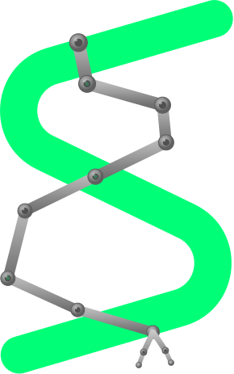
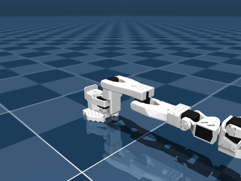
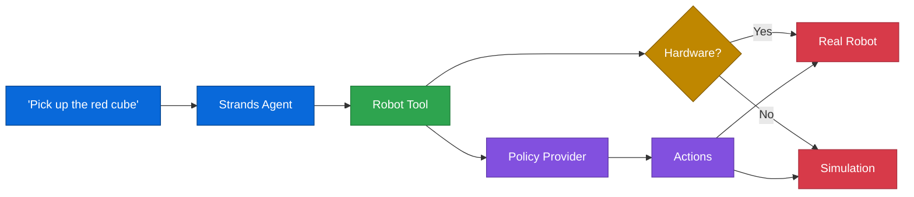
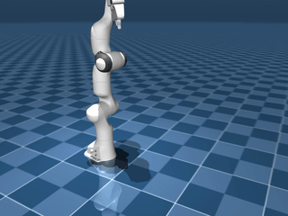
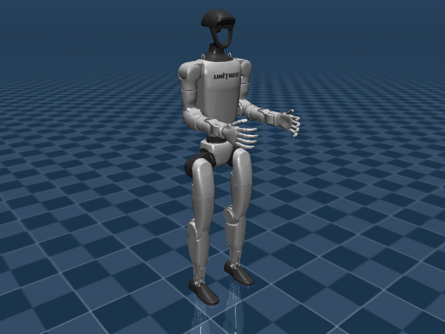
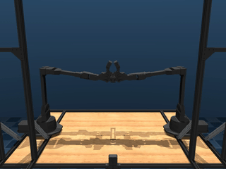
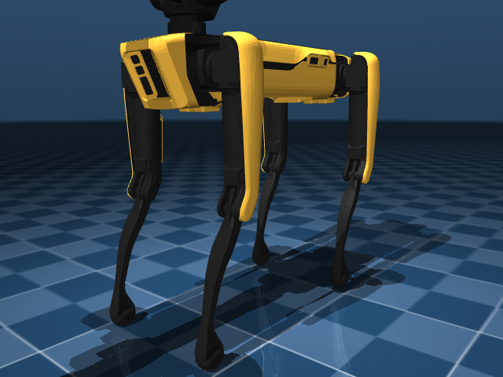
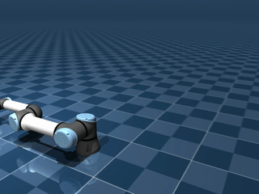
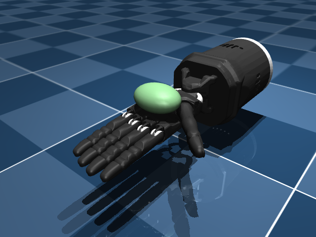

<div align="center">
  <div>
    <a href="https://strands-labs.github.io/robots">
      
    </a>
  </div>

  <h1>
    Strands Robots
  </h1>

  <h2>
    Build robot agents in a few lines of code.
  </h2>

  <div align="center">
    <a href="https://github.com/strands-labs/robots/graphs/commit-activity"></a>
    <a href="https://github.com/strands-labs/robots/issues"></a>
    <a href="https://github.com/strands-labs/robots/pulls"></a>
    <a href="https://github.com/strands-labs/robots/blob/main/LICENSE"></a>
    <a href="https://pypi.org/project/strands-robots/"></a>
    <a href="https://python.org"></a>
  </div>

  <p>
    <a href="https://strands-labs.github.io/robots">Documentation</a>
    ◆ <a href="https://github.com/strands-agents/sdk-python">Strands SDK</a>
    ◆ <a href="https://github.com/NVIDIA/Isaac-GR00T">NVIDIA GR00T</a>
    ◆ <a href="https://github.com/NVlabs/GR00T-WholeBodyControl">GEAR-SONIC</a>
    ◆ <a href="https://github.com/huggingface/lerobot">LeRobot</a>
    ◆ <a href="https://github.com/dusty-nv/jetson-containers">Jetson Containers</a>
  </p>
</div>

Strands Robots is a robotics SDK for [Strands Agents](https://github.com/strands-agents/sdk-python). Control 38 robots with natural language, run 8 policy providers, and switch between simulation and real hardware — all with the same code.

## Quick Start

```bash
pip install strands-robots
```

```python
from strands import Agent
from strands_robots import Robot

robot = Robot("so100")
agent = Agent(tools=[robot])
agent("Pick up the red cube")
```

`Robot()` auto-detects hardware. USB connected → real robot. No hardware → MuJoCo simulation. Same code, both worlds.

<div align="center">
  
  <br><em>SO-100 running ACT policy — <code>Robot("so100")</code> + <code>create_policy("lerobot/act_so100_test")</code></em>
</div>

> **Note**: For the default Amazon Bedrock model provider, you'll need AWS credentials configured and model access enabled. See the [Strands Quickstart](https://strandsagents.com/) for details on configuring other model providers.

## Installation

Ensure you have Python 3.12+ installed, then:

```bash
pip install strands-robots              # Core
pip install "strands-robots[mujoco]"    # + MuJoCo simulation
pip install "strands-robots[lerobot]"   # + LeRobot hardware
pip install "strands-robots[all]"       # Everything
```

From source:

```bash
git clone https://github.com/strands-labs/robots
cd robots
pip install -e ".[all]"
```

## Feature Overview

- **38 Robots**: Arms, humanoids, quadrupeds, bimanual — auto-resolved by name
- **8 Policy Providers**: GR00T, LeRobot, Cosmos, GearSonic, DreamGen and more
- **Sim ↔ Real**: MuJoCo, Newton GPU, Isaac Sim — same `Robot()` interface
- **Agent-Native**: Every capability is a Strands tool, composable with any agent
- **Training**: 6 trainers — LeRobot, GR00T, DreamGen IDM/VLA, Cosmos Predict/Transfer
- **DreamGen**: Record once, dream many — synthetic data augmentation

## How It Works



<div align="center">
  🔵 Agent &nbsp;→&nbsp; 🟢 Robot Tool &nbsp;→&nbsp; 🟡 Hardware Detection &nbsp;→&nbsp; 🟣 Policy &nbsp;→&nbsp; 🔴 Execution
</div>

## Robots

Any robot name auto-resolves from the registry:

```python
robot = Robot("so100")          # Tabletop arm
robot = Robot("unitree_g1")     # Humanoid
robot = Robot("aloha")          # Bimanual
robot = Robot("spot")           # Quadruped
robot = Robot("google_robot")   # Mobile manipulator
```

<div align="center">
  <table>
    <tr>
      <td align="center"><br><b>Panda</b></td>
      <td align="center"><br><b>Unitree G1</b></td>
      <td align="center"><br><b>ALOHA</b></td>
      <td align="center"><br><b>Spot</b></td>
    </tr>
    <tr>
      <td align="center"><br><b>UR5e</b></td>
      <td align="center"><br><b>Fourier N1</b></td>
      <td align="center"><br><b>Shadow Hand</b></td>
      <td align="center"><br><b>Cassie</b></td>
    </tr>
  </table>
</div>

<details>
<summary><b>Full robot list (38 robots)</b></summary>

| Category | Robots |
|----------|--------|
| **Arms** (16) | SO-100, SO-101, Koch v1.1, Franka Panda, FR3, UR5e, KUKA iiwa, Kinova Gen3, xArm 7, ViperX 300s, ARX L5, AgileX Piper, Unitree Z1, Enactic OpenArm, OMX, HOPE Jr |
| **Bimanual** (3) | ALOHA, Trossen WidowX AI, Bi-OpenArm |
| **Hands** (3) | Shadow Hand, LEAP Hand, Robotiq 2F-85 |
| **Humanoids** (8) | Fourier N1, Unitree G1, Unitree H1, Apptronik Apollo, Cassie, Reachy 2, Asimov V0, Open Duck Mini V2 |
| **Mobile** (7) | Unitree Go2, Unitree A1, Spot, Stretch 3, LeKiwi, EarthRover, Google Robot |
| **Expressive** (1) | Reachy Mini |

</details>

## Policies

8 providers. Pass a model name — auto-resolved:

```python
from strands_robots import create_policy

policy = create_policy("lerobot/act_aloha_sim_transfer_cube_human")  # HuggingFace ID
policy = create_policy("zmq://jetson:5555")                          # GR00T server
policy = create_policy("localhost:8080")                              # gRPC
policy = create_policy("mock")                                        # Testing
```

| Provider | What it does |
|----------|-------------|
| `groot` | NVIDIA GR00T N1.5/N1.6 — ZMQ or local GPU |
| `lerobot_local` | HuggingFace inference — ACT, Pi0, Pi0-FAST, SmolVLA, Wall-X, X-VLA, SARM, Diffusion Policy |
| `lerobot_async` | gRPC to LeRobot PolicyServer |
| `cosmos_predict` | NVIDIA Cosmos world model policy |
| `gear_sonic` | [NVIDIA GEAR-SONIC](https://github.com/NVlabs/GR00T-WholeBodyControl) humanoid whole-body control @ 135Hz |
| `dreamgen` | GR00T-Dreams IDM + VLA — teach once, dream many |
| `dreamzero` | Zero-shot via video world model |
| `mock` | Sinusoidal actions for testing |

Register your own:

```python
from strands_robots.policies import register_policy

register_policy("my_vla", lambda: MyPolicy, aliases=["custom"])
```

## Simulation

Three backends. Same `Robot()` interface:

| | MuJoCo | Newton (GPU) | Isaac Sim |
|---|---|---|---|
| **Physics** | CPU, 1 env | GPU, Warp solver | GPU, 1–100K+ parallel |
| **Platform** | Mac / Linux / Win | Linux + NVIDIA | Linux + NVIDIA |

```python
from strands_robots import Robot

# Robot() returns a MujocoBackend in sim mode
sim = Robot("so100")                                      # MuJoCo (default)
sim = Robot("so100", backend="newton", num_envs=4096)     # Newton GPU
sim = Robot("so100", backend="isaac", num_envs=4096)      # Isaac Sim
```

<div align="center">
  <table>
    <tr>
      <td align="center"><br><b>SO-100</b><br><code>Robot("so100")</code></td>
      <td align="center"><br><b>UR5e</b><br><code>Robot("ur5e")</code></td>
      <td align="center"><br><b>Stretch 3</b><br><code>Robot("stretch3")</code></td>
    </tr>
  </table>
</div>

> **macOS Interactive Viewer:** MuJoCo's interactive viewer window requires running under `mjpython` on macOS. Install with `pip install mujoco` then use `mjpython your_script.py` instead of `python`. Offscreen rendering (headless `render()`) works with standard `python` on all platforms.

## Training

6 trainers: `lerobot`, `groot`, `dreamgen_idm`, `dreamgen_vla`, `cosmos_predict`, `cosmos_transfer`.

```python
from strands_robots import create_trainer

trainer = create_trainer("lerobot",
    policy_type="act",
    dataset_repo_id="lerobot/so100_wipe",
)
trainer.train()
```

LeRobot 0.5.0+ features: PEFT/LoRA fine-tuning, Real-Time Chunking (RTC), EnvHub environments, and third-party policy plugins.

## DreamGen

Record one demonstration. Generate 50 variations. Train on dreams:

```python
from strands_robots.dreamgen import DreamGenPipeline

pipeline = DreamGenPipeline(
    video_model="wan2.1",
    idm_checkpoint="nvidia/gr00t-idm-so100",
    embodiment_tag="so100",
)
results = pipeline.run_full_pipeline(
    robot_dataset_path="/data/pick_and_place",
    instructions=["pour water", "fold towel"],
    num_per_prompt=50,
)
```

## GEAR-SONIC (Humanoid Whole-Body Control)

[GEAR-SONIC](https://github.com/NVlabs/GR00T-WholeBodyControl) is NVIDIA's humanoid behavior foundation model — 42M parameters, >135Hz whole-body control, trained on large-scale human motion data. It powers GR00T N1.5 and N1.6.

```python
from strands_robots import Robot, create_policy

robot = Robot("unitree_g1")
policy = create_policy("gear_sonic")

for step in range(1000):
    obs = robot.get_observation()
    actions = policy.get_actions(obs, instruction="walk forward")
    robot.apply_action(actions[0])
```

| Resource | Link |
|----------|------|
| Paper | [SONIC (arXiv:2511.07820)](https://arxiv.org/abs/2511.07820) |
| Models | [nvidia/GEAR-SONIC](https://huggingface.co/nvidia/GEAR-SONIC) |
| Docs | [GR00T-WholeBodyControl Docs](https://nvlabs.github.io/GR00T-WholeBodyControl/) |

## Tools

Every capability is a Strands tool — composable with any agent:

```python
from strands import Agent
from strands_robots import Robot, gr00t_inference, lerobot_camera, pose_tool

agent = Agent(tools=[Robot("so100"), gr00t_inference, lerobot_camera, pose_tool])
agent("Discover cameras, then pick up the red block using GR00T")
```

| Tool | What it does |
|------|-------------|
| `Robot` | Execute/start/stop/status — async robot control |
| `gr00t_inference` | Manage GR00T Docker inference services |
| `lerobot_camera` | Discover, capture, record, preview cameras |
| `teleoperator` | Record demonstrations for imitation learning |
| `lerobot_dataset` | Manage LeRobot datasets |
| `pose_tool` | Store, load, execute named robot poses |
| `serial_tool` | Low-level Feetech servo communication |
| `newton_sim` | Newton GPU simulation control |
| `stream` | Telemetry streaming |
| `stereo_depth` | Stereo depth estimation |
| `robot_mesh` | Zenoh P2P robot mesh networking |

## Optional Extras

```bash
pip install "strands-robots[mujoco]"           # MuJoCo simulation
pip install "strands-robots[lerobot]"          # LeRobot + Feetech servos
pip install "strands-robots[isaac]"            # Isaac Sim/Lab
pip install "strands-robots[newton]"           # Newton GPU physics
pip install "strands-robots[cosmos-transfer]"  # Sim→Real visual transfer
pip install "strands-robots[cosmos-predict]"   # World model policy
pip install "strands-robots[zenoh]"            # P2P robot mesh
pip install "strands-robots[policies]"         # All policy dependencies
pip install "strands-robots[all]"              # Everything
```

## Project Structure

```
strands_robots/
├── factory.py            # Robot("so100") auto-resolution (sim/real)
├── robot.py              # HardwareRobot AgentTool (real hardware via LeRobot)
├── policy_resolver.py    # Smart policy string resolution
├── policies/             # Policy ABC + 8 providers
│   ├── groot/            # NVIDIA GR00T
│   ├── lerobot_local/    # HuggingFace local inference
│   ├── lerobot_async/    # gRPC PolicyServer
│   ├── cosmos_predict/   # NVIDIA Cosmos
│   ├── gear_sonic/       # NVIDIA humanoid control
│   ├── dreamgen/         # Video world model augmentation
│   └── dreamzero/        # Zero-shot world action model
├── registry/             # JSON robot + policy definitions
├── mujoco/               # MuJoCo CPU simulation backend
├── training/             # 6 trainers (LeRobot, GR00T, DreamGen, Cosmos)
├── tools/                # 16+ Strands agent tools
├── isaac/                # Isaac Sim/Lab integration
├── newton/               # Newton GPU physics
├── dreamgen/             # DreamGen pipeline
├── cosmos_transfer/      # Cosmos Transfer 2.5 (sim→real)
├── telemetry/            # Streaming observability
└── zenoh_mesh.py         # P2P robot networking
```

## Contributing ❤️

We welcome contributions! See:

- [GitHub Issues](https://github.com/strands-labs/robots/issues) for bug reports & features
- [Pull Requests](https://github.com/strands-labs/robots/pulls) for contributions

## Security

See [CONTRIBUTING](CONTRIBUTING.md#security-issue-notifications) for more information.

## License

This project is licensed under the Apache License 2.0 - see the [LICENSE](LICENSE) file for details.

<div align="center">
  <sub>Built with <a href="https://strandsagents.com">Strands Agents</a></sub>
</div>
