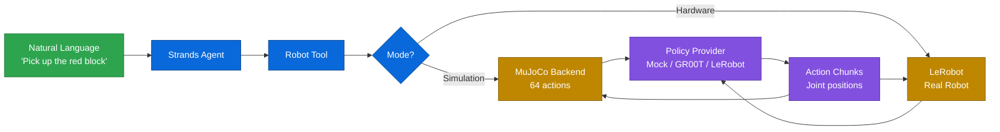

<div align="center">
  <div>
    <a href="https://strandsagents.com">
      
    </a>
  </div>

  <h1>
    Strands Robots
  </h1>

  <h2>
    Robot Control & Simulation for Strands Agents
  </h2>

  <div align="center">
    <a href="https://pypi.org/project/strands-robots/"></a>
    <a href="https://github.com/strands-labs/robots"></a>
    <a href="https://github.com/strands-labs/robots/blob/main/LICENSE"></a>
    <a href="https://mujoco.org"></a>
    <a href="https://github.com/NVIDIA/Isaac-GR00T"></a>
    <a href="https://github.com/huggingface/lerobot"></a>
  </div>
  
  <p>
    <a href="https://strandsagents.com/">Strands Docs</a>
    ◆ <a href="https://mujoco.org">MuJoCo</a>
    ◆ <a href="https://github.com/NVIDIA/Isaac-GR00T">NVIDIA GR00T</a>
    ◆ <a href="https://github.com/huggingface/lerobot">LeRobot</a>
    ◆ <a href="https://github.com/dusty-nv/jetson-containers">Jetson Containers</a>
  </p>
</div>

Control and simulate robots with natural language through [Strands Agents](https://github.com/strands-agents/sdk-python). Simulate 60+ robots in MuJoCo, run policies, record LeRobot datasets, and deploy to real hardware — all from the same API.

## The 5-Line Promise

```python
from strands_robots import Robot
from strands import Agent

robot = Robot("so100")            # MuJoCo sim, auto-downloads assets
agent = Agent(tools=[robot])      # 64 simulation actions as AgentTool
agent("Pick up the red cube")     # Agent orchestrates sim via natural language
```

That's it. `Robot("so100")` auto-detects simulation mode, downloads the MJCF model from [MuJoCo Menagerie](https://github.com/google-deepmind/mujoco_menagerie), builds a physics scene with ground plane and lighting, and exposes **64 actions** (step, render, run_policy, record, randomize, ...) as a Strands AgentTool.

## How It Works


```mermaid
graph LR
    A[Natural Language<br/>'Pick up the red block'] --> B[Strands Agent]
    B --> C[Robot Tool]
    C --> D{Mode?}
    D -->|Simulation| E[MuJoCo Backend<br/>64 actions]
    D -->|Hardware| F[LeRobot<br/>Real Robot]
    E --> G[Policy Provider<br/>Mock / GR00T / LeRobot]
    F --> G
    G --> H[Action Chunks<br/>Joint positions]
    H --> E
    H --> F

    classDef input fill:#2ea44f,stroke:#1b7735,color:#fff
    classDef agent fill:#0969da,stroke:#044289,color:#fff
    classDef policy fill:#8250df,stroke:#5a32a3,color:#fff
    classDef hardware fill:#bf8700,stroke:#875e00,color:#fff

    class A input
    class B,C,D agent
    class E,F hardware
    class G,H policy
```

## Installation

```bash
pip install strands-robots
```

### With simulation (MuJoCo)

```bash
pip install "strands-robots[sim-mujoco]"
```

### With everything

```bash
pip install "strands-robots[all]"
```

| Extra | What it adds | When you need it |
|-------|-------------|------------------|
| `sim` | `robot_descriptions` | Robot model descriptors (URDF/meshes) |
| `sim-mujoco` | `mujoco`, `imageio`, `imageio-ffmpeg` (includes `sim`) | MuJoCo simulation runtime |
| `lerobot` | `lerobot>=0.5` | LeRobot policy inference + dataset recording |
| `groot-service` | `pyzmq`, `msgpack` | NVIDIA GR00T inference |
| `mesh` | `eclipse-zenoh` | Peer-to-peer mesh networking |
| `all` | All of the above | Full development |

## Quick Start

### Simulation (no hardware needed)

```python
from strands_robots import Robot

# Create simulation — auto-downloads robot model
sim = Robot("unitree_g1")

# Step physics
sim.step(n_steps=100)

# Render a frame
frame = sim.render(width=640, height=480)  # returns dict with PNG bytes

# Run a policy
sim.run_policy(
    robot_name="unitree_g1",
    policy_provider="mock",
    instruction="walk forward",
    duration=5.0,
    video={"path": "/tmp/g1_walk.mp4", "fps": 30},
)

sim.destroy()
```

### Agent-Driven Simulation

```python
from strands_robots import Robot
from strands import Agent

robot = Robot("so100")
agent = Agent(tools=[robot])

# The agent figures out the tool calls
agent("""
1. Add a red box at [0.3, 0, 0.05]
2. Run mock policy for 3 seconds to pick it up
3. Record video to /tmp/demo.mp4
4. Show me the final state
""")
```

### Dataset Recording (LeRobot v3 format)

```python
from strands_robots import Robot

sim = Robot("so100")

# Start recording to LeRobot dataset
sim.start_recording(
    repo_id="my-org/so100-pick-cube",
    task="pick up the red cube",
    fps=30,
    root="/tmp/my_dataset",
)

# Run policy — frames auto-captured
sim.run_policy(
    robot_name="so100",
    policy_provider="mock",
    instruction="pick up the red cube",
    duration=5.0,
    fast_mode=True,
)

# Save episode
sim.stop_recording()
sim.destroy()

# Output: /tmp/my_dataset/
#   meta/info.json          — LeRobot v3 metadata
#   meta/tasks.parquet      — task descriptions
#   data/chunk-000/         — observation.state + action parquet
```

### Real Hardware

```python
from strands import Agent
from strands_robots import Robot, gr00t_inference

# Create robot with cameras (new-style factory API)
robot = Robot(
    "so101",
    mode="real",
    cameras={
        "front": {"type": "opencv", "index_or_path": "/dev/video0", "fps": 30},
        "wrist": {"type": "opencv", "index_or_path": "/dev/video2", "fps": 30},
    },
    data_config="so100_dualcam",
)

agent = Agent(tools=[robot, gr00t_inference])

# Start GR00T inference
agent.tool.gr00t_inference(
    action="start",
    checkpoint_path="/data/checkpoints/model",
    port=8000,
    data_config="so100_dualcam",
)

# Natural language control
agent("Use my_arm to pick up the red block using GR00T policy on port 8000")
```

## Architecture

```
                    ┌──────────────────────────┐
                    │      Strands Agent        │
                    │   (natural language in)   │
                    └──────────┬───────────────┘
                               │
                    ┌──────────▼───────────────┐
                    │      Robot Factory        │
                    │  Robot("so100") dispatches│
                    └──────┬──────────┬────────┘
                           │          │
              ┌────────────▼──┐  ┌────▼────────────┐
              │  Simulation   │  │  HardwareRobot   │
              │  (MuJoCo)     │  │  (LeRobot)       │
              │  64 actions   │  │  real servos      │
              └──────┬────────┘  └────┬─────────────┘
                     │                │
              ┌──────▼────────────────▼────────┐
              │         Policy Layer           │
              │  mock │ groot │ lerobot_local  │
              └──────────────┬─────────────────┘
                             │
              ┌──────────────▼─────────────────┐
              │       Dataset Recorder         │
              │  LeRobot v3 parquet + video    │
              └────────────────────────────────┘
```

## Mesh Networking

Every `Robot()` and `Simulation()` is automatically a peer on a peer-to-peer
[Zenoh](https://zenoh.io) mesh. Robots, simulations, and agents on the same
LAN discover each other with zero configuration; cross-network discovery
works through any Zenoh router or Cloudflare/Tailscale tunnel.

```python
from strands_robots import Robot

# Each Robot() auto-joins the mesh — no extra setup
sim_a = Robot("so100")          # process A
sim_b = Robot("so100")          # process B (same machine or remote)

print(sim_a.mesh.peers)         # discovers sim_b within ~1s
sim_a.mesh.tell(sim_b.mesh.peer_id, "pick up the cube")
sim_a.mesh.emergency_stop()     # broadcast E-STOP, audited to ~/.strands_robots/mesh_audit.jsonl
```

### What every peer publishes

```
strands/{peer_id}/presence       — 2 Hz heartbeat (peer discovery)
strands/{peer_id}/state          — 10 Hz joints / sim time / task status
strands/{peer_id}/cmd            — incoming RPC commands
strands/{peer_id}/response/{turn}— RPC replies (turn_id correlated)
strands/{peer_id}/stream         — VLA execution steps (publish_step)
strands/{peer_id}/pose           — SE(3) pose from SLAM/odometry/VIO
strands/{peer_id}/imu            — Roll/pitch/yaw, gyro, accel
strands/{peer_id}/odom           — Dead-reckoning odometry
strands/{peer_id}/health         — Battery, CPU, memory, temps
strands/{peer_id}/lidar/summary  — Point cloud stats
strands/{peer_id}/hand/{name}/state — End-effector joints / force
strands/{peer_id}/map/info       — Map metadata
strands/{peer_id}/input/{device} — Teleoperator action stream
strands/broadcast                — Fan-out RPC to every peer
```

Sensor topics auto-publish only when the host robot exposes the relevant
attribute (e.g. `robot._imu`, `robot._lidar_summary`) — zero cost when unused.

### Mesh-aware agent tool

The `robot_mesh` tool exposes the mesh to a Strands agent through 10 actions:

| Action | What it does |
|--------|--------------|
| `peers` | List local + remote peers |
| `status` | One-line mesh summary |
| `tell` | Natural-language instruction to a specific peer |
| `send` | Raw JSON RPC command to a peer |
| `broadcast` | Fan-out RPC to every peer |
| `stop` | Stop a single peer's running task |
| `emergency_stop` | Broadcast E-STOP (audited to disk) |
| `subscribe` | Subscribe to any Zenoh topic (wildcards supported) |
| `watch` | Watch another peer's VLA execution stream |
| `inbox` | Read buffered messages from a subscription |

```python
from strands import Agent
from strands_robots import Robot
from strands_robots.tools import robot_mesh

sim = Robot("so100")
agent = Agent(tools=[sim, robot_mesh])
agent("Find every robot on the mesh and ask each one to report its status")
```

### Teleoperation over the mesh

Stream a leader arm's joint positions to a follower on another machine via
`InputPublisher` / `InputReceiver`:

```python
from strands_robots.mesh import InputPublisher, InputReceiver

# Machine A — leader arm publishes at 50 Hz
leader = Robot("so100", mode="real")
pub = InputPublisher(leader.mesh, leader_teleoperator, device_name="leader")
pub.start()

# Machine B — follower receives + applies actions
follower = Robot("so100", mode="real")
rec = InputReceiver(follower.mesh, follower.robot, source_peer_id=leader.mesh.peer_id)
rec.start()
```

Topic schema for `strands/{peer_id}/input/{device}`:

```json
{
    "peer_id": "leader-a1b2c3d4",
    "device": "leader",
    "method": "arm",
    "t": 1736975234.123,
    "seq": 42,
    "action": {"shoulder.pos": 1.23, "elbow.pos": -0.5, "gripper.pos": 0.0},
    "events": {"terminate_episode": false}
}
```

### Safety: emergency stop with audit log

`mesh.emergency_stop()` broadcasts `{"action": "stop"}` to every peer and
appends a tamper-evident record to `~/.strands_robots/mesh_audit.jsonl`
(file mode `0o600`, parent dir `0o700`). Override the location with
`STRANDS_MESH_AUDIT_DIR`.

### Disable

| How | Scope |
|-----|-------|
| `STRANDS_MESH=false` | Process-wide kill switch |
| `Robot("so100", mesh=False)` | Per-robot opt-out |

Mesh networking requires the `[mesh]` extra (or `[all]`):

```bash
pip install "strands-robots[mesh]"
```

The base install (`pip install strands-robots`) does **not** include Zenoh.

## Simulation Features

The MuJoCo simulation backend exposes **64 actions** as a Strands AgentTool:

| Category | Actions |
|----------|---------|
| **World** | `create_world`, `load_scene`, `reset`, `get_state`, `destroy` |
| **Robots** | `add_robot`, `remove_robot`, `list_robots`, `get_robot_state` |
| **Objects** | `add_object`, `remove_object`, `move_object`, `list_objects` |
| **Cameras** | `add_camera`, `remove_camera` |
| **Policies** | `run_policy`, `start_policy`, `stop_policy`, `eval_policy`, `replay_episode` |
| **Rendering** | `render`, `render_depth`, `open_viewer`, `close_viewer` |
| **Physics** | `step`, `set_gravity`, `set_timestep`, `get_contacts` |
| **Recording** | `start_recording`, `stop_recording`, `get_recording_status` |
| **Randomization** | `randomize` (colors, physics, lighting, cameras) |
| **Assets** | `list_urdfs`, `register_urdf`, `get_features` |

### Supported Robots (60+ robots, 120+ aliases)

Any robot in the registry works in simulation. Assets auto-download from MuJoCo Menagerie on first use.

```python
from strands_robots import list_robots

# List all simulation-capable robots
for r in list_robots():
    print(f"{r['name']}: {r['description']}")
```

**Key robots tested**: `so100` (6-DOF arm), `unitree_g1` (30 joints), `panda` (Franka), `unitree_h1` (humanoid), `aloha` (bimanual).

### Domain Randomization

```python
sim.randomize(
    target="colors",      # or "physics", "lighting", "camera", "all"
    robot_name="so100",
)
```

### Policy Evaluation

```python
result = sim.eval_policy(
    robot_name="so100",
    policy_provider="mock",
    instruction="pick up the cube",
    num_episodes=10,
    max_steps_per_episode=200,
)
# Returns success rate, mean reward, per-episode stats
```

## Policy Providers

| Provider | Description | Requirements |
|----------|-------------|-------------|
| `mock` | Sinusoidal test actions | None |
| `groot` | NVIDIA GR00T N1.5/N1.6 | `[groot-service]` + inference container |
| `lerobot_local` | HuggingFace LeRobot direct inference | `[lerobot]` + model weights |

```python
from strands_robots.policies.factory import create_policy

# Mock (for testing — no deps)
policy = create_policy(provider="mock")

# GR00T (requires inference server)
policy = create_policy(provider="groot", host="localhost", port=8000, data_config="so100_dualcam")

# LeRobot local (direct inference)
policy = create_policy(provider="lerobot_local", policy_path="lerobot/act_so100_pick")
```

## Tools Reference

### Robot Tool (Simulation Mode)

When `Robot("name")` detects simulation mode, it creates a MuJoCo `Simulation` with 64 actions accessible via natural language or direct calls.

### Robot Tool (Hardware Mode)

| Action | Description |
|--------|-------------|
| `execute` | Blocking policy execution until complete |
| `start` | Non-blocking async start |
| `status` | Get current task status |
| `stop` | Emergency stop |

### GR00T Inference Tool

| Action | Description |
|--------|-------------|
| `start` | Start GR00T inference service (Docker) |
| `stop` | Stop inference service |
| `status` | Check service health |
| `list` | List running services |

<details>
<summary><b>TensorRT Acceleration</b></summary>

```python
agent.tool.gr00t_inference(
    action="start",
    checkpoint_path="/data/checkpoints/model",
    port=8000,
    use_tensorrt=True,
    trt_engine_path="gr00t_engine",
    vit_dtype="fp8",
    llm_dtype="nvfp4",
    dit_dtype="fp8",
)
```

</details>

### Additional Tools

| Tool | Description |
|------|-------------|
| `lerobot_camera` | Camera discovery, capture, recording (OpenCV + RealSense) |
| `lerobot_calibrate` | Motor calibration management |
| `lerobot_teleoperate` | Record demonstrations for imitation learning |
| `pose_tool` | Store, retrieve, execute named robot poses |
| `serial_tool` | Low-level Feetech servo communication |

<details>
<summary><b>🐳 Jetson Container Setup (for GR00T Inference)</b></summary>

GR00T inference requires the Isaac-GR00T Docker container on Jetson platforms:

```bash
git clone https://github.com/dusty-nv/jetson-containers
cd jetson-containers
jetson-containers run $(autotag isaac-gr00t) &
```

**Tested Hardware:**
- NVIDIA Thor Dev Kit (Jetpack 7.0)
- NVIDIA Jetson AGX Orin (Jetpack 6.x)

See [Jetson Deployment Guide](https://github.com/NVIDIA/Isaac-GR00T/blob/main/deployment_scripts/README.md) for TensorRT optimization.

</details>

## GR00T Data Configurations

| Config | Video Keys | Description |
|--------|------------|-------------|
| `so100` | `video.webcam` | Single camera setup |
| `so100_dualcam` | `video.front`, `video.wrist` | Front + wrist cameras |
| `so100_4cam` | `video.front`, `video.wrist`, `video.top`, `video.side` | Quad camera |
| `fourier_gr1_arms_only` | `video.ego_view` | Humanoid bimanual arms |
| `bimanual_panda_gripper` | 3 camera views | Dual Franka Emika arms |
| `unitree_g1` | `video.rs_view` | G1 humanoid platform |

## Development

```bash
git clone https://github.com/strands-labs/robots
cd robots

# Create environment
uv venv --python 3.12 .venv
source .venv/bin/activate

# Install with simulation + dev tools
uv pip install -e ".[sim,dev]"

# Run tests (34 tests, ~1s)
uv run pytest tests/ -v

# Lint
uv run ruff check .
uv run ruff format --check .
```

See [AGENTS.md](AGENTS.md) for detailed testing guide, manual E2E validation scripts, and contribution workflow.

## Configuration

### Environment Variables

| Variable | Description | Default |
|----------|-------------|---------|
| `STRANDS_ASSETS_DIR` | Custom directory for robot model assets (MJCF, meshes) | `~/.strands_robots/assets/` |
| `STRANDS_ROBOT_MODE` | Default mode for `Robot()` factory: `sim` / `real` / `auto` | `sim` |
| `STRANDS_TRUST_REMOTE_CODE` | Allow downloading + executing model code | `false` |
| `MUJOCO_GL` | GL backend for the MuJoCo renderer | auto |
| `GROOT_API_TOKEN` | API token for GR00T inference service | - |
| `STRANDS_MESH` | Set to `false` to disable Zenoh mesh networking globally | `true` |
| `STRANDS_MESH_PORT` | TCP port for the local Zenoh router (validated, falls back to default on bad input) | `7447` |
| `ZENOH_CONNECT` | Comma-separated remote Zenoh endpoints to connect to | - |
| `ZENOH_LISTEN` | Comma-separated endpoints for the local listener | - |
| `STRANDS_MESH_AUDIT_DIR` | Directory for the safety audit log `mesh_audit.jsonl` | `~/.strands_robots/` |
| `STRANDS_MESH_POSE_HZ` | Pose-loop frequency (0 disables) | `10.0` |
| `STRANDS_MESH_IMU_HZ` | IMU-loop frequency (0 disables) | `10.0` |
| `STRANDS_MESH_ODOM_HZ` | Odometry-loop frequency (0 disables) | `10.0` |
| `STRANDS_MESH_HEALTH_HZ` | Health-loop frequency (0 disables) | `0.5` |
| `STRANDS_MESH_LIDAR_SUMMARY_HZ` | LiDAR summary frequency | `5.0` |
| `STRANDS_MESH_LIDAR_STATE_HZ` | LiDAR state frequency | `1.0` |
| `STRANDS_MESH_HAND_HZ` | End-effector state frequency | `50.0` |
| `STRANDS_MESH_MAP_INFO_HZ` | Map metadata frequency | `0.2` |
| `STRANDS_MESH_CAMERA_HZ` | Camera-frame publish rate (0 disables; opt-in) | `0` |
| `STRANDS_LIBERO_ACTION_LOG` | Set to `1` to emit per-step diagnostic logs from the LIBERO OSC controller (action keys, delta scale, EEF tracking, gripper polarity, qpos/ctrl deltas). Logs the first N steps per episode. | unset |
| `STRANDS_LIBERO_ACTION_LOG_MAX` | Max number of `apply()` calls to log per episode when `STRANDS_LIBERO_ACTION_LOG=1`. | `50` |
| `STRANDS_LIBERO_STATE_LOG` | Set to `1` to emit per-step diagnostic logs of the state values (`state.x/y/z/roll/pitch/yaw/gripper`) the LIBERO adapter feeds to the GR00T policy. Pairs with `STRANDS_LIBERO_ACTION_LOG` for end-to-end interface bisection. | unset |
| `STRANDS_LIBERO_STATE_LOG_MAX` | Max number of `augment_observation()` calls to log per episode when `STRANDS_LIBERO_STATE_LOG=1`. | `50` |
| `STRANDS_GROOT_WIRE_LOG` | Path to a directory where `Gr00tPolicy` will dump pre-inference observations + post-inference action chunks as pickle files (one per `get_actions` call, named `{local,service}_call{N:04d}.pkl`). Used by the #187 bisection plan to verify whether LOCAL and SERVICE inference paths send byte-identical observations to the model. Run an eval once with each mode into the same dir, then `np.allclose` matching files. | unset |
| `STRANDS_GROOT_WIRE_LOG_MAX_CALLS` | Cap on number of wire-payload dumps per process when `STRANDS_GROOT_WIRE_LOG` is set. Prevents multi-GB pickle archives on long evals. The first few calls are enough to bisect a divergence. | `10` |

### Mesh Networking

Every `Robot()` and `Simulation()` constructed in a process is automatically a
peer on the local Zenoh mesh — no manual setup required.  Peers on the same
LAN discover each other via Zenoh multicast scouting, and a single
process-wide `zenoh.Session` is shared (ref-counted) across every robot or
simulation in the same Python process.

```python
from strands_robots import Robot
sim_a = Robot("so100")          # auto-joins the mesh as a peer
sim_b = Robot("so100")          # second peer in another process
print(sim_a.mesh.peers)         # discovers sim_b
sim_a.mesh.tell(sim_b.mesh.peer_id, "pick up the cube")
sim_a.mesh.emergency_stop()     # broadcast E-STOP, audited to disk
```

Disable globally with `STRANDS_MESH=false` or per-robot with
`Robot("so100", mesh=False)`.  Install the optional dependency with
`pip install strands-robots[mesh]`.

### Cache Directory

Robot model assets (MJCF XML files and meshes) are cached in:

```
~/.strands_robots/
└── assets/           # Downloaded robot models (from robot_descriptions / MuJoCo Menagerie)
    ├── trs_so_arm100/
    ├── franka_emika_panda/
    └── ...
```

To clear the cache: `rm -rf ~/.strands_robots/assets/`

To change the cache location: `export STRANDS_ASSETS_DIR=/path/to/custom/dir`

## Simulation (MuJoCo)

`strands-robots` ships a MuJoCo-backed simulation AgentTool — 64 actions
exposed to any Strands agent for world composition, physics, policy
execution, and video/dataset recording.

### Install

```bash
pip install "strands-robots[sim-mujoco]"
# For LeRobotDataset recording (parquet + training data):
pip install "strands-robots[sim-mujoco,lerobot]"
```

### Quick start

```python
from strands_robots.simulation import Simulation

sim = Simulation(tool_name="sim", mesh=False)
sim.create_world()
sim.add_robot(name="arm", data_config="so100")
sim.add_object(name="cube", shape="box", position=[0.3, 0, 0.05])
sim.add_camera(name="topdown", position=[0, 0, 1.5], target=[0, 0, 0])

sim.run_policy(robot_name="arm", policy_provider="mock", n_steps=200,
               control_frequency=50.0, fast_mode=True)

frame = sim.render(camera_name="topdown")  # returns {status, content:[text, image]}
```

### 64 actions grouped

- **World & objects**: `create_world`, `load_scene`, `add_robot`,
  `add_object`, `move_object`, `list_objects`, `list_robots`,
  `remove_robot`, `remove_object`, `destroy`, `reset`, `get_state`,
  `save_state`, `load_state`, `list_checkpoints`.
- **Physics**: `step`, `set_timestep`, `set_gravity`, `apply_force`,
  `raycast`, `multi_raycast`, `set_body_properties`,
  `set_geom_properties`, `get_body_state`, `get_joint_state`,
  `set_joint_positions`, `set_joint_velocities`, `forward_kinematics`,
  `get_mass_matrix`, `inverse_dynamics`, `get_total_mass`,
  `get_jacobian`, `get_energy`, `get_contacts`, `get_sensor_data`.
- **Cameras & rendering**: `add_camera`, `remove_camera`, `render`,
  `render_depth`, `render_all`, `start_cameras_recording`,
  `stop_cameras_recording`, `get_cameras_recording_status`.
- **Policy**: `start_policy`, `run_policy`, `stop_policy`,
  `replay_episode`, `eval_policy`.
- **Randomization**: `randomize`.
- **Recording (LeRobotDataset)**: `start_recording`, `stop_recording`,
  `get_recording_status`.
- **Introspection & util**: `get_features`, `list_urdfs`, `register_urdf`,
  `export_xml`, `open_viewer`, `close_viewer`.

### Common footguns

- **Planes must be static.** `add_object(shape="plane")` auto-sets
  `is_static=True`. Passing `is_static=False` on a plane is a hard error
  (MuJoCo planes are infinite and can't have dynamic mass).
- **Camera orientation.** Pass `target=[x,y,z]` to look at a point -
  without it the camera faces forward by default. `target == position`
  errors.
- **MP4 vs dataset recording.** `start_cameras_recording` writes plain
  MP4 per-camera and runs under `[sim-mujoco]` alone. `start_recording`
  writes a LeRobotDataset (parquet + MP4 + schema) and requires the
  `[lerobot]` extra.
- **Policy running → mutations blocked.** While a policy runs on any
  robot, state-mutating actions (`reset`, `set_gravity`, joint setters,
  `apply_force`, `set_body_properties`, `set_geom_properties`,
  `load_state`, `randomize`, `move_object`) error with *"Cannot 'X'
  while a policy is running."* Stop it first with
  `stop_policy(robot_name='...')`.
- **Horizon parameters.** `run_policy` accepts either `duration` +
  `control_frequency` (real-time) OR `n_steps` + `control_frequency`
  (step-count). Pass `fast_mode=True` to skip the between-step sleep
  during batch eval / data collection.
- **Name collisions.** Objects, bodies, robots, and cameras share the
  MuJoCo name table. Robot joints and actuators are auto-namespaced as
  `{robot_name}/{joint}` in multi-robot scenes. Object geoms are
  injected as `{object_name}_geom`; `set_geom_properties` accepts the
  bare object name as an alias.
- **Oversized render**: MuJoCo's offscreen framebuffer is capped by
  `<global offwidth="W" offheight="H"/>` in MJCF. Requesting a bigger
  render now errors with a plain message naming the cap - either lower
  the request or rebuild the model with larger dims.

### Self-healing features

- Unknown parameters are rejected with *"Unknown parameter X for action
  Y. Valid: [...]"* so the LLM learns the correct name without trial-
  and-error.
- Missing required parameters produce *"Action X requires parameter Y."*
  (no Python `TypeError` leaks).
- Vector dimensions and numeric dtype are validated before MuJoCo sees
  them (previously zero-length direction vectors crashed the Python
  process via `mj_ray` C-level abort).
- `destroy()` and `cleanup()` empty the renderer TLS cache and shut down
  the executor - no RSS growth across repeated create/destroy cycles.

For the full action contract and test coverage see
`tests/simulation/mujoco/test_agenttool_contract.py`.

## Contributing

We welcome contributions! Please see:
- [AGENTS.md](AGENTS.md) for development guidelines
- [GitHub Issues](https://github.com/strands-labs/robots/issues) for bug reports
- [Pull Requests](https://github.com/strands-labs/robots/pulls) for contributions
- [Project Board](https://github.com/orgs/strands-labs/projects/2) for planned work

## License

Apache-2.0 — see [LICENSE](LICENSE).

<div align="center">
  <a href="https://github.com/strands-labs/robots">GitHub</a>
  ◆ <a href="https://pypi.org/project/strands-robots/">PyPI</a>
  ◆ <a href="https://mujoco.org">MuJoCo</a>
  ◆ <a href="https://github.com/NVIDIA/Isaac-GR00T">NVIDIA GR00T</a>
  ◆ <a href="https://github.com/huggingface/lerobot">LeRobot</a>
  ◆ <a href="https://strandsagents.com/">Strands Docs</a>
</div>
