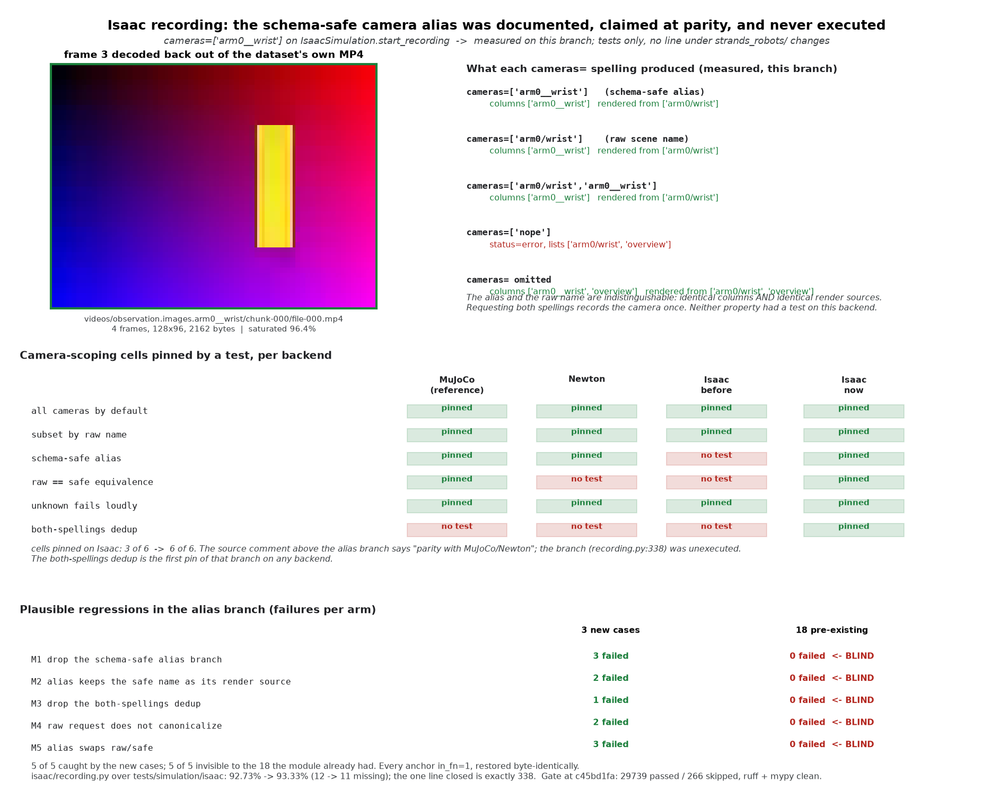

# Isaac recording: the schema-safe camera alias, measured

Artifacts for **strands-labs/robots** — pinning `IsaacSimulation.start_recording(cameras=...)`
against the schema-safe camera alias its own source comment claims is at parity with
MuJoCo/Newton.

## What the figure shows

1. **Top left** — frame 3 decoded back out of the dataset's own MP4, at
   `videos/observation.images.arm0__wrist/chunk-000/file-000.mp4`. The schema-safe key is in
   the path and the frames come from the raw scene camera `arm0/wrist`, so the alias really
   carries image data rather than only naming a column.
2. **Top right** — what each `cameras=` spelling produced. The alias and the raw name yield
   identical columns *and* identical render sources; requesting both records the camera once.
3. **Middle** — camera-scoping cells pinned by a test, per backend. 3 of 6 on Isaac before,
   6 of 6 now. `recording.py:338` (the alias branch) was unexecuted.
4. **Bottom** — five plausible regressions in that branch: all five caught by the three new
   cases, all five invisible to the 18 the module already had.

## Scripts

| file | what it does |
| --- | --- |
| `census_refusal_matrix.py` | groups every `if err := <guard>(...)` refusal by guard symbol and marks the uncovered ones — the view that found this slice |
| `probe_isaac_cams.py` | drives `start_recording` through every `cameras=` spelling on a `__new__` skeleton with no Isaac Sim |
| `mutate.py` | the five-mutation table, each anchor AST-scoped to its enclosing function, restored byte-identically |
| `capture.py` | records through the alias, decodes the MP4 back, dumps `facts.json` |
| `compose.py` | draws the figure, asserting every number against `facts.json` |

Everything here runs with **no Isaac Sim Kit, no GPU and no MuJoCo**: the camera-scoping
decision happens before any Kit call.
