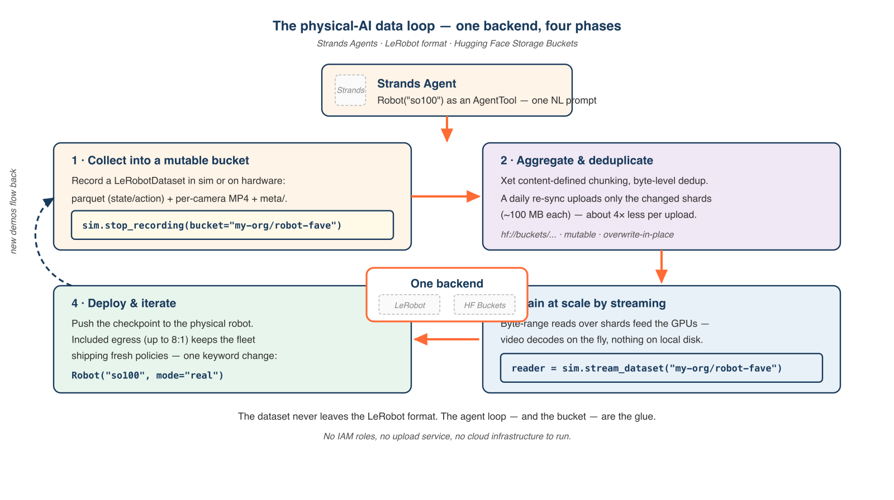
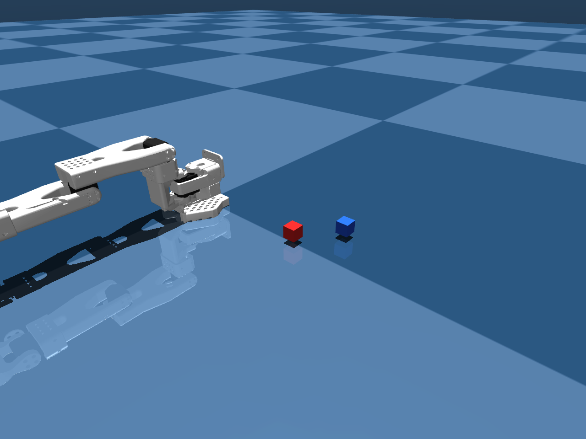

# The physical-AI data loop with Strands Agents, LeRobot, and Hugging Face Buckets

*A walkthrough of the streaming data loop in Strands Robots - one agent loop that collects robot demonstrations into a mutable storage bucket, streams them back to train without a download, and ships the policy back to hardware. No cloud infrastructure to run, and the dataset never leaves the LeRobot format.*


You have an agent that can already record a robot demonstration and push it to the [Hugging Face Hub](https://huggingface.co). Now you want to run that loop all day: collect episodes continuously, train a policy on the growing pile, deploy it, and pull the next batch back to improve it. The moment you do, the storage bill shows up. A typical robotics setup records at around 140 MB/s, and that data has to be stored, moved to GPUs, and shipped back to hardware. Push every append into a versioned dataset repository and you fight Git-LFS history; pull the whole dataset to every training run and you pay for it in idle GPUs and egress.

[Strands Robots](https://github.com/strands-labs/robots) is an open source SDK from AWS ([Apache 2.0](https://www.apache.org/licenses/LICENSE-2.0)) that exposes robot abstractions, simulation, and the [LeRobot](https://github.com/huggingface/lerobot) stack as AgentTools you compose into a single Strands agent. The [previous post](https://huggingface.co/blog) showed the agent loop from a Hub dataset to a physical robot. This one closes the loop the other way: it follows the data, from the first recorded frame to the deployed policy, over [Hugging Face Storage Buckets](https://huggingface.co/docs/hub/en/storage-buckets) - the new S3-like, [Xet](https://huggingface.co/docs/hub/en/storage-backends)-backed repository type, generally available since early 2026. LeRobot doesn't need buckets to function, and Strands Robots doesn't replace anything LeRobot does; both just slot a bucket in as the mutable working layer next to your datasets, reachable through the same `hf://` namespace, with nothing new to install.

This post walks you through the four phases of the data loop inside one agent: **collect** demonstrations into a bucket, **aggregate** them with byte-level deduplication, **train** by streaming straight from the Hub with nothing on local disk, and **deploy** the checkpoint back to hardware. At the end you can clone the working sample and run the whole loop on your laptop in simulation. No hardware, no GPU, no Hugging Face credentials needed for the default path. The runnable companion lives at [`examples/06_agent_collect_and_stream.py`](https://github.com/strands-labs/robots/blob/main/examples/06_agent_collect_and_stream.py).

## What you'll build

The Strands Robots SDK exposes the LeRobot stack as AgentTools. The example agent in this post records a LeRobotDataset from a natural-language prompt, syncs it into a mutable storage bucket, and then streams that same dataset back frame by frame - decoding camera video on the fly - without re-materializing anything to disk. The streaming read is the in-process counterpart to recording: the same `Robot()` that wrote the dataset reads it back.



**Figure 1. *The four phases share one backend. `Robot("so100")` records a LeRobotDataset through the shared `DatasetRecorder`; `stop_recording(bucket=...)` syncs it into a mutable, Xet-deduplicated Storage Bucket; `stream_dataset(...)` reads it back over the Hub with no full download; and the trained checkpoint deploys to the same `Robot` with `mode="real"`. The on-disk format stays exactly as LeRobot wrote it.***

The whole loop, in a handful of lines:

```python
from strands import Agent
from strands_robots import Robot

sim = Robot("so100")                 # mode="sim" (default - safe, no hardware)
agent = Agent(tools=[sim])

# Collect → bucket
agent("Record a pick-the-cube demo and sync it to my-org/robot-fave.")

# Stream it back to train — nothing lands on disk
for batch in sim.stream_dataset("my-org/robot-fave").dataloader(batch_size=64):
    ...
```

What follows is what's actually happening inside that loop, phase by phase.

## Prerequisites

#### Minimal (default simulation path)

* Python 3.12+, on Linux or macOS (Apple Silicon supported for the MuJoCo backend).
* A Strands-compatible model provider for the agent's reasoning: [Amazon Bedrock](https://aws.amazon.com/bedrock/) with AWS credentials, the [Anthropic API](https://docs.anthropic.com), OpenAI, or [Ollama](https://ollama.com) running locally.
* Strands Robots with the dataset extras: `uv pip install "strands-robots[sim-mujoco,lerobot]"`. The `lerobot` extra pulls in `datasets`, `av`, and `torchcodec`, so streaming and video decode work out of the box.

That's it. The recording and streaming steps in this post run end-to-end on a laptop with these three.

#### Advanced (buckets, hardware, real policies)

* A Hugging Face account and token with write permission, plus the `hf` CLI (`pip install -U huggingface_hub` then `hf auth login`), for creating buckets and syncing datasets.
* For the hardware path: an [SO-101](https://github.com/TheRobotStudio/SO-ARM100) follower/leader pair (or any LeRobot-supported robot) with calibration files under `~/.cache/huggingface/lerobot/calibration/`.
* For local VLA inference: an NVIDIA GPU. For training at scale, a GPU cluster reading from the Hub.

## Phase 1 - Collect into a mutable bucket

A collection setup records new episodes all day, each a continuous run of camera frames and state-action telemetry. The LeRobot format appends per episode: state and action tensors in Parquet, one MP4 stream per camera, and a small `meta/` folder with the schema, stats, and per-episode index. Many episodes pack into a few large shards, so an episode is a slice of a shard located through offset metadata, not a standalone file.

The practical consequence is that a dataset is a few large, mutable files that grow as you record. Push them straight into a versioned dataset repository and every append is a commit, every revision retained forever. During collection you don't want that - you want a fast place to dump bytes and overwrite freely. That is a [Storage Bucket](https://huggingface.co/docs/hub/en/storage-buckets): a repository type on the Hub that behaves like an S3 bucket, mutable and overwrite-in-place, inside your Hugging Face workspace with your existing permissions. No IAM roles, no CORS, no upload service to maintain.

In Strands Robots, the simulation tool records a LeRobotDataset in the same format LeRobot writes on hardware, and `stop_recording` takes one extra keyword to land it in a bucket:

```python
from strands import Agent
from strands_robots import Robot

sim = Robot("so100", mesh=False)     # mode="sim" by default
agent = Agent(tools=[sim])

# One prompt drives scene setup + cameras + policy + recording.
agent(
    "Create a world with the so100 robot, add a red cube and a front camera, "
    "start recording (repo_id='local/cube_pick', root='/tmp/cube_pick', fps=30, "
    "overwrite=True, task='pick up the red cube'), run the mock policy for "
    "60 steps, then stop recording."
)

# Sync the finished episode into a mutable, Xet-deduplicated bucket.
sim.stop_recording(bucket="my-org/robot-fave")
# → hf://buckets/my-org/robot-fave/cube_pick
```



**Figure 2. *The recording scene in MuJoCo: the SO-100 arm reaching toward a red cube, captured to a LeRobotDataset. No hardware, no GPU, no Hugging Face credentials needed to write the dataset; the bucket sync is the only step that needs a token.***

Under the hood, `stop_recording(bucket=...)` finalizes the dataset first - so the `meta/` folder with stats and schema is written before anything uploads, which downstream streaming and training depend on - and then runs `hf sync` into `hf://buckets/...`. If you'd rather drive the recorder directly, the same capability lives on `DatasetRecorder.sync_to_bucket(bucket, run_id=...)`. For the versioned, published artifact you still call `push_to_hub()`; the bucket is the mutable working layer you write to all day, the dataset repo is what you tag and share.

The Mock policy here is intentional: it generates placeholder joint actions so the loop runs end-to-end without a trained checkpoint. The episode is structurally complete - valid joint states, valid camera frames, a well-formed LeRobotDataset - but not useful as training data. Swap in a real policy (`--policy lerobot_local --checkpoint <hf_repo>`) for actual grasping; the prompt, the format, and the bucket sync stay identical.

#### Collecting on hardware

To record on a physical SO-101, use LeRobot's record CLI as usual (`lerobot-record ... --dataset.repo_id=my_user/cube_picking`). The dataset lands on disk in the same format; sync it to a bucket afterward with `hf sync ./recordings hf://buckets/my-org/robot-fave/run-021`, exactly what `stop_recording(bucket=...)` does for the sim path. Collection runs append into one mutable place, your published repos stay clean, and you wrote no cloud-storage plumbing.

## Phase 2 - Aggregate and deduplicate

Robot data is extraordinarily redundant. When an arm spends eight hours clearing the same table in front of two cameras, the lighting, the chassis, and most of the background stay identical across thousands of episodes. Naive storage pays for all of it every time, and Git-LFS makes it worse: change one frame in a multi-gigabyte video shard and it re-uploads the whole file.

Buckets are backed by [Xet](https://huggingface.co/blog/from-files-to-chunks), which deduplicates at the byte level using content-defined chunking. Chunk boundaries follow the content, so inserting a few bytes changes only the chunk it lands in instead of shifting every boundary after it. For an append-heavy robot dataset, a daily re-sync uploads roughly the new material plus whatever genuinely changed - about four times less data per upload in Hugging Face's own measurements, billed on the deduplicated footprint on Enterprise plans.

This is where the LeRobot shard layout pays off, and why Strands Robots leaves it untouched. The recorder packs episodes into ~100 MB Parquet shards (`data/chunk-000/file-000.parquet`) and per-camera MP4 shards (`videos/observation.images.front/chunk-000/file-000.mp4`), rolling to a new file only when the current one fills. A re-sync after a day of recording re-uploads the new trailing shards and the one partially-filled shard that grew, not the whole dataset. Calling `sim.stop_recording(bucket=...)` again on the same bucket is the daily push; Xet handles the dedup. A server-side `hf buckets cp` can even copy a terabyte-scale dataset near-instantly, since it migrates content hashes rather than bytes.

## Phase 3 - Train at scale by streaming from the Hub

Training a policy means pointing GPUs at your datasets. The expensive failure mode is GPUs sitting idle while hundreds of gigabytes download first. The shard layout from Phase 1 is what makes Hub-native streaming practical: a batch is a few byte-range reads over large shards, not thousands of tiny fetches. LeRobot's `StreamingLeRobotDataset` turns that into a drop-in torch iterable, and Strands Robots exposes it as the read counterpart to recording:

```python
# stream_dataset() is to reading what start_recording is to writing.
reader = sim.stream_dataset("my-org/cube_pick", shuffle=False)

print(reader.num_episodes, reader.num_frames, reader.fps)
for frame in reader:
    frame["observation.images.front"]   # (3, H, W) tensor, decoded on the fly from the MP4 shard
    frame["observation.state"]          # joint vector, from the parquet shard
    frame["action"]
    break
```

Nothing lands on local disk except the tiny `meta/` folder (schema, stats, episode index - kilobytes, not gigabytes). Camera frames are decoded from the remote MP4 shards as you iterate; state and action come from the Parquet shards. For training, hand the reader a DataLoader - the streaming dataset shuffles internally through a bounded reservoir buffer, so video decode parallelizes across worker processes:

```python
for batch in reader.dataloader(batch_size=64, num_workers=4):
    loss = policy(batch).loss
    loss.backward()
```

The same engine drives the upstream trainer, so a full training run needs no Strands-specific code at all - `python -m lerobot.scripts.train policy=act dataset.repo_id=my-org/cube_pick dataset.streaming=true num_workers=4`. `stream_dataset()` is for the in-process cases: validating an episode, replaying it in sim, or feeding a custom eval loop. You can request stacked time windows with `delta_timestamps={"observation.state": [-0.0667, -0.0333, 0.0], "action": [0.0, 0.0333, 0.0667]}` (multiples of `1/fps`), which returns each feature with its history-and-future window plus a `*_is_pad` mask at episode boundaries. On a constrained edge device with no video decoder, `stream_dataset(repo_id, drop_videos=True)` streams state and action only and never touches the camera stream.

Hugging Face's pre-warming caches bucket data at edge locations near the cloud and region where your jobs run, so the cluster reads locally; in their benchmark a bucket served roughly 1,100 MB/s cold and up to about 1,326 MB/s warm, against a generic object store around 310 to 420 MB/s.

#### A note on macOS, ffmpeg, and zero-touch video

Video decode on the streaming path uses [torchcodec](https://github.com/pytorch/torchcodec), which links ffmpeg through a runtime path. On macOS, Homebrew's ffmpeg lives outside the default dynamic-loader search path, so `import torchcodec` would normally fail with `Library not loaded: @rpath/libavutil.59.dylib`. Strands Robots handles this for you: on `import strands_robots` it detects the situation and puts Homebrew's ffmpeg on the loader path automatically - a no-op off macOS, without torchcodec, or when you've already set it yourself, and never inside a Jupyter kernel or test runner. Set `STRANDS_ROBOTS_NO_DYLD_SHIM=1` to opt out. The intent is that `pip install "strands-robots[lerobot]"` followed by `python your_script.py` just streams video, with nothing for you to configure.

## Phase 4 - Deploy and iterate

A finished training run emits a policy checkpoint - roughly a gigabyte for [SmolVLA](https://huggingface.co/blog/smolvla), several for a π0.5-scale model. You push it onto physical robots to evaluate, then pull the next dataset back to improve the policy. The loop only works if moving data is cheap, because you want to do it often. On a self-managed store the surprise cost is egress - every checkpoint shipped and every dataset pulled, metered per gigabyte, which for a busy fleet can exceed the storage bill. Hugging Face Storage includes egress and CDN at no extra cost up to an 8:1 ratio of stored volume, so for a fleet that ships daily that line item largely disappears.

The deploy step is the same agent code from the [hub-to-hardware walkthrough](https://huggingface.co/blog), with one keyword changed - `mode="real"`:

```python
robot = Robot("so100", mode="real", port="/dev/ttyACM0",
              cameras={"front": {"type": "opencv", "index_or_path": "/dev/video0", "fps": 30}})
agent = Agent(tools=[robot])
agent("Pick up the red cube.")
```

The checkpoint you trained by streaming from the bucket runs against the physical arm, and the demonstrations that arm records flow right back into the same bucket. The four phases close into a loop, and they share one backend: you collect into a mutable bucket instead of bloating a Git repo, Xet uploads and bills only the bytes that changed, `stream_dataset` and a pre-warmed CDN feed the GPUs without a download stall, and included egress keeps the fleet shipping fresh checkpoints. None of it asked you to run cloud infrastructure, so your time goes to policies and hardware.

## Try it using the sample application

The full sample is on GitHub at [strands-labs/robots](https://github.com/strands-labs/robots) in [`examples/06_agent_collect_and_stream.py`](https://github.com/strands-labs/robots/blob/main/examples/06_agent_collect_and_stream.py). It records a dataset from one agent prompt and streams it straight back with full camera decode. The defaults run end-to-end in simulation with the Mock policy - no GPU, no Docker, no Hugging Face credentials.

```bash
uv pip install "strands-robots[sim-mujoco,lerobot]"
git clone https://github.com/strands-labs/robots.git
cd robots

python examples/06_agent_collect_and_stream.py
```

The recorded dataset lands under `/tmp/strands_agent_dataset`. To sync it to a bucket, create one (`hf buckets create my-org/robot-fave --private`) after `hf auth login`, then call `sim.stop_recording(bucket="my-org/robot-fave")`. To train on it without a download, point the LeRobot trainer at the repo with `dataset.streaming=true`.

## Security Considerations

The snippets here are a "hello world" of the Strands Robots data loop. For production use cases there are some important considerations.

#### Prompt Injection

Supplying untrusted data into agents can lead to prompt injection, where untrustworthy context is treated as LLM instructions. Given that these agents actuate robots and now also write to and read from shared storage, this is an important risk to track. Feed the agent only data from trusted sources, and if not all input can be trusted, restrict the tools available to the agent so it cannot take safety-critical or storage-destructive actions.

#### Bucket credentials and scope

`stop_recording(bucket=...)` and `sync_to_bucket` upload through the `hf` CLI using the token from `hf auth login`. Use a token scoped to the specific namespace you're writing to, prefer `--private` buckets for collection data, and treat the bucket as the mutable working layer - the versioned dataset repo you `push_to_hub` is the artifact you share and tag.

#### Trust on policy load

The local inference path loads Hugging Face models with `trust_remote_code=True`. Set `STRANDS_TRUST_REMOTE_CODE=1` to opt in, and only load checkpoints from organizations you trust.

## How this fits together

Strands Robots doesn't reimplement what LeRobot and Hugging Face already provide. The dataset format, the streaming engine, the Xet backend, and the bucket tooling stay upstream; Strands adds the AgentTool surface and the thin recorder/reader bridge that make them composable from natural language. The bucket is reachable through the same `hf://` namespace as everything else, so it slots in as the mutable working layer next to your datasets with nothing new to install.

Two consequences follow. For users, every recorded episode is an asset an agent can dump cheaply, deduplicate automatically, train from without a download, and deploy against with no conversion step. For developers, the line between "collect," "train," and "deploy" stops being three storage systems and becomes one loop over one backend. The dataset never leaves the LeRobot format; the agent loop, and now the bucket, are the glue.

## Where to go from here

The full [Strands Robots documentation](https://strands-labs.github.io/robots/) covers the robot catalog, simulation, policy providers, recording, and the mesh in depth. The [recording & datasets guide](https://strands-labs.github.io/robots/recording/) documents the `DatasetRecorder` API, `sync_to_bucket`, and `stream_dataset` in full. For larger workloads, [strands-labs/robots-sim](https://github.com/strands-labs/robots-sim) hosts heavier simulation backends including Isaac Sim and Newton.

Contributions are welcome under Apache 2.0. If you build something with this loop, open an issue with what worked and what didn't.

## Resources

* **Strands Robots** (SDK, AgentTools, Robot factory): [github.com/strands-labs/robots](https://github.com/strands-labs/robots), Apache 2.0
* **Strands Robots docs**: [strands-labs.github.io/robots](https://strands-labs.github.io/robots/)
* **The example:** [examples/06_agent_collect_and_stream.py](https://github.com/strands-labs/robots/blob/main/examples/06_agent_collect_and_stream.py)
* **Recording & datasets guide:** [strands-labs.github.io/robots/recording](https://strands-labs.github.io/robots/recording/)
* **LeRobot**: [github.com/huggingface/lerobot](https://github.com/huggingface/lerobot) - datasets, policies, hardware drivers
* **Hugging Face Storage Buckets**: [Introducing Storage Buckets](https://huggingface.co/blog/storage-buckets) and [docs](https://huggingface.co/docs/hub/en/storage-buckets)
* **Xet deduplication**: [From Files to Chunks](https://huggingface.co/blog/from-files-to-chunks)
* **Hugging Face Storage pricing** (egress, CDN): [huggingface.co/storage](https://huggingface.co/storage)
* **The physical-AI data loop** (the article this workflow follows): Steven Palma, Hugging Face, 2026
* **Strands Agents SDK**: [github.com/strands-agents](https://github.com/strands-agents)
* * *

## Authors

**Cagatay Cali** is a Research Engineer at AWS focused on Agentic AI and robotics. He designs interfaces that connect AI agents to physical robots, enabling developers to control robotic systems through natural language and making agents and robotics development accessible to builders at any skill level.

[**Sundar Raghavan**](https://www.linkedin.com/in/sundar-raghavan-4838a526) is a Sr Solutions Architect at AWS on the Agentic AI Foundations team. He leads the developer experience for Amazon Bedrock AgentCore, owning the SDK and CLI, and drives the framework and ecosystem integrations strategy. He focuses on how developers build, deploy, and scale production AI agents on AWS, and is extending that focus into physical AI through Strands Robots.
