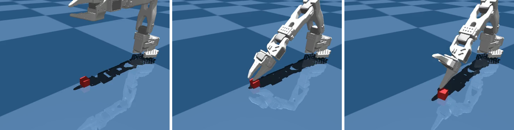

# Pick up a cube with an SO-101

You reach, close the gripper and lift a cube 15 cm off the table, in about a second on a CPU.



```python title="examples/18_so101_pick_and_lift.py"
--8<-- "examples/18_so101_pick_and_lift.py"
```

```console
$ MUJOCO_GL=egl python examples/18_so101_pick_and_lift.py
PICK OK - cube lifted 149.4 mm
```

Go deeper: [Objects](../reference/simulation/objects.md) · [Rollouts](../reference/simulation/rollouts.md)
