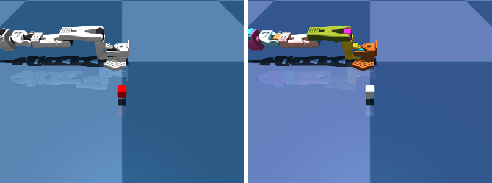

# Randomize the sim for sim2real

You shuffle the look and the physics of the scene and add sensor noise, so a policy stops trusting the sim.



```python title="examples/12_domain_randomization.py"
--8<-- "examples/12_domain_randomization.py"
```

```console
$ MUJOCO_GL=egl python examples/12_domain_randomization.py
joint 'Rotation': clean=0.0000 rad  noisy=0.0096 rad  (delta=+0.0096)
```

Go deeper: [Domain randomization](../reference/simulation/domain-randomization.md)
