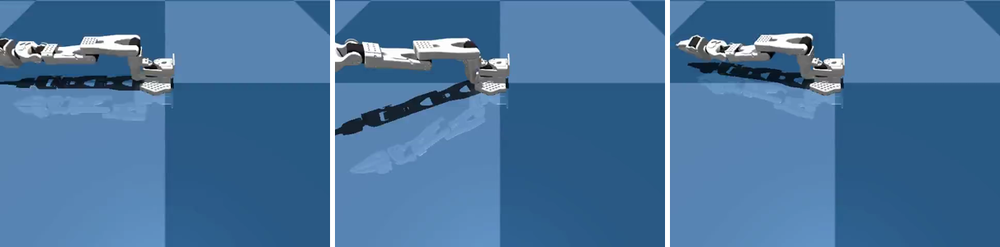

# Record a LeRobot dataset

You run a policy and save every frame and joint as a LeRobot dataset you can train on.



```python title="examples/03_record_dataset.py"
--8<-- "examples/03_record_dataset.py"
```

```console
$ MUJOCO_GL=egl python examples/03_record_dataset.py
Episode saved to LeRobotDataset
local/my_demo -- 100 frames, 1 episode(s)
```

Go deeper: [Recording](../reference/recording.md) · [Reading a dataset back](../reference/data/reading-back.md)
