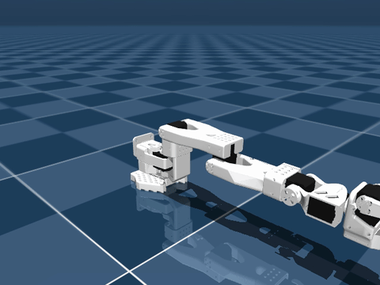

# Record, train and deploy a policy

You record demos, train an ACT policy, load the checkpoint and drive the arm with it, in about 20 seconds.



```python title="examples/07_post_tune_any_policy.py"
--8<-- "examples/07_post_tune_any_policy.py"
```

```console
$ MUJOCO_GL=egl python examples/07_post_tune_any_policy.py
train status: success | checkpoint: /tmp/strands_post_tune_ft/checkpoints/last/pretrained_model
loaded trained policy: LerobotLocalPolicy (provider=lerobot_local)
deployed: 30 steps in 1.268s
```

Go deeper: [Training](../reference/training/overview.md) · [LeRobot local](../reference/policies/lerobot-local.md)
