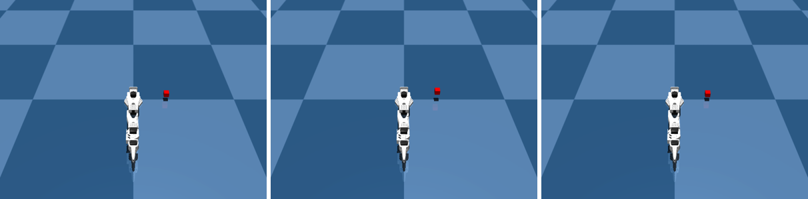

# Push the world, then rewind it

You save the scene, push a cube upward, then rewind to the exact starting state.



```python title="examples/14_save_state_and_perturb.py"
--8<-- "examples/14_save_state_and_perturb.py"
```

```console
$ MUJOCO_GL=egl python examples/14_save_state_and_perturb.py
cube z at start          : 0.0498 m
cube z after 2.0 N held  : 0.0728 m  (moved +0.0230 over 20 steps)
cube z after load_state  : 0.0498 m  (delta from start +0.000000)
```

Go deeper: [Physics](../reference/simulation/physics.md)
