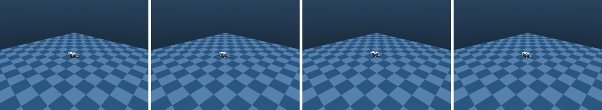

# Put the robot on rough ground

You swap the flat floor for rough ground, stairs, a pyramid or a slope, and make it harder over time.



```python title="examples/09_procedural_terrain.py"
--8<-- "examples/09_procedural_terrain.py"
```

```console
$ MUJOCO_GL=egl python examples/09_procedural_terrain.py
rough    peak=0.080 m  levels=1406  settled in  400 steps
stairs   peak=0.080 m  levels=   5  settled in  280 steps
```

Go deeper: [Terrain](../reference/simulation/terrain.md)
