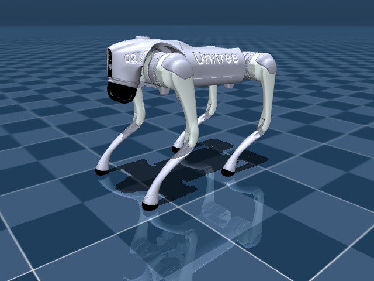

# Score a policy on a benchmark

You run a walking benchmark on a Go2 and get a success rate you can compare across policies.



```python title="examples/10_evaluate_benchmark.py"
--8<-- "examples/10_evaluate_benchmark.py"
```

```console
$ MUJOCO_GL=egl python examples/10_evaluate_benchmark.py
go2_walk_forward on unitree_go2 with the 'mock' policy:
  success_rate  : 0.0
  avg_reward    : 10.1986
```

Go deeper: [Rollout results](../reference/simulation/rollout-results.md) · [Predicates](../reference/simulation/predicates.md)
