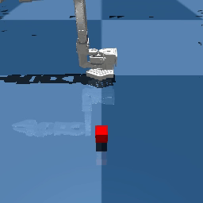

# Swap the policy, keep the robot

You load a policy from a string and run it on a sim arm; change the string to change the brain.



```python title="examples/02_policy_abstraction.py"
--8<-- "examples/02_policy_abstraction.py"
```

```console
$ MUJOCO_GL=egl python examples/02_policy_abstraction.py
Policy: MockPolicy
Requires images: False
Status: success
```

Go deeper: [Policies](../reference/policies/overview.md) · [LeRobot local](../reference/policies/lerobot-local.md)
