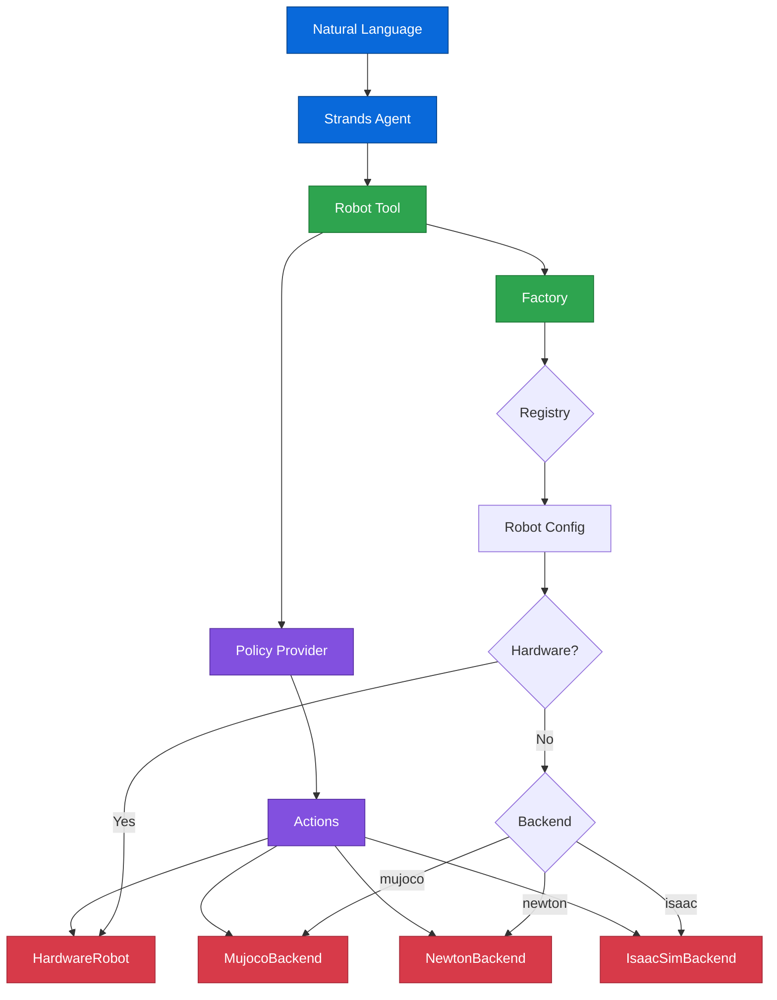

# Architecture

How Strands Robots is organized internally.

---

## Project Structure

```
strands_robots/
├── __init__.py           # Public API — tiered lazy imports
├── factory.py            # Robot("so100") auto-resolution (sim/real)
├── robot.py              # HardwareRobot AgentTool (real hardware via LeRobot)
├── policy_resolver.py    # Smart policy string resolution
├── processor.py          # Observation/action normalization bridge
├── kinematics.py         # MuJoCo/ONNX kinematics
├── video.py              # Video encoding utilities
├── motion_library.py     # Reusable motion primitives
├── dataset_recorder.py   # LeRobotDataset recording bridge
├── record.py             # Teleop + policy recording sessions
├── visualizer.py         # Live recording visualization
├── envs.py               # Gymnasium environment wrapper
├── zenoh_mesh.py         # P2P robot mesh networking
├── policies/             # Policy ABC + 8 providers
│   ├── __init__.py       # Policy ABC, MockPolicy, create_policy(), register_policy()
│   ├── _utils.py         # Shared policy utilities
│   ├── groot/            # NVIDIA GR00T N1.5/N1.6 (ZMQ)
│   ├── lerobot_local/    # HuggingFace local inference (ACT, Pi0, SmolVLA, Diffusion)
│   ├── lerobot_async/    # gRPC to LeRobot PolicyServer
│   ├── cosmos_predict/   # NVIDIA Cosmos world model policy
│   ├── gear_sonic/       # NVIDIA GEAR-SONIC humanoid control (135Hz ONNX)
│   ├── dreamgen/         # GR00T-Dreams IDM + VLA pipeline
│   └── dreamzero/        # Zero-shot world action model (WebSocket)
├── registry/             # JSON-driven robot + policy definitions
│   ├── __init__.py       # Re-exports
│   ├── loader.py         # JSON loading + mtime hot-reload + validation
│   ├── robots.py         # Robot query/resolve/list functions
│   ├── policies.py       # Policy resolve/import/kwargs functions
│   ├── robots.json       # 38 robot definitions (aliases inside each entry)
│   └── policies.json     # 8 policy providers (shorthands/urls inside each entry)
├── mujoco/               # MuJoCo CPU simulation backend
│   ├── _core.py          # MujocoBackend AgentTool
│   ├── _builder.py       # MJCF scene builder
│   ├── _registry.py      # URDF/MJCF model resolution
│   ├── _robots.py        # Robot loading
│   ├── _objects.py       # Object spawning
│   ├── _cameras.py       # Camera management
│   ├── _scene.py         # Scene composition
│   ├── _policy.py        # Policy execution in sim
│   ├── _rendering.py     # Offscreen rendering
│   ├── _recording.py     # Trajectory recording
│   ├── _randomization.py # Domain randomization
│   ├── _viewer.py        # Interactive viewer
│   └── _types.py         # SimWorld, SimRobot, SimObject, etc.
├── tools/                # 16 Strands agent tools
│   ├── gr00t_inference.py    # Manage GR00T Docker inference services
│   ├── lerobot_camera.py     # Discover, capture, record, preview cameras
│   ├── teleoperator.py       # Record demonstrations
│   ├── lerobot_dataset.py    # Manage LeRobot datasets
│   ├── lerobot_calibrate.py  # Robot calibration
│   ├── pose_tool.py          # Store/load/execute named robot poses
│   ├── serial_tool.py        # Low-level Feetech servo communication
│   ├── inference.py          # Generic inference tool
│   ├── newton_sim.py         # Newton GPU simulation control
│   ├── isaac_sim.py          # Isaac Sim control
│   ├── stream.py             # Telemetry streaming
│   ├── stereo_depth.py       # Stereo depth estimation
│   ├── robot_mesh.py         # Zenoh P2P robot mesh
│   ├── use_lerobot.py        # LeRobot CLI wrapper
│   ├── use_unitree.py        # Unitree SDK wrapper
│   ├── reachy_mini_tool.py   # Reachy Mini control
│   └── download_assets.py    # Asset download management
├── training/             # Training abstraction
│   ├── _base.py          # Trainer ABC + TrainConfig
│   ├── lerobot.py        # LeRobot trainer (ACT, Pi0, Diffusion, etc.)
│   ├── groot.py          # GR00T N1.6 fine-tuning
│   ├── dreamgen.py       # DreamGen IDM + VLA training
│   ├── cosmos_predict.py # Cosmos Predict 2.5 post-training
│   ├── cosmos_transfer.py# Cosmos Transfer 2.5 ControlNet (sim→real)
│   └── evaluate.py       # Evaluation utilities
├── assets/               # Asset download management
├── dreamgen/             # DreamGen pipeline (video world model augmentation)
├── cosmos_transfer/      # Cosmos Transfer 2.5 (sim→real visual transfer)
├── stereo/               # Stereo depth estimation (Fast-FoundationStereo)
├── isaac/                # Isaac Sim/Lab integration
│   ├── isaac_sim_backend.py  # IsaacSimBackend
│   ├── isaac_sim_bridge.py   # Scene management
│   ├── isaac_lab_env.py      # IsaacLab environment
│   ├── isaac_lab_trainer.py  # IsaacLab training
│   ├── isaac_gym_env.py      # Gym wrapper
│   └── asset_converter.py    # MJCF↔USD conversion
├── newton/               # Newton GPU physics
│   ├── newton_backend.py # NewtonBackend (Warp solver)
│   └── newton_gym_env.py # Gymnasium wrapper
├── telemetry/            # Streaming observability
├── leisaac.py            # LeIsaac × LeRobot EnvHub integration
└── rl_trainer.py         # RL training (PPO/SAC via stable-baselines3)
```

---

## Design Principles

### 1. One Interface

`Robot("name")` works for every robot — simulated or real, arm or humanoid. The factory auto-detects hardware and returns the right backend:

- **Sim**: `MujocoBackend`, `IsaacSimBackend`, or `NewtonBackend`
- **Real**: `HardwareRobot` (via LeRobot)

### 2. Auto-Resolution

Pass a string, get the right thing:

- `Robot("so100")` → looks up `registry/robots.json`, detects hardware
- `create_policy("zmq://jetson:5555")` → matches URL pattern in `registry/policies.json` → GR00T
- `create_policy("lerobot/act_aloha_sim")` → matches HF org → lerobot_local
- `create_trainer("lerobot")` → sets up LeRobot training

### 3. Agent-Native

Every capability is a Strands `AgentTool`. Tools compose with agents. Agents reason about when to use which tool. The `Robot` itself is a tool — `Agent(tools=[robot])`.

### 4. Lazy Dependencies

Heavy dependencies (MuJoCo, Isaac Sim, CUDA, torch) are optional extras. The core package only needs `strands-agents`, `numpy`, `opencv-python-headless`, `Pillow`, `msgpack`, and `pyzmq`. Requires Python 3.12+.

### 5. JSON-Driven Registry

No hardcoded if/elif chains. Robot definitions and policy providers live in JSON files. Adding a new robot or provider is a JSON edit + a Python module.

---

## Data Flow



---

## Codebase Stats

| Metric | Value |
|--------|-------|
| **Python modules** | 98 |
| **Lines of code** | ~45,000 |
| **Robot definitions** | 38 (in `robots.json`) |
| **Policy providers** | 8 (in `policies.json`) |
| **Trainer providers** | 6 |
| **Agent tools** | 16+ |
| **Simulation backends** | 3 (MuJoCo, Newton, Isaac) |
