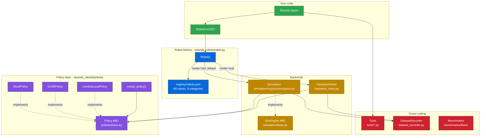

# Architecture

`strands-robots` is intentionally small. Five modules, three ABCs, one factory. Read this
page once and the rest of the docs become a refresher.

## The map


```mermaid
graph TB
    subgraph user[Your code]
        AGENT["Strands Agent"]
        FACTORY["Robot('so100')"]
    end

    subgraph factory_layer[Robot factory  ·  strands_robots/robot.py]
        ROBOT["Robot()"]
        REGISTRY["registry/robots.json<br/>68 robots, 8 categories"]
        ROBOT --> REGISTRY
    end

    subgraph backends[Backends]
        SIM["Simulation<br/>simulation/mujoco/simulation.py"]
        HW["HardwareRobot<br/>hardware_robot.py"]
        SIM_ABC["SimEngine ABC<br/>simulation/base.py"]
        SIM -.implements.-> SIM_ABC
    end

    subgraph policies[Policy layer  ·  strands_robots/policies]
        POLICY_ABC["Policy ABC<br/>policies/base.py"]
        MOCK["MockPolicy"]
        GROOT["Gr00tPolicy"]
        LEROBOT["LerobotLocalPolicy"]
        FACTORY_FN["create_policy()"]
        MOCK -.implements.-> POLICY_ABC
        GROOT -.implements.-> POLICY_ABC
        LEROBOT -.implements.-> POLICY_ABC
        FACTORY_FN --> POLICY_ABC
    end

    subgraph extras[Cross-cutting]
        TOOLS["Tools<br/>tools/*.py"]
        RECORDER["DatasetRecorder<br/>dataset_recorder.py"]
        BENCH["Benchmarks<br/>benchmarks/libero"]
    end

    AGENT --> FACTORY
    FACTORY --> ROBOT
    ROBOT -->|mode='sim' default| SIM
    ROBOT -->|mode='real'| HW

    SIM --> POLICY_ABC
    HW --> POLICY_ABC
    SIM --> RECORDER
    HW --> RECORDER

    AGENT --> TOOLS

    classDef user fill:#2ea44f,stroke:#1b7735,color:#fff
    classDef factory fill:#0969da,stroke:#044289,color:#fff
    classDef backend fill:#bf8700,stroke:#875e00,color:#fff
    classDef policy fill:#8250df,stroke:#5a32a3,color:#fff
    classDef cross fill:#cf222e,stroke:#86181d,color:#fff

    class AGENT,FACTORY user
    class ROBOT,REGISTRY factory
    class SIM,HW,SIM_ABC backend
    class POLICY_ABC,MOCK,GROOT,LEROBOT,FACTORY_FN policy
    class TOOLS,RECORDER,BENCH cross
```

## Module-by-module

| Module | What it owns | Key types |
|--------|--------------|-----------|
| `strands_robots/robot.py` | The user-facing factory `Robot(name, mode=..., backend=..., **kwargs)`. Resolves robot name → registry entry, picks sim/real backend, validates inputs, attaches optional mesh. | `Robot()` (function, capitalised) |
| `strands_robots/registry/` | Catalog of 68 robots. `robots.json` is the source of truth; `robots.py` exposes lookup helpers. | `list_robots()`, `resolve_name()`, `get_robot()` |
| `strands_robots/simulation/` | MuJoCo-backed simulation as a Strands `AgentTool`. 35+ actions exposed for the agent. | `Simulation`, `SimWorld`, `SimRobot`, `SimObject`, `SimCamera` |
| `strands_robots/simulation/base.py` | Backend-agnostic ABC. Future Isaac / Newton backends implement the same interface. | `SimEngine` |
| `strands_robots/hardware_robot.py` | Real-servo path. Wraps a LeRobot `Robot` instance with async task execution + status reporting. | `Robot` (the hardware class — distinct from the factory function) |
| `strands_robots/policies/` | Policy ABC + 3 implementations (`mock`, `groot`, `lerobot_local`) + factory + JSON registry. | `Policy`, `create_policy()`, `register_policy()` |
| `strands_robots/dataset_recorder.py` | LeRobot v3 dataset writer. Started/stopped via simulation actions. | `DatasetRecorder` |
| `strands_robots/tools/` | `@tool`-decorated Strands tools: `gr00t_inference`, `lerobot_calibrate`, `lerobot_camera`, `lerobot_teleoperate`, `pose_tool`, `serial_tool`. | All importable from `strands_robots.tools` |
| `strands_robots/benchmarks/libero/` | LIBERO benchmark adapter — BDDL parser, suite definitions. | `LiberoSuite`, BDDL parser |

## The three ABCs

Every extension point in the library is an ABC. Subclass, register, ship.

### `Policy` — *what action to take*

```python
# strands_robots/policies/base.py
class Policy(ABC):
    @abstractmethod
    def get_action(self, observation: dict) -> dict: ...
    @abstractmethod
    def reset(self) -> None: ...
```

Three implementations ship with the library:

- `MockPolicy` — zero-action / sinusoidal — for tests.
- `Gr00tPolicy` — NVIDIA GR00T (N1.5/N1.6/N1.7) over ZMQ or HTTP.
- `LerobotLocalPolicy` — direct HuggingFace LeRobot inference (ACT, Pi0, SmolVLA, etc.).

See [Policy providers](policies/overview.md). To add a fourth, see
[Custom policies](policies/custom-policies.md).

### `SimEngine` — *how to step physics*

```python
# strands_robots/simulation/base.py
class SimEngine(ABC):
    @abstractmethod
    def create_world(self, ...) -> SimWorld: ...
    @abstractmethod
    def step(self, ...) -> None: ...
    # ... 30+ more abstract actions
```

Today: MuJoCo CPU backend. Tomorrow: Isaac Sim, Newton (GPU). Same ABC, same `Simulation`
public surface — the user code never changes.

### Strands `AgentTool`

`Simulation` and `HardwareRobot` are both Strands `AgentTool` subclasses. That's what
makes `agent = Agent(tools=[robot])` work — the agent calls actions like `step`, `render`,
`run_policy` directly through the tool dispatcher.

## The one rule

**Lazy imports everywhere.** `strands_robots/__init__.py` exports `Policy`, `MockPolicy`,
and `create_policy` eagerly because they're light. Everything else (`Robot`, `Simulation`,
`Gr00tPolicy`, the tools) lives behind `__getattr__` so `import strands_robots` stays fast
even when `lerobot`, `torch`, or `mujoco` are installed but not yet needed.

This is enforced by the test suite (`tests/test_init.py`): adding a heavy eager import
will fail CI.

## Optional dependency extras

The `pyproject.toml` exposes one extra per heavy backend so installs stay surgical:

| Extra | Pulls in | When you need it |
|-------|----------|------------------|
| `[sim-mujoco]` | `mujoco`, `numpy`, `imageio` | Any `Robot()` with default `mode="sim"` |
| `[lerobot]` | `lerobot`, `torch` | Real hardware OR `LerobotLocalPolicy` |
| `[groot-service]` | `pyzmq`, `msgpack` | `Gr00tPolicy` (talks to a GR00T inference container) |
| `[mesh]` | `eclipse-zenoh` | Multi-robot peer discovery + RPC over Zenoh |
| `[benchmark-libero]` | `libero`, eval deps | LIBERO benchmark suite |
| `[all]` | union of everything above | Demos, CI, "I'll figure out what I need later" |
| `[dev]` | `pytest`, `ruff`, `mypy`, `hatch` | Contributing |

## Why this shape?

1. **A factory not a class hierarchy.** `Robot()` returns concrete `Simulation` /
   `HardwareRobot` instances. Users never see a wrapper.
2. **Composition over inheritance for cross-cutting concerns.** Recording, mesh
   networking, dataset capture — these attach to a robot, they don't subclass it.
3. **Registries are JSON.** Robots and policies are addressable by name from a JSON file.
   Adding either is a code-free PR most of the time.
4. **Tests live next to the code.** `tests/` mirrors `strands_robots/` 1:1.

## See also

- [Robot factory](getting-started/robot-factory.md) — every kwarg `Robot(...)` accepts.
- [Custom policies](policies/custom-policies.md) — how to implement and register a new
  `Policy`.
- [Simulation overview](simulation/overview.md) — the 35+ action vocabulary.
- [Contributing](contributing.md) — module conventions every PR has to satisfy.
