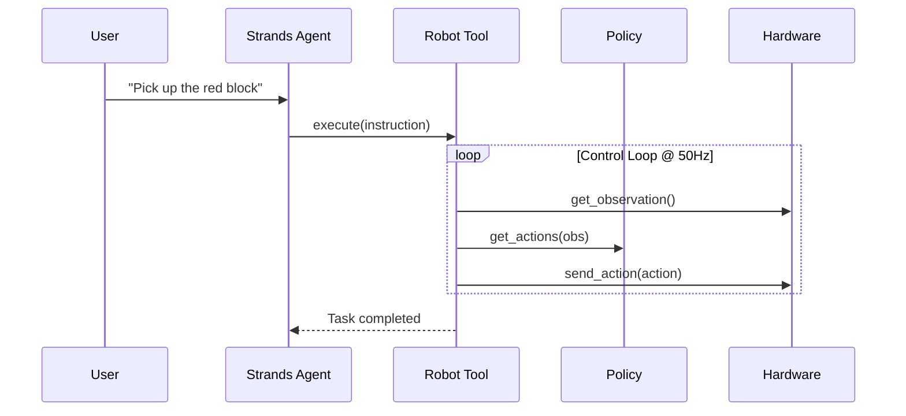

# Robot Control

!!! info "Coming Soon"
    This page is under active development.

Control real robot hardware through the Robot tool.

## Control Flow

## Actions

| Action | Description |
|--------|-------------|
| `execute` | Blocking execution |
| `start` | Non-blocking async start |
| `status` | Get current task status |
| `stop` | Interrupt running task |
