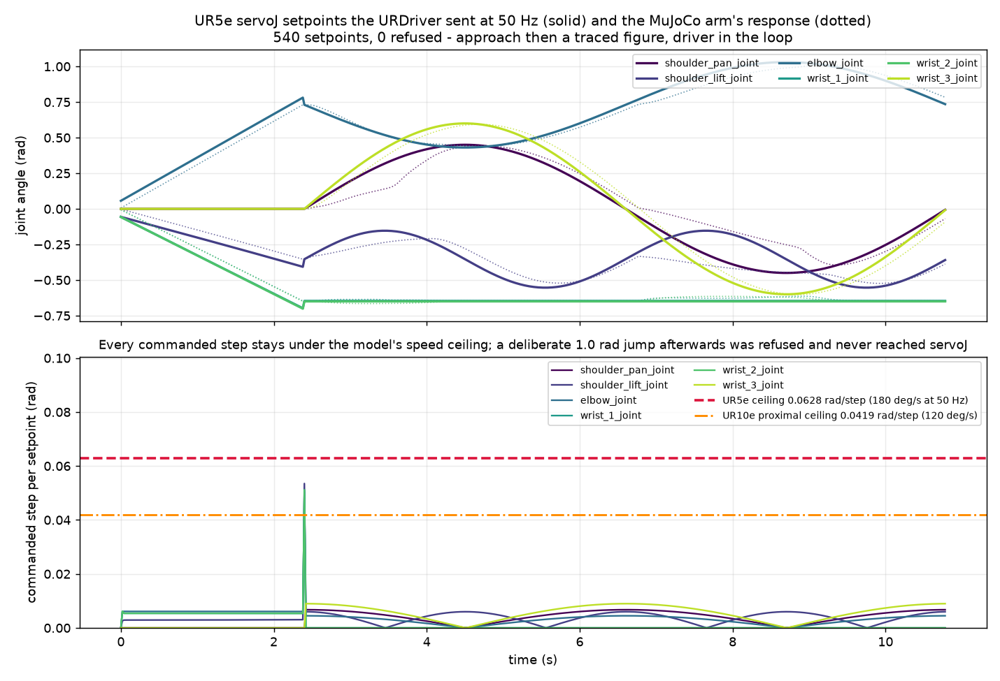

# Universal Robots over RTDE

`ur5e` and `ur10e` have a native driver, so an e-Series arm is driven directly by its
controller's Real-Time Data Exchange interface rather than through lerobot (which
registers no UR robot type):

```python
from strands_robots import Robot

arm = Robot("ur5e", mode="real", driver="strands", port="192.168.1.10")
arm.connect_eagerly()                      # refuses a controller that cannot move
arm.state()                                # joints, TCP pose, TCP wrench
arm.send_action({"elbow_joint": 1.40})     # one servoJ setpoint, radians
arm.run_policy(policy, n_steps=500)        # streamed rollout at control_frequency
```

## Installing the SDK

Needs the SDK: `pip install 'strands-robots[ur]'`, which declares the `ur_rtde`
build the driver's two interfaces come from. `port=` is the controller's address; the RTDE
port is fixed at 30004 by the protocol, so a different suffix is refused rather than
dialled.

## The two gates before a write

Two gates stand in front of every write, because a UR controller does not reject a bad
command the way a servo bus does - it accepts the register and performs nothing:

- **Controller mode.** A robot mode other than `RUNNING`, or a safety mode outside
  `NORMAL`/`REDUCED`, is refused in the controller's own vocabulary (`PROTECTIVE_STOP`,
  `SAFEGUARD_STOP`). The mode is re-read per write, so a stop landing mid-rollout ends
  the rollout with that reason.
- **Commanded speed.** A joint asked to move further than the model's datasheet ceiling
  allows in one control period is refused, naming the joint and both figures. The
  ceilings differ per model - every UR5e joint reaches 180 deg/s where the UR10e's three
  proximal joints are held to 120 deg/s - so the same policy cadence can be admitted on
  one arm and refused on the other.

## Vector width

Reads are held to one further rule, and it applies to every surface rather than only to a
write: each RTDE vector is named by its position against the arm's six joints, so a
controller answering a different width is refused by name - `state()` and the mesh joint
read included - instead of being reported as far as it goes. This driver serves six-axis e-Series arms only.

## Stopping a rollout

Stopping a rollout is reported rather than asserted. `stop_task()` signals the loop,
waits up to two seconds for its thread and decelerates the arm with `servoStop`; a
policy blocking on a remote inference call outlasts that budget, and the envelope then
carries `status="error"` with `stopped=False` and a reason naming the timeout, matching
what `get_task_status()` says about the same loop. The arm is decelerated either way,
and no further setpoint reaches the controller. The loop re-reads the stop signal after the
policy returns, and `send_action` re-reads the driver's halt counter immediately before
`servoJ`. `stop()` carries no verdict (the
driver protocol annotates it `-> None`); read `stop_task()` when the outcome matters.

## Building the policy from the registry

`start_task()` is the one verb in the fleet that builds the policy for you, from the
provider registry, and a provider it cannot build is refused rather than raised.
The refusal names the provider and carries the build's own reason, so a remote-code
provider reports the `STRANDS_TRUST_REMOTE_CODE` opt-in it wants and a mistyped
`checkpoint_dir` reports the path. Hold a built policy and `run_policy()` skips the build
entirely.

## Joint keys, simulation to controller

Joint keys are the arm's own names, in RTDE wire order, and the MuJoCo assets declare
them identically - so an action dict recorded in simulation streams to the controller
with no remap:

{ width=420 }

_540 servoJ setpoints from `URDriver.send_action` driving the `ur5e` MuJoCo model at
50 Hz, headless._

{ width=640 }

_Top: the setpoints the controller received (solid) and the arm's response (dotted).
Bottom: every commanded step against the model ceiling._

## See also

- [Native drivers](native-drivers.md) - the `driver="strands"` contract this driver satisfies.
- [Arms](../robots/arms.md) - the catalog entry, and which other arms have a native driver.
- [Robot factory](../getting-started/robot-factory.md) - every `Robot()` kwarg.
