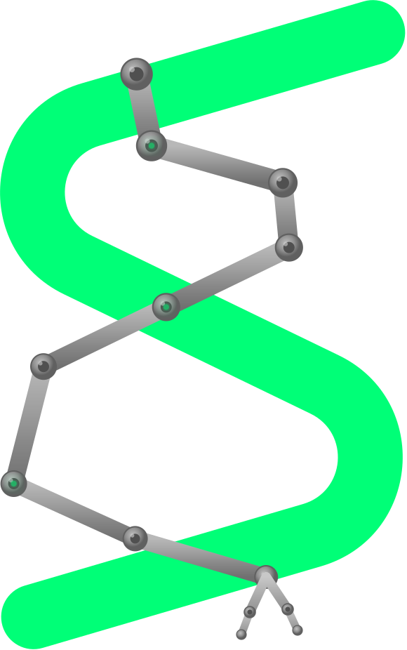
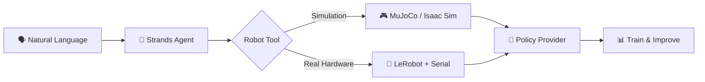
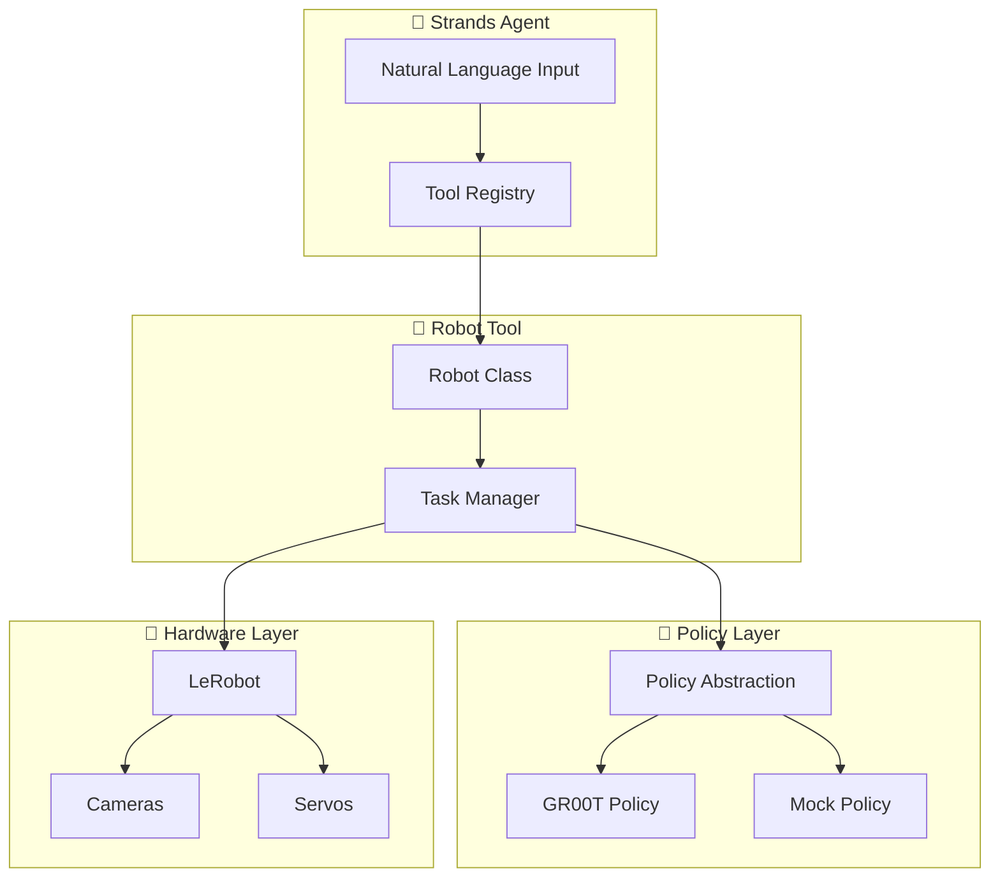

<div align="center">
  
  <h1>Strands Robots</h1>
</div>

> **Control robots with natural language through AI agents.**

Strands Robots is a Python SDK that gives [Strands Agents](https://github.com/strands-agents/sdk-python) the power to **control robots**, **run neural policies**, **build simulations**, and **train models** — all through natural language.

---

## How It Works



---

## Get Started in 2 Minutes

```bash
pip install strands-robots
```

```python
from strands import Agent
from strands_robots import Robot, gr00t_inference

# Create robot
robot = Robot(
    tool_name="my_arm",
    robot="so101_follower",
    cameras={"front": {"type": "opencv", "index_or_path": "/dev/video0", "fps": 30}},
    port="/dev/ttyACM0"
)

# Create agent with robot tool
agent = Agent(tools=[robot, gr00t_inference])

# Control with natural language
agent("Pick up the red block")
```

---

## New to Strands Robots?

Start with the **[Tutorial](tutorial/index.md)** — a 9-part progressive guide:

| # | Section | Time |
|---|---------|------|
| 1 | [Your First Robot](tutorial/01-your-first-robot.md) | 5 min |
| 2 | [Simulation](tutorial/02-simulation.md) | 10 min |
| 3 | [Policies](tutorial/03-policies.md) | 10 min |
| 4 | [AI Agents](tutorial/04-agents.md) | 10 min |
| 5 | [Multi-Robot](tutorial/05-multi-robot.md) | 10 min |
| 6 | [Recording Data](tutorial/06-recording.md) | 10 min |
| 7 | [Training](tutorial/07-training.md) | 15 min |
| 8 | [Real Hardware](tutorial/08-real-hardware.md) | 15 min |
| 9 | [Advanced Topics](tutorial/09-advanced.md) | 15 min |

---

## Key Features

### 🦾 Robot Control

Control real robot hardware through natural language — SO-100, SO-101, humanoids, and more via LeRobot integration.

### 🧠 Policy Providers

Plugin-based policy registry supporting NVIDIA GR00T, LeRobot local policies, and custom implementations.

### 🎮 Simulation

Build scenes and test policies in MuJoCo or Isaac Sim before deploying to real hardware.

### 🔄 Sim ↔ Real

Zero code changes between simulation and real hardware — same policies, same API.

### 📊 Training

Record demonstrations, train policies, and fine-tune models with integrated tooling.

### 🔧 Developer Tools

Camera management, serial communication, teleoperation, calibration, and pose management.

---

## Quick Links

<div class="grid" markdown>

[:material-rocket-launch: **Quickstart** →](getting-started/quickstart.md)

[:material-school: **Tutorial** →](tutorial/index.md)

[:material-robot-industrial: **Robot Catalog** →](robots/index.md)

[:material-cube-outline: **Simulation** →](simulation/overview.md)

[:material-brain: **Policy Providers** →](policies/overview.md)

[:material-robot: **Real Hardware** →](hardware/robot-control.md)

[:material-school: **Training** →](training/overview.md)

[:material-code-tags: **Examples** →](examples/overview.md)

</div>

---

## Install

=== "Real hardware"
    ```bash
    pip install strands-robots
    ```

=== "From source"
    ```bash
    git clone https://github.com/strands-labs/robots
    cd robots
    pip install -e .
    ```

---

## Architecture



---

## Contributing

We welcome contributions! See the [Contributing Guide](contributing.md) for details.

- [GitHub Issues](https://github.com/strands-labs/robots/issues)
- [Pull Requests](https://github.com/strands-labs/robots/pulls)

## License

Apache-2.0 — see [LICENSE](https://github.com/strands-labs/robots/blob/main/LICENSE).
