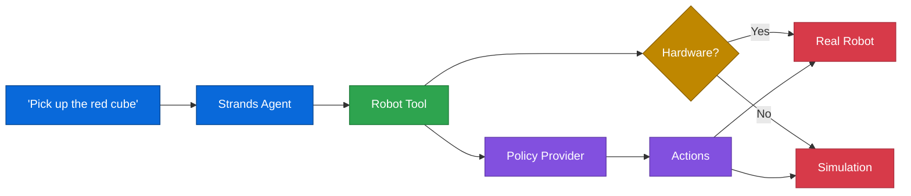

---
hide:
  - navigation
---

# Strands Robots

**Build robot agents in a few lines of code.**

```python
from strands import Agent
from strands_robots import Robot

robot = Robot("so100")
agent = Agent(tools=[robot])
agent("Pick up the red cube")
```

That's it. Three lines. The robot understands natural language, picks a policy, and executes.

`Robot()` auto-detects your setup. USB connected? Real robot. No hardware? MuJoCo simulation. Same code, both worlds.

---

## What You Can Do

<div class="grid cards" markdown>

-   :material-robot:{ .lg .middle } **38 Robots**

    ---

    Arms, humanoids, quadrupeds, hands, mobile platforms. Just pass a name.

    [:octicons-arrow-right-24: See all robots](robots/index.md)

-   :material-brain:{ .lg .middle } **8 Policy Providers**

    ---

    GR00T, LeRobot, Cosmos, GearSonic, DreamGen — auto-resolved by URI.

    [:octicons-arrow-right-24: Policy providers](policies/overview.md)

-   :material-cube-outline:{ .lg .middle } **Simulation**

    ---

    MuJoCo, Newton GPU, Isaac Sim. Same `Robot()` interface.

    [:octicons-arrow-right-24: Simulation guide](simulation/overview.md)

-   :material-school:{ .lg .middle } **Training**

    ---

    LeRobot, GR00T, and Cosmos trainers. One function call.

    [:octicons-arrow-right-24: Training guide](training/overview.md)

</div>

---

## How It Works



🔵 **Agent** → 🟢 **Robot Tool** → 🟡 **Hardware Detection** → 🟣 **Policy** → 🔴 **Execution**

---

## Quick Install

```bash
pip install strands-robots
```

Want simulation? Training? Everything?

```bash
pip install "strands-robots[all]"
```

---

## Where to Start

| You want to... | Go here |
|---|---|
| Follow a step-by-step tutorial | [🗺️ Learning Path](learning-path.md) |
| Get running in 5 minutes | [Quickstart](getting-started/quickstart.md) |
| See all supported robots | [Robot Catalog](robots/index.md) |
| Understand policies | [Policy Providers](policies/overview.md) |
| Run in simulation | [Simulation](simulation/overview.md) |
| Train a model | [Training](training/overview.md) |
| Use real hardware | [Real Hardware](hardware/robot-control.md) |

---

<div align="center">
  <sub>Built with <a href="https://strandsagents.com">Strands Agents</a></sub>
</div>
