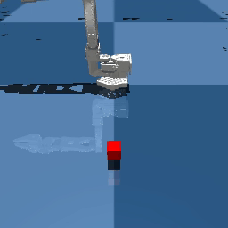

# Strands Robots

<figure class="brand-figure" markdown="span">
  { loading=lazy }
  <figcaption>Your first pick - <code>examples/18_so101_pick_and_lift.py</code>, MuJoCo, laptop CPU.</figcaption>
</figure>

Name a robot and you get one object your code and your agent can both drive: in simulation
today, on the real machine when you plug it in.

Written for you if:

- **An arm sits on your desk.** SO-101, Franka, UR5e - one call in sim, the same call with
  `mode="real"` once the cable is in.
- **You train policies.** Roll out SmolVLA, GR00T or your own checkpoint, record the episodes
  as a LeRobot dataset, replay them.
- **Your agent needs hands.** One tool per robot; the agent picks the action and reads back
  what happened.

## Install

```bash
uv venv --python 3.12 && source .venv/bin/activate
uv pip install "strands-robots[sim-mujoco]"   # simulation
uv pip install "strands-robots[all]"          # sim + hardware + most policies
```

## Drive one

```python
from strands import Agent
from strands_robots import Robot

arm = Robot("so101", mode="sim")            # MuJoCo scene, CPU, no GPU
Agent(tools=[arm])("Pick up the red cube")
```

The factory returns the backend itself, so the same object is callable from Python -
`arm.get_robot_state()`, `arm.run_policy(...)` - and `mode="real"` drives a physical SO-101
through the same actions.

## Next

<div class="grid cards" markdown>

-   :material-play-circle-outline:{ .lg .middle } **Move something**

    ---

    Install, step a scene, save the first frame, run the pick that lifts a cube.

    [:octicons-arrow-right-24: Quickstart](getting-started/quickstart.md)

-   :material-robot-outline:{ .lg .middle } **Find your robot**

    ---

    {{n:robots}} of them, {{n:hardware}} with a hardware path: arms, hands, humanoids, rovers.

    [:octicons-arrow-right-24: Robot catalog](robots/index.md)

-   :material-robot-happy-outline:{ .lg .middle } **Hand it to an agent**

    ---

    Give the robot to a Strands agent and ask for the task in plain English.

    [:octicons-arrow-right-24: AI agents](agents.md)

</div>

## Robots at work

<div class="grid" markdown>

<figure markdown="span">
  { loading=lazy }
  <figcaption><code>run_policy(policy_provider="wbc")</code> - G1, 0 to 2.8 m in 8 s.</figcaption>
</figure>

<figure markdown="span">
  { loading=lazy }
  <figcaption><code>microduck</code> provider - <code>alpha_walking.onnx</code> at 0.3 m/s.</figcaption>
</figure>

<figure markdown="span">
  { loading=lazy }
  <figcaption>SmolVLA through <code>lerobot_local</code>, rendered headless.</figcaption>
</figure>

</div>

## What runs on what

**{{n:robots}} robots** in the registry, {{n:hardware}} of them with a hardware path, across
{{n:categories}} categories and {{n:sim_backends}} simulation backends. Which driver builds which
robot is derived from the registries rather than declared:

```python
from strands_robots.drivers import list_driver_coverage

list_driver_coverage()["so101"]     # ('lerobot', 'strands')
```

Deeper: [Policy providers](policies/overview.md) · [Architecture](architecture.md) ·
[API reference](api-reference.md) · [Tool reference](reference/tools.md)
