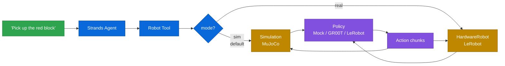

---
hide:
  - navigation
---

# Strands Robots

!!! tip "Recently shipped"

    - **Robot factory** — `Robot("name", mode=...)` returns a Simulation or HardwareRobot from the same call (PR #86).
    - **MuJoCo simulation backend** — 60+ AgentTool actions, full sim/real parity (PR #85).
    - **Mesh networking** — every `Robot()` auto-joins a Zenoh mesh; `mesh.tell` / `mesh.broadcast` / `emergency_stop` for fleet coordination (PR #101).
    - **LIBERO benchmark adapter** — BDDL parser + suite definitions in `strands_robots.benchmarks.libero` (PR #110, #130, #147).
    - **GR00T N1.7 support** — full container lifecycle helpers + (B,T,...) wire format (PR #149-#152, #155).
    - **Cosmos 3 omnimodal VLA policy provider** — NVIDIA Cosmos 3 via WebSocket, four policy providers total (PR #317).
    - **LeRobot 0.5.2 recording pipeline** — synchronized multi-robot recording, `run_multi_policy` (PR #366).
    - **README rewrite** — cleaner onboarding (PR #371).

**Robot control for Strands Agents — three lines from natural language to motion.**

```python
from strands import Agent
from strands_robots import Robot

robot = Robot("so100")            # default mode='sim' (safe); pass mode='real' or mode='auto' for hardware
agent = Agent(tools=[robot])      # 60+ actions exposed as a single AgentTool
agent("Pick up the red cube")     # the agent picks the policy, the policy moves the joints
```

`Robot()` is a factory. Same call, two worlds: simulation by default (MuJoCo, CPU-only, no GPU
required), real hardware when `mode="real"`. The agent doesn't care which.

---

## What you can do

<div class="grid cards" markdown>

-   :material-robot:{ .lg .middle } **68 robots, 8 categories**

    ---

    Arms, bimanual setups, humanoids, mobile platforms, dexterous hands, drones —
    all addressable by name (`Robot("panda")`, `Robot("unitree_g1")`,
    `Robot("aloha")`).

    [:octicons-arrow-right-24: Robot catalog](robots/index.md)

-   :material-cube-outline:{ .lg .middle } **MuJoCo simulation**

    ---

    60+ AgentTool actions: load worlds, add cameras, randomize physics, run
    policies, record datasets — all as a single `Simulation` object the agent
    can drive directly.

    [:octicons-arrow-right-24: Simulation guide](simulation/overview.md)

-   :material-brain:{ .lg .middle } **Pluggable policies**

    ---

    Four providers: `MockPolicy` for tests, `Gr00tPolicy` for NVIDIA GR00T
    (N1.5 / N1.6 / N1.7), `LerobotLocalPolicy` for HuggingFace LeRobot inference,
    and `Cosmos3Policy` for NVIDIA Cosmos 3 omnimodal VLA. One ABC, drop-in
    implementations.

    [:octicons-arrow-right-24: Policy providers](policies/overview.md) · [:octicons-arrow-right-24: Cosmos 3](policies/cosmos3.md)

-   :material-record-circle:{ .lg .middle } **LeRobot v3 recording**

    ---

    `start_recording` / `stop_recording` actions on every Simulation. Output
    is a parquet + MP4 dataset compatible with the LeRobot training loop.

    [:octicons-arrow-right-24: Recording](recording.md)

</div>

---

## Five-minute tour

1. **[Tutorial 1 — Your first robot](tutorial/01-your-first-robot.md)** — install, run a sim, render a frame.
2. **[Tutorial 4 — AI agents](tutorial/04-agents.md)** — wire a `Robot()` into a Strands `Agent`, control it with English.
3. **[Robot factory](getting-started/robot-factory.md)** — the rules behind `Robot("name", mode=..., backend=...)`.
4. **[Architecture](architecture.md)** — the single diagram that explains every module boundary.

---

## How it works


```mermaid
graph LR
    A["'Pick up the red block'"] --> B[Strands Agent]
    B --> C[Robot Tool]
    C --> D{mode?}
    D -->|sim<br/>default| E[Simulation<br/>MuJoCo]
    D -->|real| F[HardwareRobot<br/>LeRobot]
    E --> G[Policy<br/>Mock / GR00T / LeRobot]
    F --> G
    G --> H[Action chunks]
    H --> E
    H --> F

    classDef in fill:#2ea44f,stroke:#1b7735,color:#fff
    classDef agent fill:#0969da,stroke:#044289,color:#fff
    classDef policy fill:#8250df,stroke:#5a32a3,color:#fff
    classDef hw fill:#bf8700,stroke:#875e00,color:#fff

    class A in
    class B,C,D agent
    class E,F hw
    class G,H policy
```

- The **Strands Agent** decides *what* to do (`agent("pick up the cube")`).
- The **Robot tool** dispatches to a sim or real backend depending on `mode=`.
- The **policy** decides *how* to do it (joint deltas, action chunks).
- The backend executes — physics step in sim, servos in real.

See [Architecture](architecture.md) for the full module map.

---

## Install

```bash
# Core (light) — Robot factory, registry, lazy imports
pip install strands-robots

# With simulation
pip install "strands-robots[sim-mujoco]"

# Everything (sim + lerobot + groot + mesh)
pip install "strands-robots[all]"
```

Full install matrix and platform notes: [Installation](getting-started/installation.md).

---

## Where to next?

- **New here?** → [Learning path](learning-path.md) → [Tutorial](tutorial/index.md)
- **Have a robot in mind?** → [Robot catalog](robots/index.md)
- **Want to write a policy?** → [Custom policies](policies/custom-policies.md)
- **Building an agent?** → [Tutorial 4 — AI agents](tutorial/04-agents.md)
- **Hit a wall?** → [Troubleshooting](troubleshooting.md)
