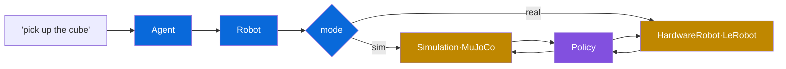

---
hide:
  - navigation
---

# Strands Robots

**Three lines from natural language to motion.**

```python
from strands import Agent
from strands_robots import Robot

robot = Robot("so100")            # sim by default; mode="real" for hardware
agent = Agent(tools=[robot])      # one tool, 60+ actions
agent("Pick up the red cube")
```

Same call, two worlds — MuJoCo sim (CPU, no GPU) or real servos. The agent doesn't care which.


```mermaid
graph LR
    A["'pick up the cube'"] --> B[Agent] --> C[Robot] --> D{mode}
    D -->|sim| E[Simulation·MuJoCo]
    D -->|real| F[HardwareRobot·LeRobot]
    E --> G[Policy] --> E
    F --> G --> F
    classDef a fill:#0969da,color:#fff
    classDef h fill:#bf8700,color:#fff
    classDef p fill:#8250df,color:#fff
    class B,C,D a
    class E,F h
    class G p
```

| | | |
|---|---|---|
| **[68 robots](robots/index.md)** · 8 categories | **[Simulation](simulation/overview.md)** · 60+ actions | **[4 policies](policies/overview.md)** · Mock / GR00T / LeRobot / [Cosmos 3](policies/cosmos3.md) |
| `Robot("panda")`, `Robot("aloha")` | worlds, cameras, randomize, record | one ABC, drop-in |

## Install

```bash
pip install "strands-robots[sim-mujoco]"   # sim
pip install "strands-robots[all]"          # everything
```

## Next

[Quickstart](getting-started/quickstart.md) · [Tutorial](tutorial/index.md) · [Robot factory](getting-started/robot-factory.md) · [Architecture](architecture.md) · [Troubleshooting](troubleshooting.md)

!!! tip "Recently shipped"
    Cosmos 3 VLA (#317) · LeRobot 0.5.2 multi-robot recording (#366) · GR00T N1.7 (#149-155) · Mesh networking (#101) · Robot factory (#86)
