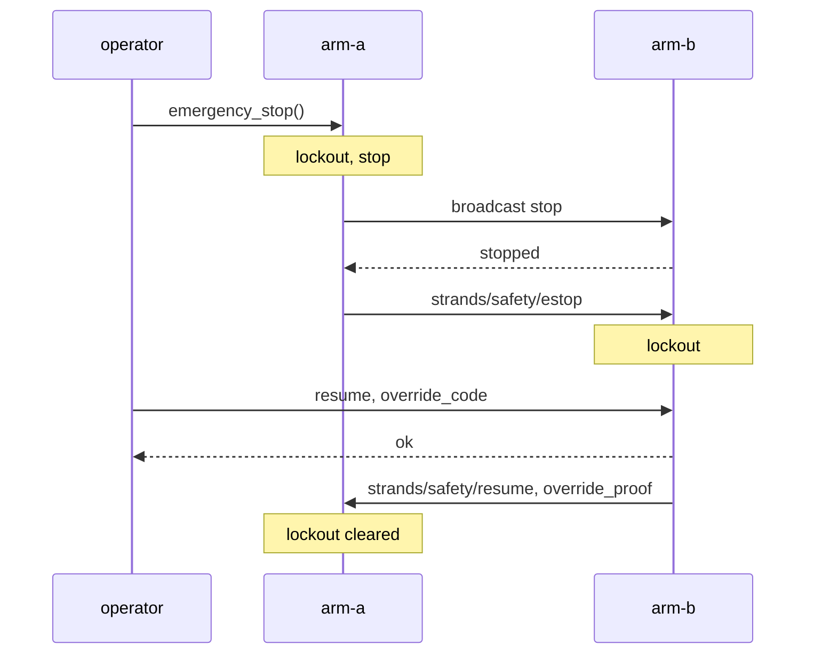
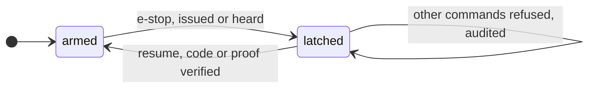

# Safety and e-stop

After this page you know what one `emergency_stop()` does to every robot it can reach, why a stopped fleet stays stopped until an operator with the override code says otherwise, what a resume must prove, and where each event is written down.

```python title="sketch"
# STRANDS_MESH_OVERRIDE_CODE: the SAME value on every peer, set before Python starts.
responses = a.mesh.emergency_stop()                 # local stop, then broadcast {"action": "stop"}
print([r["responder_id"] for r in responses])
print(a.mesh.send("arm-b", {"action": "execute", "instruction": "wave", "policy_provider": "mock"}))
# refused: lockout engaged
print(a.mesh.send("arm-b", {"action": "resume", "override_code": "<the code>"}))
# {'status': 'ok'}  or  {'status': 'error', 'error': 'resume rejected'}
```

No runnable fence here, on purpose: an e-stop reaches every peer the session can see, a dashboard someone else left running included. Run it when you mean it.

## What an e-stop does

{{drawing:d07_estop}}

1. Engages the local lockout and records the time.
2. Stops the local robot through the same `_dispatch({"action": "stop"})` path a remote peer runs (`broadcast` never reaches its sender).
3. Broadcasts `{"action": "stop"}` and collects replies for 3 s.
4. Publishes the event on `strands/safety/estop` (fleet-wide lockout) and `strands/<peer>/safety/event`.
5. Writes `emergency_stop` to the audit log.

Three stops, two resumes:



The return value is every reply, the local one first. A reply counts as "stopped" only if it says so: a peer whose robot exposes no `stop_task` answers `{"ok": False}`, is logged at CRITICAL and listed in `peers_not_stopped`; counting it would call a moving robot halted. A mesh that is not running raises `RuntimeError` instead of returning `[]`: "asked nobody" cannot look like "asked, nobody answered".

## The lockout

While engaged, a peer answers only `status`, `resume` and `stop`; `stop` stays admitted because it only de-energises, so a second e-stop still halts a rollout the first one missed. Every other action is refused and audited. A peer that receives `strands/safety/estop` engages its own lockout too; the log line reads `lockout engaged via remote estop from <issuer>`.



Replay defence on that topic: the envelope's `t` must be fresh (`STRANDS_MESH_RESUME_FRESHNESS_S`, default 60 s, forward skew 5 s), a per-receiver cache refuses a repeated `t`, issuers are capped per window; refusing a cache slot never refuses the stop.

## Resume

A resume is second-factor gated. `STRANDS_MESH_OVERRIDE_CODE` (at least 16 characters, say `secrets.token_urlsafe(32)`) must be set on the resuming peer and on every peer that honours it; a peer without one that long refuses every remote resume and says so at start:

```text
[safety:arm-a] No emergency-stop resume code set. If any peer broadcasts an e-stop, this robot stays locked until you physically restart it (one message can freeze the whole fleet).
```

`{"action": "resume", "override_code": ...}` on one peer compares the code in constant time, throttles after `STRANDS_MESH_RESUME_MAX_FAILS` (default 5) failures for `STRANDS_MESH_RESUME_BACKOFF_S` (default 30 s), and answers `{"status": "ok"}` or `{"status": "error", "error": "resume rejected"}`. "Lockout not engaged", "code unconfigured" and "wrong code" share that generic shape on the wire; the structured reason goes to the local audit log only, so a prober learns nothing.

A receiver refuses a resume older than `STRANDS_MESH_RESUME_FRESHNESS_S` (default 60 s; a receiver whose clock is ahead of the operator trips it) and one more than `STRANDS_MESH_RESUME_FORWARD_SKEW_S` (default 5 s, the tight one) in its future, which a receiver behind the operator trips.

On success the peer publishes `strands/safety/resume` carrying an HMAC-SHA256 `override_proof` keyed with an scrypt-derived key over `peer_id`, `t`, `lockout_elapsed_s`, `proof_nonce` and the TLS session id, never the code. Receivers verify it under the same throttle, refuse a repeated `(issuer, proof_nonce)`, and only then clear their lockout; every refusal leaves it engaged.

## Stopping is never gated

On every surface stop runs: the robot tool's `stop`, `robot_mesh(action="stop")`, the mesh `stop` under lockout, the dashboard's e-stop button. `emergency_stop` from `robot_mesh` asks the operator first, being fleet-wide and prompt-injectable; its rate limit is 3 per minute.

## Audit

Every event here is one JSONL row in `~/.strands_robots/mesh_audit.jsonl` (`STRANDS_MESH_AUDIT_DIR`): `emergency_stop`, `remote_estop_engaged`, `estop_replay_rejected`, `estop_corroborated` (two operators within 0.2 s), `resume_ok`, `resume_denied` with the structured reason, `remote_resume_applied`, `resume_replay_rejected`, `command_refused` under lockout. Rows carry `ts`, `event`, `peer_id`, `payload`, a process-monotonic `seq` (a deleted row shows as a gap) and `sig` (HMAC-SHA256) when `STRANDS_MESH_AUDIT_PSK` is set; `verify_audit_integrity()` reports broken signatures, sequence gaps and unsigned rows. Rotation: `STRANDS_MESH_AUDIT_MAX_BYTES`, `STRANDS_MESH_AUDIT_MAX_FILES`.

See [security](../security.md) for the whole posture on one page.
