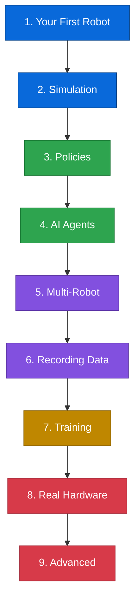

# 🗺️ Learning Path

New to robotics? New to AI agents? No problem. This path takes you from zero to building robot agents, one step at a time.

---

## The Journey

---

## 🔵 Beginner (Chapters 1–2)

**No hardware needed.** Everything runs in simulation on your laptop.

| Chapter | What you'll learn | Time |
|---|---|---|
| [1. Your First Robot](tutorial/01-your-first-robot.md) | Install, create a robot, read observations | 10 min |
| [2. Simulation](tutorial/02-simulation.md) | MuJoCo physics, rendering, controlling joints | 15 min |

**After this:** You can create simulated robots and make them move.

---

## 🟢 Intermediate (Chapters 3–4)

**Add intelligence.** Connect policies and AI agents to your robots.

| Chapter | What you'll learn | Time |
|---|---|---|
| [3. Policies](tutorial/03-policies.md) | What policies are, how to use them, mock testing | 15 min |
| [4. AI Agents](tutorial/04-agents.md) | Natural language control with Strands Agents | 15 min |

**After this:** You can tell a robot "pick up the red cube" and it does it.

---

## 🟣 Advanced (Chapters 5–6)

**Scale up.** Multiple robots, recording demonstrations.

| Chapter | What you'll learn | Time |
|---|---|---|
| [5. Multi-Robot](tutorial/05-multi-robot.md) | Coordinate multiple robots, bimanual tasks | 20 min |
| [6. Recording Data](tutorial/06-recording.md) | Teleoperation, dataset creation, replay | 20 min |

**After this:** You can record robot demonstrations and manage datasets.

---

## 🟡 Expert (Chapter 7)

**Train your own models.** Use your recorded data to train policies.

| Chapter | What you'll learn | Time |
|---|---|---|
| [7. Training](tutorial/07-training.md) | LeRobot trainer, checkpoints, evaluation | 30 min |

**After this:** You can train a robot policy from your own data.

---

## 🔴 Hardware (Chapters 8–9)

**Go real.** Deploy to physical robots.

| Chapter | What you'll learn | Time |
|---|---|---|
| [8. Real Hardware](tutorial/08-real-hardware.md) | Connecting servos, cameras, calibration | 30 min |
| [9. Advanced](tutorial/09-advanced.md) | DreamGen, custom policies, Zenoh mesh, GR00T | 30 min |

**After this:** You're building production robot agents.

---

## Prerequisites

- **Python 3.10+** — that's it
- **No robot hardware needed** — simulation works on any laptop
- **Basic Python knowledge** — if you can write a function, you're ready

!!! tip "Don't have AWS credentials?"
    You can use any model provider (Ollama, OpenAI, Anthropic) with Strands Agents. The tutorials use the default Bedrock provider, but any LLM works. See the [Strands docs](https://strandsagents.com/) for setup.
