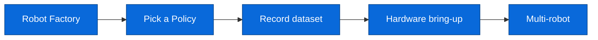
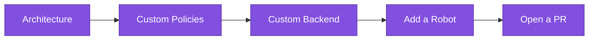

# Learning Path

Three tracks, one repo. Pick the one that matches where you are right now.

---

## Track 1 — "I just want to see it move"

For developers new to robotics, new to `strands-robots`, or evaluating whether the library
fits a project.

```mermaid
graph LR
    A[Install] --> B[Robot('so100')]
    B --> C[render frame]
    C --> D[run a policy]
    D --> E[Agent('pick up the cube')]
    classDef step fill:#2ea44f,stroke:#1b7735,color:#fff
    class A,B,C,D,E step
```

| Step | Page | Time |
|------|------|------|
| 1 | [Installation](getting-started/installation.md) | 2 min |
| 2 | [Quickstart](getting-started/quickstart.md) | 5 min |
| 3 | [Tutorial 1 — Your first robot](tutorial/01-your-first-robot.md) | 10 min |
| 4 | [Tutorial 2 — Simulation](tutorial/02-simulation.md) | 15 min |
| 5 | [Tutorial 4 — AI agents](tutorial/04-agents.md) | 15 min |

**End state:** you can spawn any of the 68 catalog robots, render a frame, and have a
Strands Agent drive it via natural language.

---

## Track 2 — "I want to ship something with this"

For engineers integrating `strands-robots` into a product, training pipeline, or research
workflow.

```mermaid
graph LR
    A[Robot Factory] --> B[Pick a Policy]
    B --> C[Record dataset]
    C --> D[Hardware bring-up]
    D --> E[Multi-robot]
    classDef step fill:#0969da,stroke:#044289,color:#fff
    class A,B,C,D,E step
```

| Step | Page | What you walk away with |
|------|------|-------------------------|
| 1 | [Robot factory](getting-started/robot-factory.md) | The full `Robot(...)` signature and every kwarg it forwards |
| 2 | [Policy providers](policies/overview.md) → [GR00T](policies/groot.md), [LeRobot](policies/lerobot-local.md), or [Cosmos 3](policies/cosmos3.md) | A working VLA policy you can drop into any `Simulation` |
| 3 | [Tutorial 6 — Recording](tutorial/06-recording.md) → [Recording reference](recording.md) | A LeRobot v3 dataset on disk |
| 4 | [Tutorial 8 — Real hardware](tutorial/08-real-hardware.md) → [Hardware tools](hardware/tools.md) | A real arm calibrated, cameras streaming, teleop wired up |
| 5 | [Tutorial 5 — Multi-robot](tutorial/05-multi-robot.md) | Two `Robot()` instances coordinating via the mesh |

**End state:** you have a recording → training → deployment pipeline running on real
servos and a sim twin.

---

## Track 3 — "I want to extend the library"

For contributors writing new policies, new sim backends, new robots, new tools.

```mermaid
graph LR
    A[Architecture] --> B[Custom Policies]
    B --> C[Custom Backend]
    C --> D[Add a Robot]
    D --> E[Open a PR]
    classDef step fill:#8250df,stroke:#5a32a3,color:#fff
    class A,B,C,D,E step
```

| Step | Page | What you'll touch |
|------|------|-------------------|
| 1 | [Architecture](architecture.md) | Module boundaries, ABC contracts, lazy-import discipline |
| 2 | [Custom policies](policies/custom-policies.md) | `policies/base.py`, `policies/factory.py`, registry |
| 3 | [Tutorial 9 — Advanced](tutorial/09-advanced.md) | Sim backends (`SimEngine` ABC), data_configs, tool authoring |
| 4 | [Robot catalog](robots/index.md) → registry source | `strands_robots/registry/robots.json` schema, asset auto-download |
| 5 | [Contributing](contributing.md) | hatch envs, lint rules, PR conventions |

**End state:** your patch lands on `main`. New robot, new policy, new backend — all
shipped through the existing factory + registry plumbing.

---

## Quick references

If you're not learning, just looking something up:

- [API reference](api-reference.md) — every public symbol grouped by module
- [Robot catalog](robots/index.md) — every robot, every alias, every category
- [Troubleshooting](troubleshooting.md) — error → fix
- [Examples overview](examples/overview.md) — runnable scripts in the repo

---

## Why three tracks?

The same install (`pip install strands-robots`) covers all three. We built it that way on
purpose — the Robot factory is the only thing you need to know on day one, and every
deeper layer (policies, backends, mesh) is a single import away when you need it.

Pick a track. Skip ahead if a step is obvious. Come back when something breaks.
