# Multi-robot mesh

<figure class="brand-figure" markdown="span">
  { .brand-svg }
</figure>

`Robot(name, mesh=True)` joins a Zenoh mesh - joining is opt-in, so a bare `Robot()` leaves `robot.mesh` as `None` unless `STRANDS_MESH` is `true`/`1`/`yes`. Peers then discover each other on the LAN and can query, command, and e-stop one another.

!!! info "Device Connect is the recommended networking layer"
    What's described here is the built-in **Zenoh mesh** — the automatic fallback. When the [`device-connect`](device-connect.md) extra is installed, `Robot().run()` and `robot_mesh()` use [**Device Connect**](device-connect.md) (structured RPC, presence, registry, safety) and fall back to this mesh only when it's unavailable. Both ride on Zenoh.

```python
# process A
from strands_robots import Robot
sim_a = Robot("so100", mesh=True)
print(sim_a.mesh.peers)          # discovers sim_b within ~1 s

# process B
sim_b = Robot("aloha", mesh=True)
sim_a.mesh.tell(sim_b.mesh.peer_id, "pick up the cube",
                policy_provider="mock", duration=10.0)
```

```bash
uv pip install "strands-robots[mesh]"   # eclipse-zenoh + json5; not in the base install
```

`[mesh]` requires `eclipse-zenoh>=1.6.1`: e-stop and resume publishers are
authenticated at the wire level through `zenoh.SourceInfo`, which first ships
in 1.6.1, so upgrade every peer in a fleet together.

## First run across two hosts

Multicast scouting is off by default, so peers on two machines find each other
only through an explicit endpoint. One host listens, the other connects:

```bash
# host A (e.g. the robot's Jetson) - listen
STRANDS_MESH_LOCAL_DEV=1 ZENOH_LISTEN=tcp/0.0.0.0:7447 python -c \
  'from strands_robots import Robot; import time; r = Robot("so100", mesh=True); time.sleep(60)'

# host B (your laptop) - connect to A's address
STRANDS_MESH_LOCAL_DEV=1 ZENOH_CONNECT=tcp/<host-a-ip>:7447 python -c \
  'from strands_robots import Robot; import time; r = Robot("aloha", mesh=True); time.sleep(2); print(r.mesh.peers)'
```

Measured Mac to Jetson Thor on one LAN, the peer is visible in 0.26 s.
`STRANDS_MESH_LOCAL_DEV=1` runs the mesh with no wire authentication - it is
for a lab bench, never a shared network. The default is mTLS, configured as
described in [Security](security.md#robot-mesh-authentication); under it a
`tcp/` endpoint is refused with a `ValueError` at config build (only `tls`,
`quic`, `wss` carry TLS), so the two lines above change together.

## Key mesh calls

```python
# Point-to-point status query
result = sim_a.mesh.send(target_peer_id, {"action": "status"}, timeout=5.0)

# Fan-out → list of responses collected within timeout
results = sim_a.mesh.broadcast({"action": "status"}, timeout=2.0)

# Safety primitive - writes a tamper-evident audit log
sim_a.mesh.emergency_stop()   # STRANDS_MESH_AUDIT_DIR overrides log location
```

## What a fleet e-stop reaches

`emergency_stop()` broadcasts `{"action": "stop"}` with no `robot_name`, so
each peer decides which of its own robots that reaches: a hardware peer stops
its task, a simulation peer asks every rollout it could be running.
`stop_policy` is idempotent and reports `was_running`, so `stopped` names only
the robots whose answer did not say they were idle, and the peer's `ok` is
derived from those answers:

```python
responses = sim_a.mesh.emergency_stop()
# {"ok": True,  "stopped": ["arm"], "results": {...}}          the rollout halted
# {"ok": True,  "stopped": [],      "results": {...}}          asked, none was running
# {"ok": False, "stopped": [], "not_stopped": ["arm"], ...}    a stop was refused
```

`emergency_stop()` returns after its 3 s response-collection window
(`broadcast(..., timeout=3.0)`); the remote stop itself fires at network
round-trip, so 3 s is how long you wait for the tally, not how long the robot
keeps moving. A refusal puts the peer in `peers_not_stopped`, logged at
CRITICAL and carried in the safety envelope. A backend that keeps no durable
per-robot rollout claim refuses rather than affirming on no evidence; bound
such a rollout instead with `run_policy(n_steps=...)` or
`run_policy(stop_when={...})`.

## Recovering from an emergency stop

`emergency_stop()` latches a **lockout** on every peer that receives it: the
peer refuses every command except `status` and `resume`, and nothing clears it
on a timer. Recovery is always an explicit `resume`:

```python
sim_a.mesh.send(peer_id, {"action": "resume", "override_code": OPERATOR_CODE})
```

Two prerequisites must be in place *before* you e-stop a fleet, because both
are only observable once you are locked out:

1. **Every peer needs the same override code.** `resume` is accepted only when
   `STRANDS_MESH_OVERRIDE_CODE` is set, and receivers verify the operator's
   proof against their own copy; unset, there is no remote resume (the mesh
   warns at startup).
2. **Fleet clocks have to agree.** A resume envelope is stamped with the
   operator's wall clock and refused when older than
   `STRANDS_MESH_RESUME_FRESHNESS_S` (default 60 s) or more than
   `STRANDS_MESH_RESUME_FORWARD_SKEW_S` (default 5 s) ahead. Each bound catches
   one direction of skew, so widening the other does not help; a robot only
   6 s behind the operator refuses a correct resume as future-dated:

```
[safety] robot-1: refusing remote resume -- ``t``=... in future (forward_skew_s=5.0, now=...)
```

Keep fleet clocks in NTP sync or raise both knobs on every peer. Correcting a
clock does not cost you the fleet: every duration the mesh decides on its own
(`age`, the 10 s peer timeout, `STRANDS_MESH_MAX_PEERS` eviction, publish
intervals) is measured on `time.monotonic()`, and `age`, `reachable` and
`peer_id` are this process's own observations that a peer's payload cannot
overwrite. Repeated wrong codes arm a cooldown
(`STRANDS_MESH_RESUME_MAX_FAILS`, `STRANDS_MESH_RESUME_BACKOFF_S`) during which
even the correct code is refused. Every attempt is written to the safety audit
log.

## Published topics

| Topic | Rate | Content |
|-------|------|---------|
| `strands/{peer_id}/presence` | 2 Hz | heartbeat / peer discovery |
| `strands/{peer_id}/state` | 10 Hz | joints, sim time, task status, which robots are running a policy, degraded probes |
| `strands/{peer_id}/cmd` | on demand | incoming RPC commands |
| `strands/{requester}/response/{responder}/{turn_id}` | on demand | RPC replies (turn_id correlated) |
| `strands/{peer_id}/stream` | on demand | VLA execution steps |
| `strands/{peer_id}/pose` | on demand | SE(3) from SLAM/odom/VIO |
| `strands/{peer_id}/imu` | on demand | orientation, gyro, accel |
| `strands/{peer_id}/health` | on demand | battery, CPU, memory |
| `strands/broadcast` | on demand | fan-out RPC |

Sensor topics only publish when the robot exposes the attribute. A reply is
published on `strands/{sender_id}/response/{responder}/{turn_id}`, so
`sender_id` and `turn_id` must be plain identifiers (`[A-Za-z0-9_.-]+`, at most
128 chars) - a wildcard in either would address every peer - and a command
that breaks the rule is refused whole; omitting `sender_id` means
fire-and-forget. A sensor record is filed under the publisher's `peer_id`
(and `hand`), never under one the provider names; a provider-supplied `t` is
honoured.

### Degraded state probes

Every section of a state snapshot is optional, so an absent section is
ambiguous. A probe that fails names itself, keyed by category, so the fault is
on the wire:

```json
{
  "peer_id": "arm-a1",
  "t": 1755900000.123,
  "degraded": {
    "hw_joints": {
      "reason": "ConnectionError",
      "detail": "Port is in use!",
      "failures": 37,
      "for_seconds": 3.7
    }
  }
}
```

`reason` is the exception's type name, `detail` its bounded message,
`failures` the ticks raised since the fault began and `for_seconds` its
duration. The entry is removed on the tick the probe answers again, and the
key is absent when nothing is degraded. Categories: `hw_joints`, `task_state`,
`sim_world`, `sim_joints`.

### Which robot is running

A sim peer's snapshot names every robot in its world with an `active` flag:

```json
{"robots": {"arm_a": {"active": true}, "arm_b": {"active": false}}}
```

`active` means *executing a policy right now* (whether launched by
`start_policy` or the blocking `run_policy`), read from the same in-flight
population the `status` command answers `robots_running` from. A peer that
cannot read that population names its robots with **no `active` key**, answers
`unknown`, and reports the failure under `sim_world` in `degraded`.

### Pose orientation

A 4x4 SE(3) pose provider is decomposed into `x` / `y` / `z`, a planar
`theta` and a scalar-first unit `quat` `[w, x, y, z]` canonicalized to
`w >= 0`; `theta` and `quat` come from the same matrix, so they always agree.

### Out of contact vs gone

A peer that stops heartbeating is *unreachable* after `PEER_TIMEOUT` (10 s)
and, by default, deleted at that moment. Set `STRANDS_MESH_PEER_RETENTION_S`
to keep planned silences (an RF shadow, a Wi-Fi dead zone) on the books with
`reachable: false` until the silence exceeds `max(PEER_TIMEOUT, retention)`;
`STRANDS_MESH_MAX_PEERS` eviction still outranks retention. Readers that act
on a record can state the freshness they need:

```python
row = robot.mesh.get_peer(peer_id, max_age_s=30.0)
if row is None:
    ...  # unknown OR older than 30 s - for this decision, the same thing
```

`max_age_s=None` (default) accepts any age; the bound must be positive and
finite.

### Rejoining the mesh

`stop()` then `start()` leaves and rejoins. The `peer_id` and an engaged
e-stop lockout survive; your own `subscribe()` topics do not, so a rejoining
consumer re-declares them. `subscribe()` returns `None` and warns when it
refuses, naming which of three reasons (off the mesh, no session, declare
failed):

```python
sim.mesh.stop()
sim.mesh.start()
name = sim.mesh.subscribe("strands/*/state", callback=on_state)
if name is None:
    ...  # the WARNING says which of the three refusals it was
```

## Agent-driven mesh

```python
from strands import Agent
from strands_robots.tools import robot_mesh

agent = Agent(tools=[sim_a, robot_mesh])
agent("Find every robot on the mesh and ask each one to report its status")
agent("E-STOP all peers")
```

## Mesh teleop

```python
# Machine A - leader publishes at 50 Hz  # requires hardware
leader = Robot("so100", mode="real", mesh=True)
leader_arm = Teleoperator("so101_leader", port="/dev/ttyACM1", id="leader")
leader.start_teleop_publish(teleoperator=leader_arm,
                            device_name="leader", method="arm", hz=50)

# Machine B - follower applies incoming actions  # requires hardware
follower = Robot("so100", mode="real", mesh=True)
follower.start_teleop_receive(source_peer_id=leader.mesh.peer_id,
                              device_name="leader", apply_fn=None)

leader.stop_teleop("leader")
follower.stop_teleop("leader")
```

`get_teleop_status()` on either side reports cumulative counts (`frames`,
`errors`, `rejected`, ...) and `hz_actual` for the session running now;
compare `hz_actual` against `hz_target` to judge the link. Each frame carries
the teleoperator's control events (`terminate_episode`, `success`,
`rerecord_episode`, `is_intervention`); reading them is best-effort and a
failed read increments `event_read_errors` rather than stopping the joint
stream. `source_peer_id` and `device_name` are single segments of
`strands/{peer_id}/input/{device_name}`, so a wildcard or `/` is refused
with a `ValidationError` rather than widening the stream to every peer.

## Attach a mesh to a Simulation

`Robot(name, mode="sim", mesh=True)` is the normal path. To attach a mesh to a
`Simulation` you built yourself, start the client and assign it:

```python
from strands_robots.mesh import init_mesh
from strands_robots.simulation import create_simulation

sim = create_simulation("mujoco")
sim.mesh = init_mesh(sim, peer_id="bench-sim")   # None when mesh is disabled
```

`Simulation(mesh=...)` takes that same started client, not a boolean;
`cleanup()` stops it before tearing down MuJoCo.

## Enable and disable

| Method | Scope |
|--------|-------|
| `Robot("so100", mesh=True)` | per-robot opt-in |
| `STRANDS_MESH=true` (or `1`/`yes`) | process-wide opt-in for a bare `Robot()` |
| `sim.mesh = init_mesh(sim, ...)` | a `Simulation` built directly (see above) |
| `STRANDS_MESH=false` | process-wide kill switch, overrides `mesh=True`; also refuses the shared transport, so nothing in the process opens a session or binds the `STRANDS_MESH_PORT` listener |
| `Robot("so100", mesh=False)` | per-robot opt-out |

Unset `STRANDS_MESH` with no `mesh=` argument leaves the mesh off. Mesh
failures are non-fatal - `robot.mesh` becomes `None` and the robot still works.

## Transport selection: `STRANDS_MESH_BACKEND`

One env var chooses the transport at runtime; the install extra brings its
client. Both are needed to move off the default:

| Value | Transport | Extra needed | Notes |
|-------|-----------|--------------|-------|
| `zenoh` (default) | Zenoh. The first process on a host listens on `tcp/127.0.0.1:7447` (`STRANDS_MESH_PORT`) and later ones dial it; cross-host peers need `ZENOH_CONNECT=tcp/<host>:7447`. Multicast scouting is off by default. | none - ships with `strands-robots`. | `STRANDS_MESH_MULTICAST=true` opts into LAN scouting on `224.0.0.224:7446` - a group shared with every other Zenoh application on the LAN, not just this fleet, so any of them sees this peer's presence. |
| `iot` | AWS IoT Core MQTT with X.509 mutual TLS. | `strands-robots[mesh-iot]` (adds `awsiotsdk`). | Requires `STRANDS_IOT_ENDPOINT`, `STRANDS_IOT_THING_NAME`, `STRANDS_IOT_CERT_DIR`. See [Security](security.md). |
| `bridge` | Zenoh locally, mirrored to AWS IoT for fleet-wide fan-out. | `strands-robots[mesh-iot]`. | A peer speaks Zenoh to its lab neighbours and IoT to the cloud on the same publish. |

```bash
# Local dev, nothing to set - peers on this host find each other through the local hub port.
export STRANDS_MESH_BACKEND=zenoh   # or leave unset

# AWS IoT Core - the peers are on different networks.
export STRANDS_MESH_BACKEND=iot

# Both at once - a lab peer is reachable from a remote operator.
export STRANDS_MESH_BACKEND=bridge
```

Case and whitespace are normalised; an unrecognised value falls back to
`zenoh` and is reported once per distinct value. The vocabulary lives in
`strands_robots/mesh/_backend_select.py`.

## See also

- [Device Connect](device-connect.md) - the recommended networking layer this mesh backs.
- [AI agents](agents.md) - drive the mesh with natural language.
- [Architecture](architecture.md) - where the mesh sits in the module map.
- [Mesh source](https://github.com/strands-labs/robots/tree/main/strands_robots/mesh) - `core.py`, `session.py`, `audit.py`, `sensors.py`, `input.py`.
