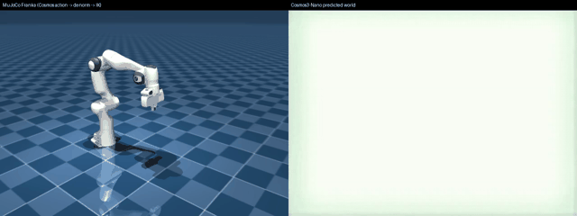

# Cosmos 3 in process

`backend="diffusers"` runs Cosmos 3 in the calling process through native
`diffusers`, so one forward pass returns the predicted world video and sound
alongside the action chunk, and the full physics loop (`forward_dynamics`,
`inverse_dynamics`) is reachable. The policy itself - its parameters,
embodiments and action spaces - is on [Cosmos 3](cosmos3.md).

## Install

```bash
# in-process backend (heavy GPU stack: diffusers + torch)
uv pip install "strands-robots[cosmos3-diffusers]"
```

`Cosmos3OmniPipeline` and `CosmosActionCondition` first ship in diffusers
0.39.0, which the extra floors; `nvidia/Cosmos3-Edge` is built against
0.40.0.dev0, which at the time of writing ships only from source:

```bash
uv pip install 'diffusers @ git+https://github.com/huggingface/diffusers'
```

Loading a checkpoint the installed diffusers cannot build is refused naming the
tensors it could not fill - `from_pretrained` itself only warns and would run on
random weights. The extra is native `diffusers` + `torch` + `transformers`,
`numpy>=2`-compatible and co-installable with `cosmos3-service`.

> **Action layout note.** The `diffusers` backend returns the model's **raw
> unified action** (DROID = 9D end-effector pose `tx,ty,tz,r0..r5` + 1D `grasp`
> = 10D), named by the embodiment `raw_action_layout` - the pipeline's native
> output, *before* the RoboLab server's `joint_pos` (8D) conversion. Use
> `backend="service"` when you need joint-position commands.

> **Safety checker / `cosmos_guardrail`.** `Cosmos3OmniPipeline` builds a
> `CosmosSafetyChecker` at load time, which requires the heavy optional
> `cosmos_guardrail` package and otherwise raises `ImportError: cosmos_guardrail
> is not installed`. The diffusers backend disables it by default
> (`enable_safety_checker=False`, passed through to `from_pretrained`) so the
> pipeline loads without that extra. To re-enable it, install `cosmos_guardrail`
> and build the backend with `enable_safety_checker=True`, then hand that backend
> to the policy - the flag is a `Cosmos3DiffusersBackend` parameter, not a
> `Cosmos3Policy` one:
>
> ```python
> from strands_robots.policies.cosmos3.embodiments import get_embodiment
> from strands_robots.policies.cosmos3.policy import Cosmos3Policy
> from strands_robots.policies.cosmos3.policy_diffusers import Cosmos3DiffusersBackend
>
> backend = Cosmos3DiffusersBackend(
>     embodiment=get_embodiment("droid"),
>     model="nvidia/Cosmos3-Nano",
>     enable_safety_checker=True,   # needs cosmos_guardrail installed
> )
> policy = Cosmos3Policy(embodiment="droid", backend="diffusers", diffusers_backend=backend)
> ```
>
> `Cosmos3Policy` forwards only `embodiment`, `model` and `mode` to the backend, so
> the same route is how you reach its other load and sampling knobs
> (`resolution_tier`, `view_point`, `device`, `dtype`, `num_inference_steps`,
> `guidance_scale`, `enable_sound`). Note Cosmos runs in `bfloat16`, so the backend
> up-casts the half-precision action tensor to `float32` before returning the chunk.

## World video alongside the action chunk

One in-process forward pass returns the predicted world video, optional sound,
**and** the action chunk. The chunk comes back through the normal `get_actions`
-> `list[dict]` contract; video and sound are surfaced on `policy.last_rollout`:

```python
from strands_robots.policies import create_policy

policy = create_policy(
    "cosmos3",
    embodiment="droid",
    backend="diffusers",
    model="nvidia/Cosmos3-Nano",  # HF repo id or local path
)
policy.set_robot_state_keys([f"joint_{i}" for i in range(7)] + ["gripper"])

steps = policy.get_actions_sync(observation, "pick up the red cube")
# steps == [{"tx": .., "ty": .., ..., "r5": .., "grasp": ..}, ...]  (raw unified
# action, one dict per timestep)

# the predicted world video Cosmos rolled out for that action chunk:
print(policy.last_rollout["video"])   # path to an .mp4 / .gif
print(policy.last_rollout["sound"])   # path to a .wav, or None
```

## Action modes

The diffusers backend exposes Cosmos 3's full physics loop via the `mode` kwarg
(`CosmosActionCondition.mode`). These do **not** exist in service mode - a
non-`policy` mode under `backend="service"` raises.

| `mode` | conditioning | predicts | `get_actions` returns |
|--------|--------------|----------|------------------------|
| `policy` (default) | first frame + task prompt | future video **+ actions** | action chunk (`list[dict]`) |
| `forward_dynamics` | first frame + given `raw_actions` | future video | `[]` (world video on `last_rollout`) |
| `inverse_dynamics` | an observed video | the actions between frames | action chunk (`list[dict]`) |

All three modes are verified live on real `nvidia/Cosmos3-Nano` weights (Thor,
bf16/CUDA); metrics in `docs/assets/cosmos3/live_modes_metrics.json`.

```python
# forward dynamics: "what world results if I run these actions?"
fd = create_policy("cosmos3", embodiment="droid", backend="diffusers", mode="forward_dynamics")
fd.set_robot_state_keys([f"joint_{i}" for i in range(7)] + ["gripper"])
fd.get_actions_sync(observation, "", raw_actions=my_action_chunk)
print(fd.last_rollout["video"])   # predicted world rollout

# inverse dynamics: "what actions produced this observed video?"
inv = create_policy("cosmos3", embodiment="droid", backend="diffusers", mode="inverse_dynamics")
inv.set_robot_state_keys([f"joint_{i}" for i in range(7)] + ["gripper"])
steps = inv.get_actions_sync(observation, "", video="observed.mp4")
```

## Closing the sim loop: de-normalize → IK → MuJoCo

The `diffusers` backend's raw unified action is **quantile-normalized to
`[-1, 1]`** and encodes a *relative end-effector pose delta* per step, **not
joint radians** - fed straight to MuJoCo joint actuators it is meaningless.
Three geometric steps (`cosmos3-sim` extra: `mink` + `mujoco`, numpy>=2,
co-installable with the other extras) turn it into joint targets. The fence below
also reads a robot model, which `robot_descriptions` ships and no cosmos3 extra
declares, so add `sim-mujoco` when you run it:

1. **De-normalize** - invert the quantile transform with the embodiment's
   bundled `q01`/`q99` action stats:
   `denorm = 0.5 * (a + 1) * (q99 - q01) + q01` (`denormalize_quantile`).
2. **Decode poses** - integrate the per-step `[translation(3), rot6d(6)]` deltas
   into an absolute `(T+1, 4, 4)` SE3 trajectory anchored at the robot's current
   EE pose (`decode_pose_trajectory`, via `MinkIKBridge.ee_pose(qpos)`, the
   forward-kinematics call).
3. **Inverse kinematics** - solve each Cartesian target with
   [`mink`](https://github.com/kevinzakka/mink) differential IK on the *same*
   `mujoco.MjModel`, warm-starting each step (`MinkIKBridge`).

```python
import mujoco, numpy as np
from robot_descriptions import panda_mj_description
from strands_robots.policies.cosmos3 import (
    Cosmos3Policy, MinkIKBridge, decode_cosmos_chunk_to_targets,
)
from strands_robots.policies.cosmos3.embodiments import get_embodiment

policy = Cosmos3Policy(embodiment="droid", backend="diffusers", model="nvidia/Cosmos3-Nano")
policy.set_robot_state_keys([f"joint_{i}" for i in range(7)] + ["gripper"])
chunk_dicts = policy.get_actions_sync(observation, "pick up the red cube")
raw_chunk = policy.last_rollout["action"]          # [T, 10] raw [-1,1] action

model = mujoco.MjModel.from_xml_path(panda_mj_description.MJCF_PATH)
bridge = MinkIKBridge(model, ee_frame_name="hand", ee_frame_type="body")
q_init = np.zeros(model.nq); q_init[:7] = [0, -0.3, 0, -2.2, 0, 2.0, 0.79]

out = decode_cosmos_chunk_to_targets(raw_chunk, get_embodiment("droid"), bridge, q_init)
out["qpos"]            # [T, nq] joint targets to send to MuJoCo
out["gripper"]         # [T] grasp column (None for grasp-less embodiments)
out["tracking_error"]  # {"mean_mm", "max_mm"} Cartesian tracking error
```

Verified on Thor against real `nvidia/Cosmos3-Nano` weights, a reachable EE
trajectory tracks to **mean ≈ 11.5 mm / max ≈ 42.8 mm** - the bar pinned by
`tests/policies/cosmos3/test_sim_ik.py`. The Cosmos "modes" above are
world-model *conditioning* modes, not a kinematics solve; this IK layer is
applied *after* Cosmos.

### De-normalization stats are per domain

The de-normalize step needs that domain's own `q01`/`q99` quantiles. Two domains
ship them bundled; the other three registered embodiments do not:

| embodiment | domain | raw dim | bundled stats |
|---|---|---|---|
| `droid` | `droid_lerobot` | 10 | yes |
| `bridge` | `bridge_orig_lerobot` | 10 | yes |
| `umi` | `umi` | 10 | no |
| `av` | `av` | 9 | no |
| `openarm` | `openarm_lerobot` | 10 | no |

`nvidia/Cosmos3-Edge` documents its forward-dynamics example on `umi` and its
inverse-dynamics example on `av` - both without bundled quantiles - so driving
the sim bridge from Edge means supplying that domain's stats yourself:

```python
out = decode_cosmos_chunk_to_targets(
    raw_chunk, get_embodiment("umi"), bridge, q_init,
    stats={"q01": q01, "q99": q99},   # this domain's own quantiles
    stats_domain="umi",               # required: which domain they describe
)
```

`stats` takes the quantiles as a list (the layout of the bundled
`stats/*_stats.json`), tuple or array; every component must be a finite real
number, since one `nan` quantile would spread through the whole trajectory.
`stats_domain` is required with `stats` and must match the embodiment's domain:
four of the five domains are 10 columns wide, so the width check cannot tell
their quantiles apart, and the two bundled domains disagree by up to **2.77x**
on the translation they decode from the same normalized action.



*Left: MuJoCo Franka driven by a **real** `nvidia/Cosmos3-Nano` action chunk through de-normalize → decode → IK. Right: the Cosmos predicted world video from the same forward pass. Runnable: `examples/vla/cosmos3_diffusers_mujoco_rollout.py --render out.mp4`.*

## See also

- [Cosmos 3](cosmos3.md) - the policy, its parameters and its embodiments.
- [Policy overview](overview.md)
- [Rollouts](../simulation/rollouts.md)
