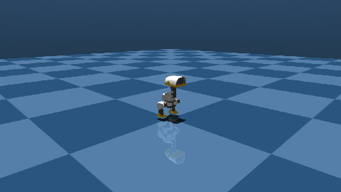

# Microduck — locomotion policies for the Pollen 14-DOF biped

`MicroduckPolicy` wraps one of Pollen Robotics' shipped **Microduck** ONNX
policies (`alpha_walking`, `alpha_stand`, `alpha_sitstand`, `roulade`,
`ball_kick_left`/`ball_kick_right`, `roller`/`roller_crouch`,
`alpha_ground_pick`) and drives the open 14-DOF biped through the standard
`Robot(...).run_policy` seam — in MuJoCo or on hardware.

Each export is an actor with its input **normaliser fused into the graph**, so
the provider feeds the observation **raw** and never re-normalises. The policy
also **self-configures from the ONNX metadata**: `joint_names`,
`default_joint_pos`, `action_scale` and `command_names` are read from the file's
`custom_metadata_map` on first inference, so pointing it at a different weight
file reconfigures it. Explicit constructor arguments always win.

## Walking in MuJoCo

{ width=480 }

_`alpha_walking.onnx` driven forward at `vx=0.3 m/s`, filmed with a
body-tracking chase camera. Reproduce with
[`examples/microduck/render_video.py`](https://github.com/strands-labs/robots/blob/main/examples/microduck/render_video.py):_

```bash
export DYLD_FALLBACK_LIBRARY_PATH=/opt/homebrew/lib  # macOS: Homebrew ffmpeg
python examples/microduck/render_video.py \
    --onnx ../microduck/policies/alpha_walking.onnx \
    --vx 0.3 --duration 8 --out walk_forward.mp4 \
    --gif docs/assets/microduck/microduck_walk.gif
```

`render_video.py` steps the sim manually at the control frequency and captures
each frame with a tracking camera locked to the pelvis, so the duck stays
centered as it walks. `--vx`/`--vy`/`--vyaw` set the twist command, and any
shipped weight (`alpha_stand`, `roulade`, `ball_kick_*`, …) drops straight in.


## Install

```bash
pip install "strands-robots[microduck]"
```

That pulls `onnxruntime` (runs the graph). Weights are not bundled — they ship
in Pollen's `microduck` repository under `policies/*.onnx`. A MuJoCo rollout
additionally needs `strands-robots[sim-mujoco]`.

## Walk in simulation

```python
from strands_robots import Robot
from strands_robots.policies.microduck import MicroduckPolicy

sim = Robot("microduck")
sim.reset()

policy = MicroduckPolicy(onnx_path="alpha_walking.onnx")
sim.run_policy(
    policy_object=policy,
    control_frequency=50,
    duration=8.0,
    policy_kwargs={"target_velocity": [0.3, 0.0, 0.0]},  # forward twist
)
```

See [`examples/microduck/microduck_walk_sim.py`](https://github.com/strands-labs/robots/blob/main/examples/microduck/microduck_walk_sim.py)
for the runnable script.

## The observation contract

The vector is a fixed float32 concatenation (measured off Pollen's reference
`infer_policy.py` and each ONNX's `observation_names` metadata):

| block | width | source |
| --- | --- | --- |
| `base_ang_vel` | 3 | IMU angular velocity |
| `projected_gravity` | 3 | world `-Z` rotated into the base frame from `base_quat` |
| `joint_pos` | 14 | current joint position − `DEFAULT_POSE`, contract order |
| `joint_vel` | 14 | joint velocity, contract order |
| `last_action` | 14 | the **previous raw** ONNX output (not the motor target) |
| `command` | C | unified command (`twist(3) + head_pose(4) + body_pose(6)`) |

Total width is `48 + C`: **61** for the shipped alpha policies (C = 13) and 51
for legacy twist-only policies (C = 3). The width is read from `command_names`,
never hardcoded, and unused command slots stay present and zero (the
dead-weight rule) so one observation layout serves every skill. Actions decode
as `motor_target = DEFAULT_POSE + action * action_scale`.

`action_scale` is the only path from the network's output to the joint targets,
so it must be a positive finite number. A scale of `0` would make every target
exactly `DEFAULT_POSE` — the network's decision discarded and the biped holding
its nominal stance while the rollout reports success — and a non-finite one
would make all fourteen targets `nan`. Both routes to the decode are held to
that domain: an explicit `action_scale=` and the value read from the ONNX
`action_scale` metadata.

## Commanding motion

The command vector defaults to all-zero (stand in place). Steer with the
well-known `target_velocity` kwarg (writes the twist slots) or replace it
wholesale with `command=`:

```python
await policy.get_actions(obs, "", target_velocity=[0.3, 0.0, 0.2])  # vx, vy, ω
```

## Hot-swapping skills

`MicroduckPolicyBundle` holds several `MicroduckPolicy` instances warm and
delegates each tick to the active one, so a controller can switch skill
mid-rollout without rebuilding sessions:

```python
from strands_robots.policies.microduck import MicroduckPolicy, MicroduckPolicyBundle

bundle = MicroduckPolicyBundle(
    {
        "walk": MicroduckPolicy(onnx_path="alpha_walking.onnx"),
        "stand": MicroduckPolicy(onnx_path="alpha_stand.onnx"),
    },
    active="stand",
    switch_on_velocity=0.1,  # auto walk<->stand by |twist|
)
```

Select explicitly with `get_actions(..., select="walk")` or `bundle.switch(...)`.

`switch_on_velocity` must be a positive finite number. The gate compares a
magnitude, so a threshold of `0` or below could never select the idle skill and
a non-finite one could never select the move skill. Omit it (the default) to
leave the gate off and switch only explicitly.

## Byte-compatibility

`MicroduckPolicy.infer_raw(obs_vector)` runs the graph on a raw observation with
no normalisation — exactly as Pollen's reference deployment does. The provider's
test suite pins that an identical 61-D observation yields an action byte-identical
(0.0 max abs delta) to a bare `onnxruntime` session, and that a real MuJoCo
rollout moves the joints.
