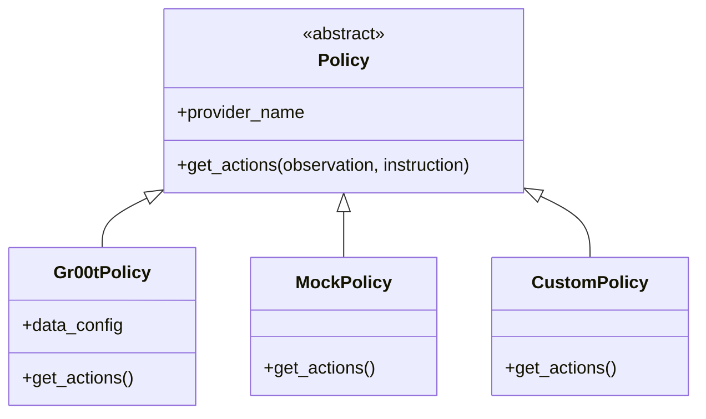

# Policy Providers Overview

!!! info "Coming Soon"
    This page is under active development.

Strands Robots uses a plugin-based policy registry — any VLA model can be integrated.

## Architecture

## Supported Providers

| Provider | Description |
|----------|-------------|
| `groot` | NVIDIA GR00T N1.5/N1.6 |
| `lerobot_local` | LeRobot local policies (ACT, Pi0, SmolVLA) |
| `mock` | Random actions for testing |
