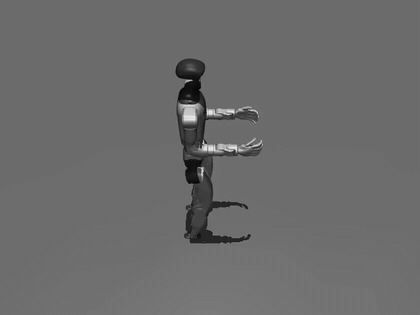

# WBC rollouts (torque control, recording, composite)

How a [WBC](wbc.md) rollout is run: the torque shim `run_policy` installs on a
position-servo scene, a camera that rides with the walk, the upstream
torque-deploy loop, and layering a manipulation policy on the arms. The
controller itself - install, parameters, goal kwargs, observation layout - is on
the [WBC](wbc.md) page.

## In simulation

```python
from strands_robots import Robot

sim = Robot("unitree_g1")             # sim-by-default; CPU ONNX, no GPU needed
sim.run_policy(
    robot_name="unitree_g1",
    instruction="walk forward",       # ignored by the controller
    policy_provider="wbc",
    policy_config={"checkpoint": "/path/to/grootwbc-g1", "walk": True},
    policy_kwargs={"target_velocity": [0.5, 0.0, 0.0]},   # per-call locomotion goal
    duration=10.0,
    control_frequency=50.0,
    action_horizon=1,                 # WBC is closed-loop per tick
)
```

The stock Menagerie G1 ships *position-servo* actuators with a uniform `kp=500`
that overrides SONIC's tuned PD, so writing targets to them directly makes the
robot fall. `run_policy` therefore detects a `WBCPolicy` on a position-servo
scene and installs the torque shim (`WBCTorqueController`, PD->torque) for the
call, restoring the actuators afterwards so a second call behaves like the
first. That install is the MuJoCo engine's: the shim is written against a
compiled `MjModel`, so on any other backend (`newton`, `isaac`) a WBC rollout is
refused up front - naming `backend="mujoco"` and the opt-out below - instead of
running without it. The shim's `physics_substeps_per_control` (upstream `control_decimation=4`
at 0.005 s = one inference per 20 ms) must be a positive integer, because the
gait clock integrates at the declared period. With the real weights and
`target_velocity = [0.5, 0, 0]` the base advances ~1.9 m over 5 s at pelvis
height ~0.75 m. Opt out to drive a torque scene directly:

```python
sim.run_policy(..., policy_provider="wbc", wbc_install_torque_control=False)
```

A *static* velocity can be set once via
`policy_config={"checkpoint": ..., "target_velocity": [0.5, 0.0, 0.0]}`; that is
also the way to evaluate WBC at a fixed velocity, since `policy_kwargs` is wired
on the control path (`run_policy` / `start_policy` / `tell()`), not on
`eval_policy`.

### Recording it

`run_policy(video={...})` records from the scene's `default` camera unless told
otherwise, and that view is a fixed function of the compiled model - its pose
does not move while the robot does. On the stock G1 scene the pelvis crosses the
right edge of the 640x480 default view after 1.5 m of forward walk (under 4 s at
0.4 m/s) and the rest of the clip is empty floor. Add a camera first and name it
in `video`. Mounted on the pelvis it rides with the robot and turns with it -
`position` and `target` are then in the pelvis frame, x forward:

```python
sim = Robot("unitree_g1")
sim.add_camera(
    name="follow",
    parent_body="unitree_g1/pelvis",
    position=[-2.6, -1.6, 1.1],     # behind and to the right, a little above
    target=[0.4, 0.0, -0.3],        # looking just ahead of the base
    fov=45,
    width=1280,
    height=720,
)
sim.run_policy(
    robot_name="unitree_g1",
    policy_provider="wbc",
    policy_config={"checkpoint": "/path/to/grootwbc-g1", "walk": True},
    policy_kwargs={"target_velocity": [0.5, 0.0, 0.3]},
    duration=6.0,
    control_frequency=50.0,
    action_horizon=1,
    video={"path": "/tmp/g1_follow.mp4", "fps": 30, "camera": "follow", "width": 1280, "height": 720},
)
```

The mount holds the base at one pixel for the whole rollout, so a longer walk
needs no re-placement.
[`examples/microduck/eval_rl_policy.py`](https://github.com/strands-labs/robots/blob/main/examples/microduck/eval_rl_policy.py)
records a walking robot this way: a `chase` camera mounted on
`microduck/trunk_base`, added before the rollout and named in its `video`.
A fixed camera works when the path is known -
[`examples/kimodo/kimodo_g1_walking.py`](https://github.com/strands-labs/robots/blob/main/examples/kimodo/kimodo_g1_walking.py)
calls `add_camera` with `position=[3.0, 0.0, 1.2]`, `target=[0.0, 0.0, 0.8]` to
face the G1 where it starts. Either way the camera has to be added before the
rollout; `add_camera` is refused while a policy is running.

## Watching it walk (torque-control deploy)

[`examples/wbc/wbc_g1_torque_deploy.py`](https://github.com/strands-labs/robots/blob/main/examples/wbc/wbc_g1_torque_deploy.py)
reproduces the upstream deploy loop directly - torque motors,
`policy.compute_torques(...)` at `control_decimation=4`, whole-body observation
with real joint velocities + base IMU:

```bash
python examples/wbc/wbc_g1_torque_deploy.py --checkpoint /path/to/grootwbc-g1 \
    --duration 5 --vx 0.5 --mp4 /tmp/g1_walk.mp4
```

With the real weights this produces a stable forward walk (~0.38 m/s for a
0.5 m/s command); `--vx 0` holds balance in place.

<figure markdown>
  
  <figcaption>Unitree G1 under <code>WBCPolicy</code> (GR00T-WBC SONIC, <code>walk_policy.onnx</code>)
  commanded at <code>vx = 0.5 m/s</code> — the torque-PD deploy loop in MuJoCo (headless).
  The base advances ~2.3 m over 6 s (~0.38 m/s) while holding pelvis height ~0.75 m and
  staying upright. Produced by <code>examples/wbc/wbc_g1_torque_deploy.py --vx 0.5 --mp4</code>
  (<a href="https://github.com/strands-labs/robots/blob/main/docs/assets/wbc/g1_walk.mp4">MP4</a>).</figcaption>
</figure>

## Composing an upper body (manipulation on top of WBC)

To layer a manipulation policy on the arms while WBC keeps the robot balanced
and walking, wrap both in [`CompositePolicy`](custom-policies.md): the lower
policy owns legs+waist, the upper policy owns the arms, and the composite queries
both each tick and merges their action dicts by joint name.

```python
from strands_robots.policies import CompositePolicy, create_policy
from strands_robots.policies.wbc import WBC_G1_ALL_JOINTS, WBC_G1_LEG_WAIST_JOINTS

ARM_JOINTS = WBC_G1_ALL_JOINTS[len(WBC_G1_LEG_WAIST_JOINTS):]  # the 14 arm DOFs

lower = create_policy("wbc", checkpoint="/path/to/grootwbc-g1")
upper = create_policy("groot", port=5555)        # or pi0 / MolmoAct / any Policy
policy = CompositePolicy(
    lower=lower,
    upper=upper,
    lower_joints=WBC_G1_LEG_WAIST_JOINTS,   # legs + waist
    upper_joints=ARM_JOINTS,                 # both arms
)
```

Each child contributes only its own joint group; a genuine ownership conflict
is raised, never silently resolved, and the merged chunk length is the shorter
of the two so the per-tick controller is never starved. An explicit group is
exclusive either way round - the child it names is the only one allowed to
command those joints, so a whole-body manipulation policy paired with
`lower_joints=WBC_G1_LEG_WAIST_JOINTS` is refused rather than allowed to drive
the waist on the ticks the balance controller happens not to command it. `lower_obs_keys` /
`upper_obs_keys` optionally narrow what each child is queried with, and a subset
sharing no key with the observation is refused - a balance controller reading
nothing runs open-loop. Run the composite like a bare policy; the torque shim is
installed for the `WBCPolicy` inside it (or inside a `PersistentPolicy`) and
runs a light PD (`kp = 100`, `kd = 0.5`) on each arm joint toward the upper
policy's target:

```python
sim.run_policy(
    robot_name="unitree_g1",
    policy_object=policy,
    policy_kwargs={"target_velocity": [0.5, 0.0, 0.0]},
    control_frequency=50.0,
    n_steps=500,
)
```

[`examples/wbc/wbc_g1_composite.py`](https://github.com/strands-labs/robots/blob/main/examples/wbc/wbc_g1_composite.py)
runs the composite in the torque-deploy loop with a scripted arm-wave as the
upper body (`--upper-port` for a real GR00T server):

```bash
python examples/wbc/wbc_g1_composite.py --checkpoint /path/to/grootwbc-g1 \
    --duration 5 --vx 0.4 --mp4 /tmp/g1_composite.mp4
```

<figure markdown>
  
  <figcaption>Unitree G1 under <code>CompositePolicy</code>: <code>WBCPolicy</code> (GR00T-WBC SONIC)
  drives the legs+waist for a <code>vx = 0.4 m/s</code> walk while the upper-body policy drives the
  arms - the base advances ~1.55 m over 5 s while the arms move, in MuJoCo (headless).
  Produced by <code>examples/wbc/wbc_g1_composite.py --vx 0.4 --mp4</code>
  (<a href="https://github.com/strands-labs/robots/blob/main/docs/assets/wbc/g1_composite.mp4">MP4</a>).</figcaption>
</figure>

## See also

- [WBC](wbc.md) - the controller: install, parameters, goal kwargs, control contract.
- [WBC gait-clock variant](wbc_gait.md)
- [Custom policies](custom-policies.md) - the `CompositePolicy` ownership contract.
- [Rollouts](../simulation/rollouts.md) - the posture flags every rollout surface takes.
