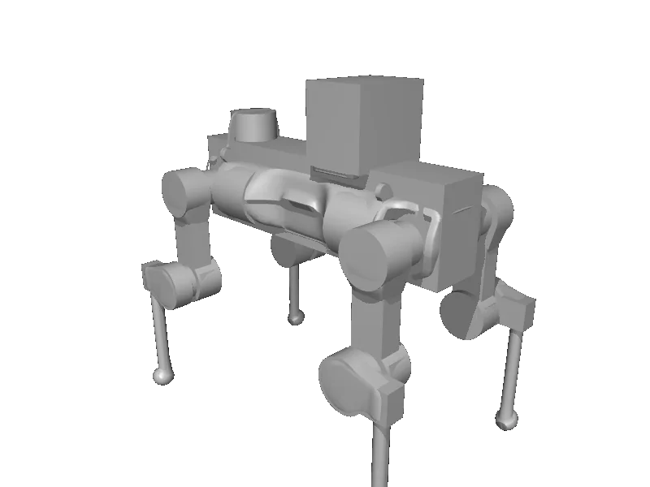

<!-- generated: docs/hooks/robot_pages.py -->

# anymal_d (quadruped URDF from robot_descriptions)

{{robot_chips:anymal_d}}

URDF from [ANYbotics/anymal_d_simple_description@6adc147](https://github.com/ANYbotics/anymal_d_simple_description/tree/6adc14720aab583613975e5a9d6d4fa3cfcdd081), [compiled for MuJoCo](../learn/simulation/urdf.md) on first use: 14 position actuators, floating base.



```python title="sketch"
from strands_robots import Robot

robot = Robot("anymal_d")  # clones the description and compiles the URDF on first use
print(robot.robot_action_keys("anymal_d"))
robot.cleanup()
```

Command it as a velocity setpoint stream, or train a gait in batch ([rl](../learn/policies/rl.md)).

## Policies verified on this robot

No checkpoint verified on this robot yet. Record one: [Record](../learn/data/record.md), then [train](../learn/training/lerobot.md) and run it with `run_policy`.
