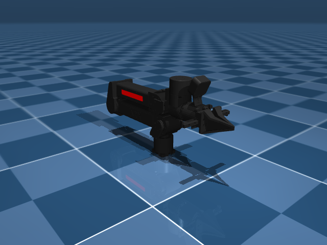
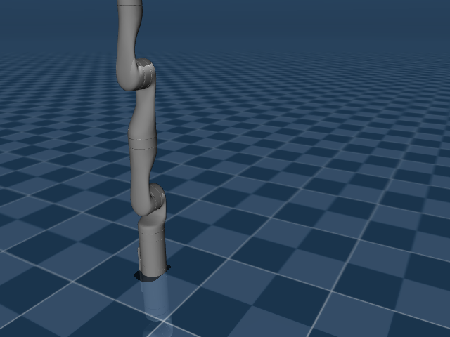
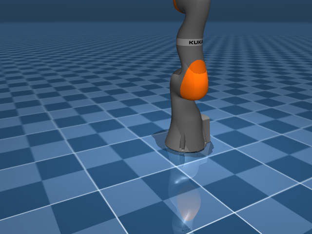
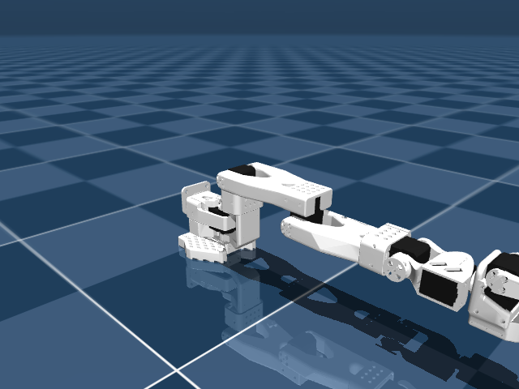
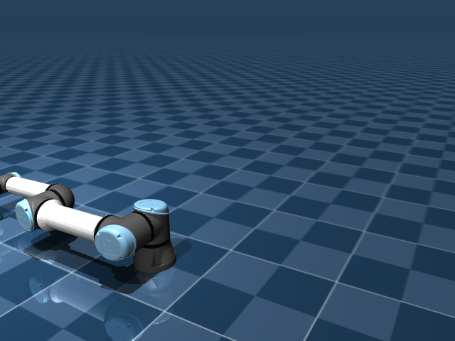
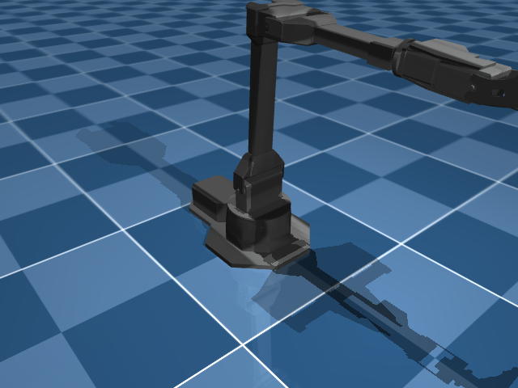
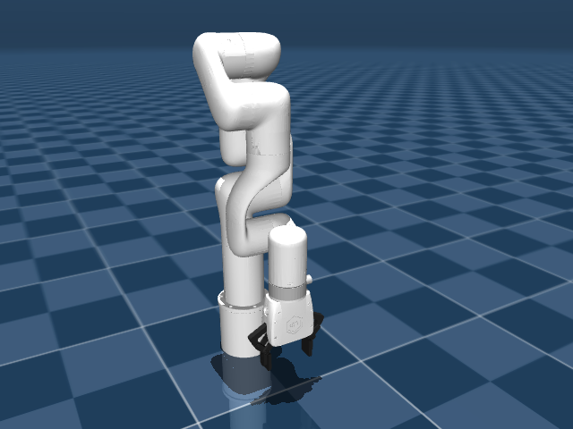
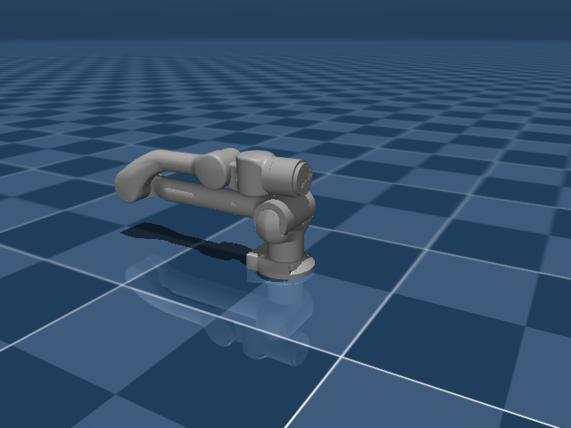

# Arms

16 robot arms from tabletop to industrial. All single-arm manipulators.

---

| Robot | DOF | Notes |
|---|---|---|
| **SO-100** | 6 | TrossenRobotics SO-ARM100. Feetech servos. Best starter robot. |
| **SO-101** | 6 | RobotStudio. Upgraded SO-100 design. |
| **Koch v1.1** | 6 | Low-cost 3D-printed arm. Dynamixel servos. |
| **Franka Panda** | 7 | Research-grade. Torque sensing. |
| **FR3** | 8 | Franka Research 3. Next-gen Franka. |
| **UR5e** | 6 | Universal Robots. Industrial collaborative. |
| **KUKA iiwa** | 7 | Industrial. Impedance control. |
| **Kinova Gen3** | 7 | Lightweight research arm. |
| **xArm 7** | 7 | UFactory. Affordable 7-DOF. |
| **ViperX 300s** | 6 | Trossen Robotics. Desktop. |
| **ARX L5** | 6 | Compact low-cost arm. |
| **AgileX Piper** | 6 | AgileX Robotics. 6-DOF + gripper. |
| **Unitree Z1** | 6 | Unitree's manipulation arm. 6-DOF + gripper. |
| **Enactic OpenArm** | 7 | Open-source modular. DAMIAO motors, CAN bus. |
| **OMX** | 6 | Open Manipulator X (ROBOTIS). CAN bus motors. |
| **HOPE Jr** | — | Hope Junior arm platform. |

---


<div class="robot-gallery" markdown>
<figure markdown>
  { width="240" }
  <figcaption><b>Arx L5</b><br>ARX L5 (6-DOF lightweight arm)</figcaption>
</figure>
<figure markdown>
  { width="240" }
  <figcaption><b>Fr3</b><br>Franka Research 3 (7-DOF + gripper)</figcaption>
</figure>
<figure markdown>
  { width="240" }
  <figcaption><b>Kinova Gen3</b><br>Kinova Gen3 (7-DOF lightweight)</figcaption>
</figure>
<figure markdown>
  { width="240" }
  <figcaption><b>Koch</b><br>Koch v1.1 Low Cost Robot Arm (6-DOF, Dynamixel)</figcaption>
</figure>
<figure markdown>
  { width="240" }
  <figcaption><b>Kuka Iiwa</b><br>KUKA LBR iiwa 14 (7-DOF collaborative)</figcaption>
</figure>
<figure markdown>
  { width="240" }
  <figcaption><b>Openarm</b><br>Enactic OpenArm (7-DOF, DAMIAO motors, CAN bus)</figcaption>
</figure>
<figure markdown>
  { width="240" }
  <figcaption><b>Panda</b><br>Franka Emika Panda (7-DOF + gripper)</figcaption>
</figure>
<figure markdown>
  { width="240" }
  <figcaption><b>Piper</b><br>AgileX Piper (6-DOF + gripper)</figcaption>
</figure>
<figure markdown>
  { width="240" }
  <figcaption><b>So100</b><br>TrossenRobotics SO-ARM100 (6-DOF, Feetech servos)</figcaption>
</figure>
<figure markdown>
  { width="240" }
  <figcaption><b>Ur5E</b><br>Universal Robots UR5e (6-DOF industrial)</figcaption>
</figure>
<figure markdown>
  { width="240" }
  <figcaption><b>Vx300S</b><br>Trossen ViperX 300s (6-DOF + gripper)</figcaption>
</figure>
<figure markdown>
  { width="240" }
  <figcaption><b>Xarm7</b><br>UFactory xArm 7 (7-DOF + gripper)</figcaption>
</figure>
<figure markdown>
  { width="240" }
  <figcaption><b>Z1</b><br>Unitree Z1 (6-DOF + gripper)</figcaption>
</figure>
</div>

## Example

```python
from strands_robots import Robot

robot = Robot("so100")
obs = robot.get_observation()
print(f"Joint positions: {obs['joint_positions']}")
# Joint positions: [0.0, 0.0, 0.0, 0.0, 0.0, 0.0]
```

!!! tip "Start with SO-100"
    If you're new, the SO-100 is the best place to start. Cheap, well-documented, and used in most tutorials and training datasets.
