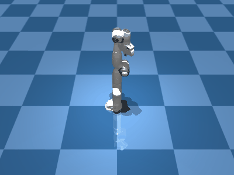

# Arms

Single-arm manipulators: industrial robots, research arms, educational kits.
**23 robots in this category.**

```python
from strands_robots import Robot
sim = Robot("panda")            # Franka Emika Panda
sim = Robot("ur5e")             # Universal Robots UR5e
sim = Robot("so100")            # SO-ARM100 (low-cost Feetech)
```

## Catalog

Every robot in this family, generated from `robots.json` at build time. Renders are MuJoCo sim renders, never hardware photos.

{{robot_cards:arm}}

## Compatibility notes

- Most arms are loadable in MuJoCo via the registry's asset block and pull from
  [robot_descriptions.py](https://github.com/robot-descriptions/robot_descriptions.py)
  on first use. Exceptions: `hope_jr`, `omx` and `rebot_b601` declare no sim asset
  and require physical hardware.
- Real hardware through LeRobot, where the registry entry names a `lerobot_type`:
  `hope_jr`, `koch`, `omx`, `openarm`, `rebot_b601`, `so100`, `so101`.
- Real hardware through a native Strands driver, selected with `driver="strands"`
  ([the contract](../hardware/native-drivers.md)):
  `dynamixel_2r`, `fr3`, `fr3_v2`, `hope_jr`, `koch`, `panda`, `so100`, `so101`,
  `ur10e`, `ur5e`, `vx300s`, `wx250s`.
- Every other arm is simulation-only: `Robot(name, mode="real")` refuses it and names
  the robots that do have a path, rather than falling back to sim.
- The Franka arms (`panda`, `fr3`, `fr3_v2`) are driven over the Franka Control
  Interface, which needs the control box's address and the `panda-py` binding over
  libfranka (`pip install panda-py`):

    ```python
    arm = Robot("panda", mode="real", driver="strands", port="172.16.0.2")
    arm.connect_eagerly()                     # returns None, or a reason
    arm.send_action({**dict(zip(arm.joint_names, targets)), "gripper_width": 0.04})
    ```

    Read `arm.joint_names` rather than assuming them: each Franka's joints are named
    the way *its own* MuJoCo model names them, so a Panda's are `joint1..joint7`
    while an FR3's are `fr3_joint1..fr3_joint7`. That is what lets one action dict
    drive the simulated arm and the real one:

    { width=400 }

    _The same dict, keyed by `arm.joint_names` and passed through the driver's own
    `action_to_targets` gate, stepping the simulated `panda`._

    A `send_action` that reports success means the arm reached the configuration
    it was given. `panda-py` runs the trajectory on its own realtime thread and
    reports the outcome as a return value rather than by raising, so a reflex
    stop, an out-of-limit target, or a motion that simply ended short of the goal
    all come back as an error envelope carrying libfranka's own message - not as
    a success naming joints the arm is not holding.

    `arm.stop()` preempts a motion in flight. It goes through libfranka's own
    `Robot::stop()`, which is designed to abort a running control loop from
    another thread, so it does not wait for the motion it was asked to interrupt;
    the Franka Hand is halted with the arm. Telemetry keeps answering throughout,
    so `read_state()` on another thread is not blanked for the duration of a
    motion.
- Joint counts include any free joints / gripper actuators - the *control* DOF is
  usually `joints - 1` for arms with grippers.

## See also

- [SO arms over the Feetech bus](../hardware/so-arms.md) - reading, calibrating and
  rolling a policy out on an SO-100/SO-101, and the same verbs against its twin.
- [Universal Robots over RTDE](../hardware/universal-robots.md) - UR5e and UR10e
  bring-up, the gates in front of a write, and `stop_task()`.
- [Robot factory](../getting-started/robot-factory.md) - how `Robot("name")` resolves
  these names.
- [Bimanual](bimanual.md) - two-arm setups (Aloha, Trossen WX-AI).
- [Hands](hands.md) - pair an arm with a dexterous end-effector.
- [Quickstart](../getting-started/quickstart.md) - spawn one of these arms in 3 lines.
