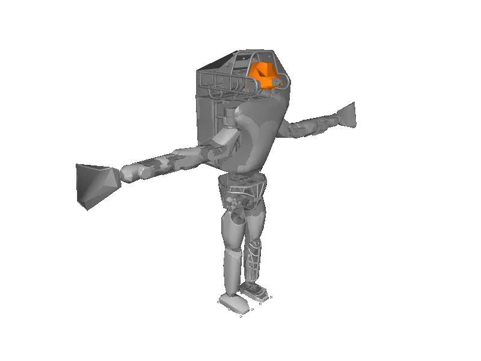

<!-- generated: docs/hooks/robot_pages.py -->

# atlas_drc (humanoid URDF from robot_descriptions)

<p class="sr-chips"><span class="sr-chip sr-chip-family" data-family="humanoid">Humanoids</span><span class="sr-chip">30 joints</span><span class="sr-chip sr-chip-sim">sim only</span></p>

URDF from [RobotLocomotion/drake@7abea05](https://github.com/RobotLocomotion/drake/tree/7abea0556ede980a5077fe1a8cfbae59b57c7c27), [compiled for MuJoCo](../learn/simulation/urdf.md) on first use: 30 position actuators, floating base.



```python
from strands_robots import Robot

robot = Robot("atlas_drc")
```
