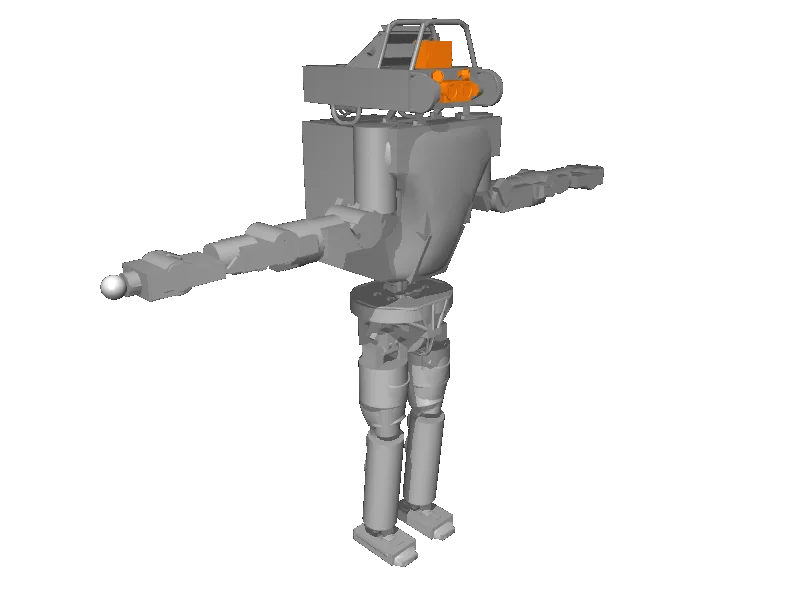

<!-- generated: docs/hooks/robot_pages.py -->

# atlas_v4 (humanoid URDF from robot_descriptions)

<p class="sr-chips"><span class="sr-chip sr-chip-family" data-family="humanoid">Humanoids</span><span class="sr-chip">30 joints</span><span class="sr-chip sr-chip-sim">sim only</span></p>

URDF from [openai/roboschool@1.0.49](https://github.com/openai/roboschool/tree/1.0.49), [compiled for MuJoCo](../learn/simulation/urdf.md) on first use: 30 position actuators, floating base.



```python
from strands_robots import Robot

robot = Robot("atlas_v4")
```
