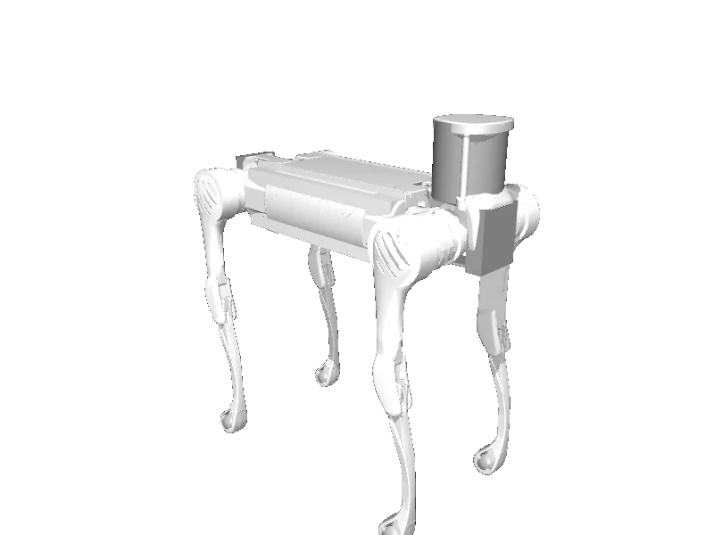

<!-- generated: docs/hooks/robot_pages.py -->

# b2 (quadruped URDF from robot_descriptions)

{{robot_chips:b2}}

URDF from [unitreerobotics/unitree_ros@267182b](https://github.com/unitreerobotics/unitree_ros/tree/267182b8521c8d6a631bab1fe63836873237a525), [compiled for MuJoCo](../learn/simulation/urdf.md) on first use: 12 position actuators, floating base.



```python title="sketch"
from strands_robots import Robot

robot = Robot("b2")  # clones the description and compiles the URDF on first use
print(robot.robot_action_keys("b2"))
robot.cleanup()
```

Command it as a velocity setpoint stream, or train a gait in batch ([rl](../learn/policies/rl.md)).

```python title="sketch"
robot = Robot("b2", mode="real", port="192.168.123.161", network_interface="eth0")  # Go2Driver
```

## Hardware

**`Go2Driver`** (the default for this robot) speaks CycloneDDS through `unitree_sdk2py`: [port, SDK, kwargs and checks](../learn/hardware/drivers.md#go2driver).

## Policies verified on this robot

No checkpoint verified on this robot yet. Record one: [Record](../learn/data/record.md), then [train](../learn/training/lerobot.md) and run it with `run_policy`.
