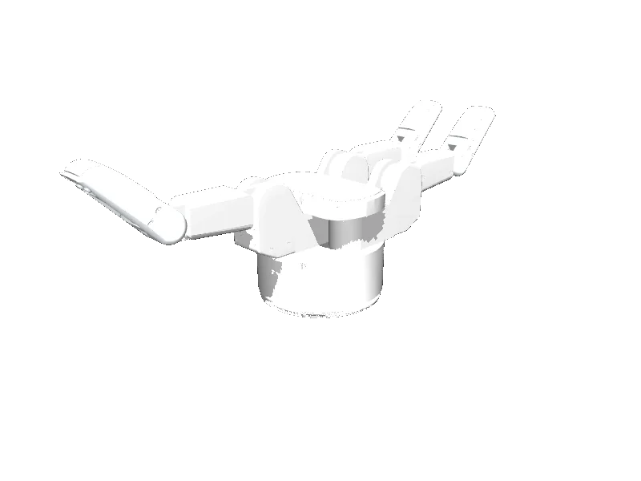

<!-- generated: docs/hooks/robot_pages.py -->

# barrett_hand (end_effector URDF from robot_descriptions)

<p class="sr-chips"><span class="sr-chip sr-chip-family" data-family="hand">Hands and grippers</span><span class="sr-chip">8 joints</span><span class="sr-chip sr-chip-sim">sim only</span></p>

URDF from [jhu-lcsr-attic/bhand_model@937f418](https://github.com/jhu-lcsr-attic/bhand_model/tree/937f4186d6458bd682a7dae825fb6f4efe56ec69), [compiled for MuJoCo](../learn/simulation/urdf.md) on first use: 8 position actuators, fixed base.



```python
from strands_robots import Robot

robot = Robot("barrett_hand")
```

## Policies verified on this robot

No checkpoint verified on this robot yet. Record one: [Record](../learn/data/record.md), then [train](../learn/training/lerobot.md) and run it with `run_policy`.
