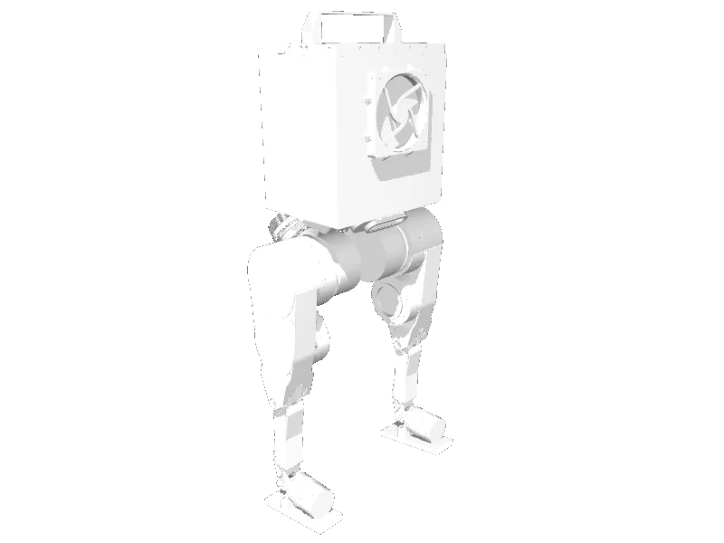

<!-- generated: docs/hooks/robot_pages.py -->

# berkeley_humanoid (humanoid URDF from robot_descriptions)

{{robot_chips:berkeley_humanoid}}

URDF from [HybridRobotics/berkeley_humanoid_description@d0d13d3](https://github.com/HybridRobotics/berkeley_humanoid_description/tree/d0d13d3f81d795480e25ed1910eaf83d5f0a1d0b), [compiled for MuJoCo](../learn/simulation/urdf.md) on first use: 12 position actuators, floating base.



```python title="sketch"
from strands_robots import Robot

robot = Robot("berkeley_humanoid")  # clones the description and compiles the URDF on first use
print(robot.robot_joint_names("berkeley_humanoid"))
robot.cleanup()
```

Walk it with a whole-body controller ([wbc](../learn/policies/wbc.md)) or a trained gait ([rl](../learn/policies/rl.md)).

## Policies verified on this robot

No checkpoint verified on this robot yet. Record one: [Record](../learn/data/record.md), then [train](../learn/training/lerobot.md) and run it with `run_policy`.
