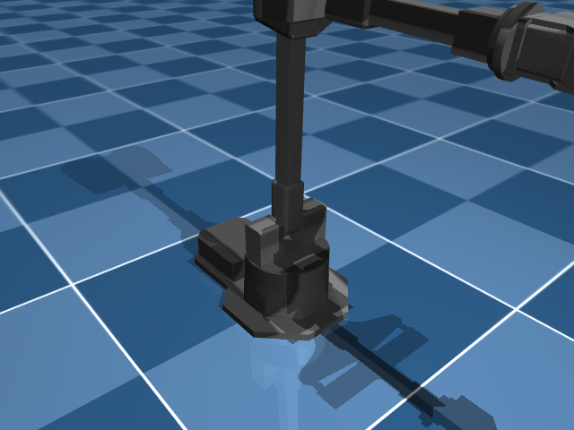

# Bimanual

Two-arm systems for tasks that need coordination — folding, pouring, assembly.

---

| Robot | Arms | DOF | Notes |
|---|---|---|---|
| **ALOHA** | 2 × ViperX 300s | 14 + 2 grippers | Google/Stanford. Leader-follower teleoperation. |
| **Trossen WidowX AI** | 2 × WidowX | 12 | Trossen Robotics bimanual kit. |
| **Bi-OpenArm** | 2 × OpenArm | 12+ | Dual-arm Enactic OpenArm coordination. |

---


<div class="robot-gallery" markdown>
<figure markdown>
  { width="240" }
  <figcaption><b>Aloha</b><br>ALOHA Bimanual (2x ViperX 300s, 14-DOF + 2 gripper</figcaption>
</figure>
<figure markdown>
  { width="240" }
  <figcaption><b>Trossen Wxai</b><br>Trossen WidowX AI Bimanual</figcaption>
</figure>
</div>

## Example

```python
from strands import Agent
from strands_robots import Robot

robot = Robot("aloha")
agent = Agent(tools=[robot])
agent("Fold the towel using both arms")
```

Bimanual robots manage both arms internally. The agent talks to one tool, both arms coordinate.
