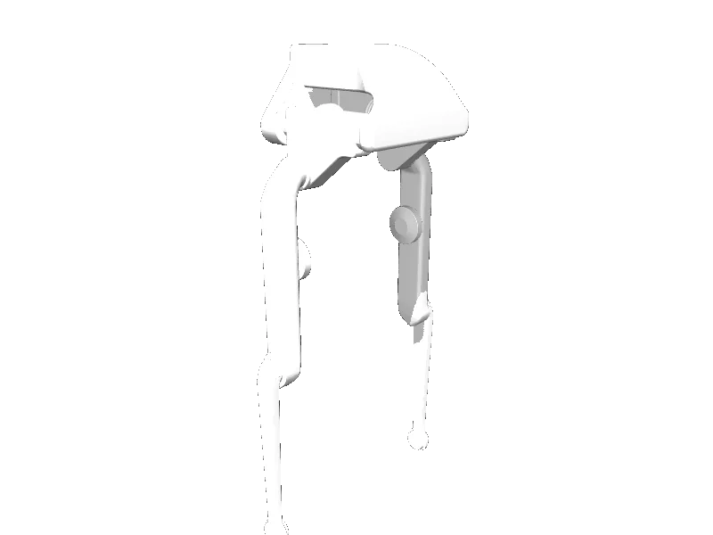

<!-- generated: docs/hooks/robot_pages.py -->

# bolt (biped URDF from robot_descriptions)

{{robot_chips:bolt}}

URDF from [Gepetto/example-robot-data@d0d9098](https://github.com/Gepetto/example-robot-data/tree/d0d9098d752014aec3725b07766962acf06c5418), [compiled for MuJoCo](../learn/simulation/urdf.md) on first use: 6 position actuators, floating base.



```python
from strands_robots import Robot

robot = Robot("bolt")
```

## Policies verified on this robot

No checkpoint verified on this robot yet. Record one: [Record](../learn/data/record.md), then [train](../learn/training/lerobot.md) and run it with `run_policy`.
