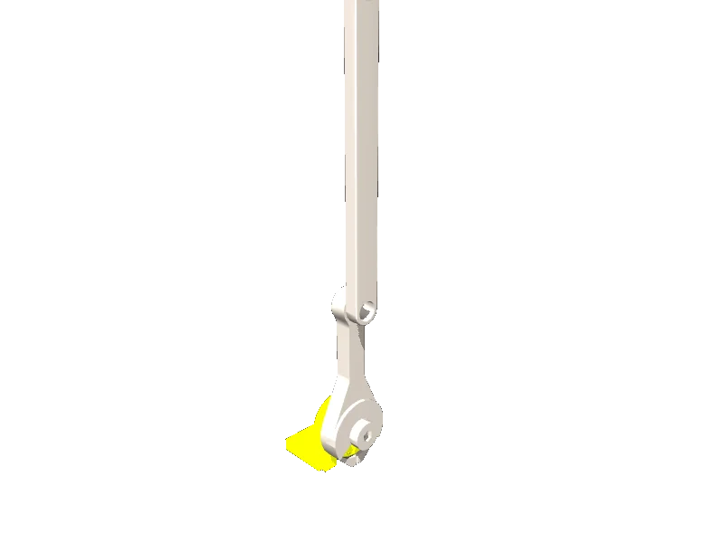

<!-- generated: docs/hooks/robot_pages.py -->

# double_pendulum (educational URDF from robot_descriptions)

{{robot_chips:double_pendulum}}

URDF from [Gepetto/example-robot-data@d0d9098](https://github.com/Gepetto/example-robot-data/tree/d0d9098d752014aec3725b07766962acf06c5418), [compiled for MuJoCo](../learn/simulation/urdf.md) on first use: 2 position actuators, fixed base.



```python title="sketch"
from strands_robots import Robot

robot = Robot("double_pendulum")  # clones the description and compiles the URDF on first use
print(robot.robot_joint_names("double_pendulum"))
robot.cleanup()
```

Add a cube and camera ([worlds and objects](../learn/simulation/worlds-and-objects.md)), then run [a checkpoint](../start/first-policy.md) on it.

## Policies verified on this robot

No checkpoint verified on this robot yet. Record one: [Record](../learn/data/record.md), then [train](../learn/training/lerobot.md) and run it with `run_policy`.
