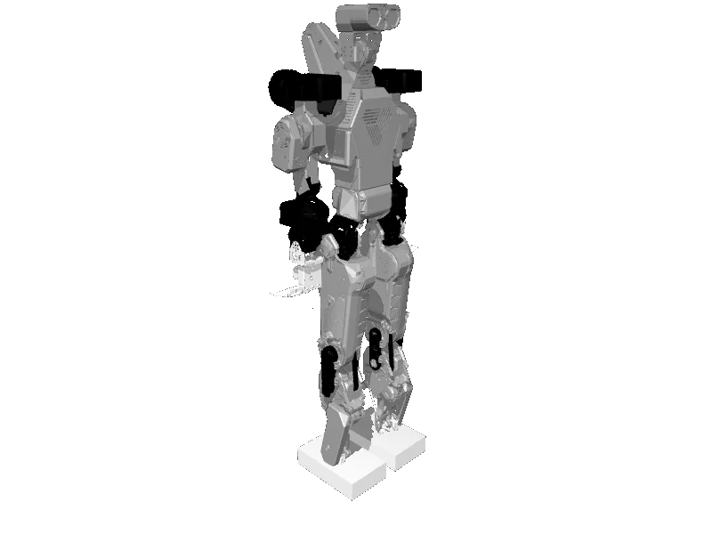

<!-- generated: docs/hooks/robot_pages.py -->

# draco3 (humanoid URDF from robot_descriptions)

<p class="sr-chips"><span class="sr-chip sr-chip-family" data-family="humanoid">Humanoids</span><span class="sr-chip">27 joints</span><span class="sr-chip sr-chip-sim">sim only</span></p>

URDF from [shbang91/draco3_description@5afd197](https://github.com/shbang91/draco3_description/tree/5afd19733d7b3e9f1135ba93e0aad90ed1a24cc7), [compiled for MuJoCo](../learn/simulation/urdf.md) on first use: 27 position actuators, floating base.



```python
from strands_robots import Robot

robot = Robot("draco3")
```

## Policies verified on this robot

No checkpoint verified on this robot yet. Record one: [Record](../learn/data/record.md), then [train](../learn/training/lerobot.md) and run it with `run_policy`.
