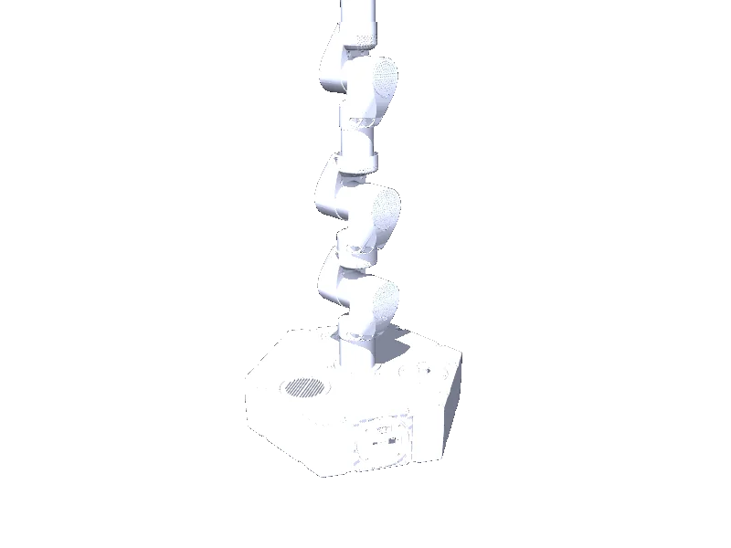

<!-- generated: docs/hooks/robot_pages.py -->

# edo (arm URDF from robot_descriptions)

{{robot_chips:edo}}

URDF from [ianathompson/eDO_description@17b3f92](https://github.com/ianathompson/eDO_description/tree/17b3f92f834746106d6a4befaab8eeab3ac248e6), [compiled for MuJoCo](../learn/simulation/urdf.md) on first use: 6 position actuators, fixed base.



```python title="sketch"
from strands_robots import Robot

robot = Robot("edo")  # clones the description and compiles the URDF on first use
print(robot.robot_joint_names("edo"))
robot.cleanup()
```

Add a cube and a camera ([worlds and objects](../learn/simulation/worlds-and-objects.md)), then run a checkpoint on it ([same checkpoint](../start/first-policy.md)).

## Policies verified on this robot

No checkpoint verified on this robot yet. Record one: [Record](../learn/data/record.md), then [train](../learn/training/lerobot.md) and run it with `run_policy`.
