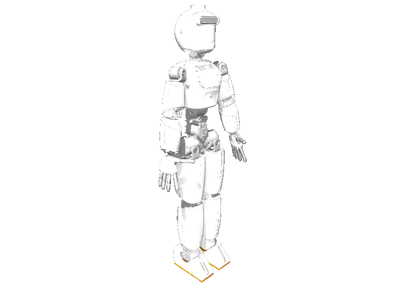

<!-- generated: docs/hooks/robot_pages.py -->

# ergocub (humanoid URDF from robot_descriptions)

<p class="sr-chips"><span class="sr-chip sr-chip-family" data-family="humanoid">Humanoids</span><span class="sr-chip">57 joints</span><span class="sr-chip sr-chip-sim">sim only</span></p>

URDF from [icub-tech-iit/ergocub-software@v0.7.7](https://github.com/icub-tech-iit/ergocub-software/tree/v0.7.7), [compiled for MuJoCo](../learn/simulation/urdf.md) on first use: 57 position actuators, floating base.



```python
from strands_robots import Robot

robot = Robot("ergocub")
```
