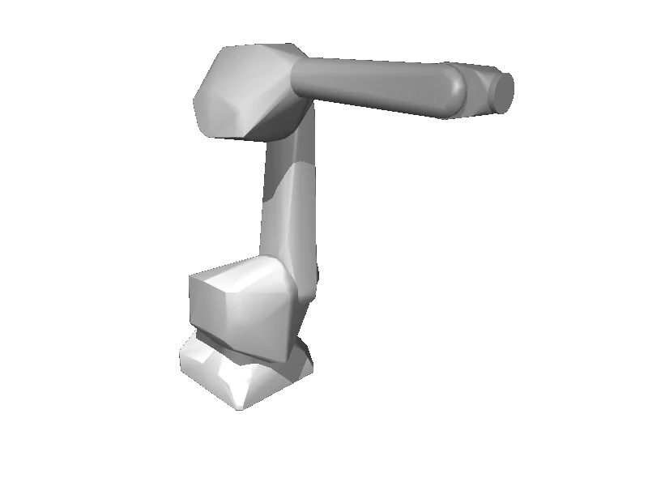

<!-- generated: docs/hooks/robot_pages.py -->

# fanuc_m710ic (arm URDF from robot_descriptions)

<p class="sr-chips"><span class="sr-chip sr-chip-family" data-family="arm">Arms</span><span class="sr-chip">6 joints</span><span class="sr-chip sr-chip-sim">sim only</span></p>

URDF from [robot-descriptions/fanuc_m710ic_description@d12af44](https://github.com/robot-descriptions/fanuc_m710ic_description/tree/d12af44559cd7e46f7afd513237f159f82f8402e), [compiled for MuJoCo](../learn/simulation/urdf.md) on first use: 6 position actuators, fixed base.



```python
from strands_robots import Robot

robot = Robot("fanuc_m710ic")
```

## Policies verified on this robot

No checkpoint verified on this robot yet. Record one: [Record](../learn/data/record.md), then [train](../learn/training/lerobot.md) and run it with `run_policy`.
