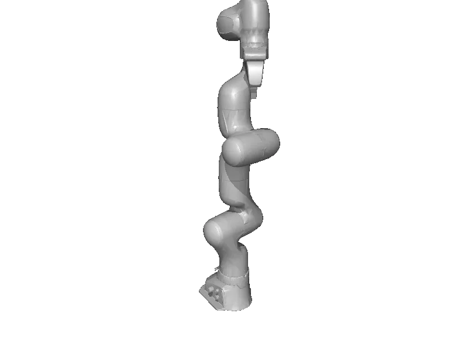

<!-- generated: docs/hooks/robot_pages.py -->

# fr3_v2_1 (arm URDF from robot_descriptions)

{{robot_chips:fr3_v2_1}}

URDF from [frankarobotics/franka_description@1aa4fd3](https://github.com/frankarobotics/franka_description/tree/1aa4fd30e6e274cbf5e986a5af8004df32bad284), [compiled for MuJoCo](../learn/simulation/urdf.md) on first use: 9 position actuators, fixed base.



```python title="sketch"
from strands_robots import Robot

robot = Robot("fr3_v2_1")  # clones the description and compiles the URDF on first use
print(robot.robot_action_keys("fr3_v2_1"))
robot.cleanup()
```

Add a cube and camera ([worlds and objects](../learn/simulation/worlds-and-objects.md)), then run a checkpoint on it ([same checkpoint](../start/first-policy.md)).

## Policies verified on this robot

No checkpoint verified on this robot yet. Record one: [Record](../learn/data/record.md), then [train](../learn/training/lerobot.md) and run it with `run_policy`.
