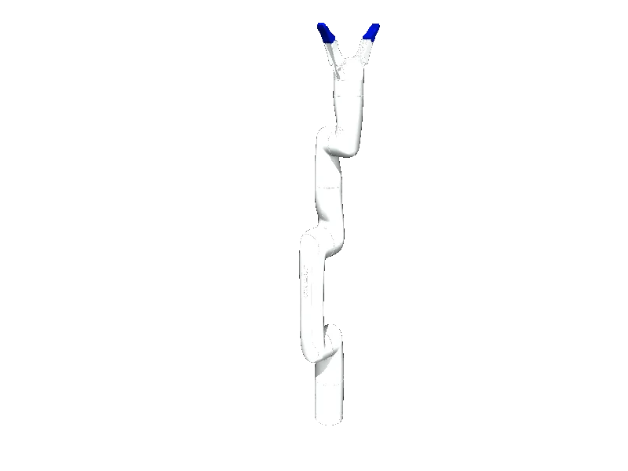

<!-- generated: docs/hooks/robot_pages.py -->

# gen3_lite (arm URDF from robot_descriptions)

{{robot_chips:gen3_lite}}

URDF from [Kinovarobotics/ros2_kortex@8bf2034](https://github.com/Kinovarobotics/ros2_kortex/tree/8bf203423911446de28a2248ec87380b7eea2f90), [compiled for MuJoCo](../learn/simulation/urdf.md) on first use: 10 position actuators, fixed base.



```python title="sketch"
from strands_robots import Robot

robot = Robot("gen3_lite")  # clones the description and compiles the URDF on first use
print(robot.robot_joint_names("gen3_lite"))
robot.cleanup()
```

Add a cube and camera ([worlds and objects](../learn/simulation/worlds-and-objects.md)), then run [a checkpoint](../start/first-policy.md) on it.

## Policies verified on this robot

No checkpoint verified on this robot yet. Record one: [Record](../learn/data/record.md), then [train](../learn/training/lerobot.md) and run it with `run_policy`.
